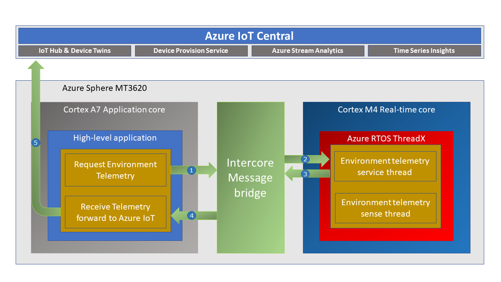

In this unit you will learn how to deploy a real-time [Azure RTOS](https://azure.microsoft.com/en-us/services/rtos/?WT.mc_id=julyot-azd-dglover) application to an Azure Sphere Cortex M4 Real-Time core.


---

## What you will learn

You will learn how to deploy a [Azure RTOS](https://azure.microsoft.com/en-us/services/rtos) application to an Azure Sphere Cortex M4 Real-Time core.

You can run Bare Metal applications or applications built on Real-Time frameworks such as FreeRTOS and Azure RTOS on the Azure Sphere Real-Time cores.

The main reason you would run an application on a Real-Time core is when you need precise or highly deterministic timing. For example, you have a sensor driver that requires precise timing.

For security, applications running on Real-Time cores do not have direct internet access. They communicate with the internet via a High-Level application.

 In this lab, you will also learn about **Intercore** messaging.

---

## Prerequisites

1. Enabled the Real-Time Core debugger


## How to install the real time tool chain on Linux

1. Download the [GNU Arm Embedded Toolchain](https://developer.arm.com/tools-and-software/open-source-software/developer-tools/gnu-toolchain/gnu-rm/downloads). At the time of writting this was *Version 9-2020-q2-update*.
2. Install the downloaded package. The following installs the toolchain in the /opt directory.

    ```bash
    sudo tar -xjvf gcc-arm-none-eabi-9-2020-q2-update-x86_64-linux.tar.bz2 -C /opt
    ```

3. Update your path. Open ~/.bashrc and add to the end.

    ```bash
    export PATH=$PATH:/opt/gcc-arm-none-eabi-9-2020-q2-update/bin
    ```

---

## Enable Real-Time Core Development

### Step 1: Enable Real-Time Core Debugging

1. On Windows, start the **Azure Sphere Developer Command Prompt** as **Administrator**. On Linux, you will be promoted for the superuser password.
1. **Enable Real-Time core debugging**

    ```bash
    azsphere device enable-development -r
    ```

1. Exit the command prompt. Type **exit**, and then press return.

<!-- ### Step 2: Enable the Real-Time Core Floating Point Toolchain

Copy the **AzureSphereRTCoreToolchainVFP.cmake** file found in the **Azure Sphere Learning Path** directory you just cloned to the Azure Sphere SDK CMakeFiles directory. The default destination directory is **C:\Program Files (x86)\Microsoft Azure Sphere SDK\CMakeFiles**. -->

---

## Tutorial Overview

1. Deploy your first Real-Time Core Azure RTOS Application to Azure Sphere.

---


## Key Concepts

In this lab, you will learn how to secure, deploy, and debug a **Real-Time** Azure RTOS application running on one of the Azure Sphere **Cortex M4** Real-Time cores.

As a reminder, the Azure Sphere has three application cores. The Cortex A7 runs High-Level applications, the two Cortex M4s run Real-Time applications.

Like High-Level applications, Real-Time core applications are locked down by default, so you need to grant permissions to access hardware resources.

For security, applications running on Real-Time cores cannot connect directly to **any** network.

In this lab and the next, you will learn about  **Intercore** messaging. Intercore messaging provides a secure channel for applications running on different cores to communicate.


## Application architecture


<!-- ## Solution architecture

 -->


Sequence

1.  
2. 
3. 
4. 
5.

**UPDATE AS LIFTED FROM ULTRASONIC PROJECT**

### Real-time Azure RTOS ThreadX Application

* The Real-time Azure RTOS ThreadX application running on one of the M4 cores that is responsible for running the timing-sensitive HC-SR04 ultrasonic distance sensor.
* Distance is measured every 20 milliseconds so the rover can decide the best route.
* The sensor requires precise microsecond timing to trigger the distance measurement process, so it is a perfect candidate for running on the Real-time core as a Azure RTOS ThreadX thread.
* Every 5 seconds a Azure RTOS ThreadX thread sends distance telemetry to the Azure Sphere A7 High-level application.

### Azure IoT High-level Application

* The application running on the Azure Sphere A7 High-level application core is responsible for less timing-sensitive tasks such as establishing WiFi/Network connectivity, negotiating security and connecting with Azure IoT Central, updating the device twin and send telemetry messages.


---

## What is an RTOS (Real-Time Operating System)

A Real-Time Operating System is system software that provides services and manages processor resources for applications. These resources include processor cycles, memory, peripherals, and interrupts. The main purpose of a Real-Time Operating System is to allocate processing time among various duties the embedded software must perform. 

This typically involves a division of the software into pieces, commonly called “tasks” or “threads,” and creating a run-time environment that provides each thread with its own virtual microprocessor (“Multithreading”). Basically, a virtual microprocessor consists of a virtual set of microprocessor resources, e.g., register set, program counter, stack memory area, and a stack pointer. Only while executing does a thread use the physical microprocessor resources, but each thread retains its own copy of the contents of these resources as if they were its own private resources (the thread”s “context”).

### To learn more

To learn more about what an RTOS read the [Real-Time Operating System - What it is and why you might want to use one](https://azure.microsoft.com/en-au/resources/real-time-operating-system/) article.

---

## Inter-Core Messaging Security

Both the Azure RTOS application running on the Real-Time core and the High-Level application need **Inter-Core** messaging permissions. The **app_manifest.json** property **AllowedApplicationConnections** of both applications must include the _Component ID_ of the **Partner** application.

### Real-Time intercore capabilities

In the following Azure RTOS Real-Time **app_manifest.json** file, the **AllowedApplicationConnections** property is set to the Component ID of the High-Level application.

```json
{
  "SchemaVersion": 1,
  "Name": "demo_threadx",
  "ComponentId": "6583cf17-d321-4d72-8283-0b7c5b56442b",
  "EntryPoint": "/bin/app",
  "CmdArgs": [],
  "Capabilities": {
    "Gpio": [ ],
    "I2cMaster": [ "$I2cMaster2" ],
    "AllowedApplicationConnections": [ "25025d2c-66da-4448-bae1-ac26fcdd3627" ]
  },
  "ApplicationType": "RealTimeCapable"
}

```

### High-Level intercore capabilities

The following is the High-Level **app_manifest.json** file, the **AllowedApplicationConnections** property is set to the Component ID of the Azure RTOS Real-Time application.

```json
{
  "SchemaVersion": 1,
  "Name": "AzureSphereIoTCentral",
  "ComponentId": "25025d2c-66da-4448-bae1-ac26fcdd3627",
  "EntryPoint": "/bin/app",
  "CmdArgs": [
    "--ConnectionType", "DPS", "--ScopeID", "Your_ID_Scope",
	  "--RTComponentId", "6583cf17-d321-4d72-8283-0b7c5b56442b"
  ],
  "Capabilities": {
    "Gpio": [
      "$NETWORK_CONNECTED_LED",
      "$LED_RED",
      "$LED_GREEN",
      "$LED_BLUE"
    ],
    "PowerControls": [
      "ForceReboot"
    ],
    "AllowedConnections": [
      "global.azure-devices-provisioning.net"
    ],
    "DeviceAuthentication": "Replace_with_your_Azure_Sphere_Tenant_ID",
    "AllowedApplicationConnections": [ "6583cf17-d321-4d72-8283-0b7c5b56442b" ]
  },
  "ApplicationType": "Default"
}
```

