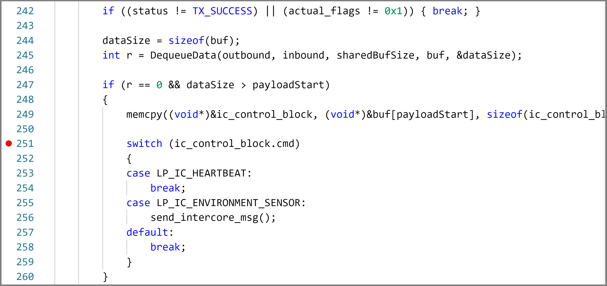

In this exercise, we'll deploy a real-time application to your Azure Sphere.

## Step 1: Delete the existing applications on the Azure Sphere

1. There will be peripheral reassignments between the existing high-level application that is running on the Azure Sphere and the new real-time application that will be deployed to the Azure Sphere in this exercise. So you need to delete any existing applications on the Azure Sphere to avoid clashes.

    From the Windows **PowerShell command line** or Linux **Terminal**, delete the existing application by running

    ```
    azsphere device sideload delete
    ```

2. You must restart the Azure Sphere device to clear the existing silicon firewall settings. From the Windows **PowerShell command line** or Linux **Terminal**, run

    ```
    azsphere device restart
    ```

## Step 2: Open the project

1. Start Visual Studio Code to open your project.
2. Click **Open folder**.
3. Open the **Azure-Sphere lab** folder.
4. Open the **Lab_6_AzureRTOS_Environment** folder.
5. Click **Select Folder** or the **OK** button to open the project.

    
6. If you installed the Visual Studio Code Peacock extension then Visual Studio Code will turn red. We will be connecting two instances of Visual Studio Code to the Azure Sphere. The red colored instance is connected to the real-time core.

## Step 3: Set your developer board configuration

These labs support developer boards from AVNET and Seeed Studio. You need to set the configuration that matches your developer board.

The default developer board configuration is for the Avnet Azure Sphere Starter Kit Revision 1. If you have this board, there's no additional configuration required.

1. Open the **CMakeList.txt** file.

2. Add a `#` at the beginning of the set Avnet line to disable it.

3. Uncomment the `set` command that corresponds to your Azure Sphere device developer board.

   ```text
   set(AVNET TRUE "AVNET Azure Sphere Starter Kit Revision 1 ")
   # set(AVNET_REV_2 TRUE "AVNET Azure Sphere Starter Kit Revision 2 ")
   # set(SEEED_STUDIO_RDB TRUE "Seeed Studio Azure Sphere MT3620 Development Kit (aka Reference Design Board or rdb)")
   # set(SEEED_STUDIO_MINI TRUE "Seeed Studio Azure Sphere MT3620 Mini Dev Board")
   ```

4. Save the file. This will auto-generate the CMake cache.

## Step 4: Deploy the Azure RTOS application to Azure Sphere

1. Select **CMake: [Debug]: Ready** from the Visual Studio Code Status Bar.

    <!--  -->

    :::image type="content" source="../media/visual-studio-code-start-application.png" alt-text="This illustration shows you how to set the the debug build.":::

2. From Visual Studio Code, press <kbd>F5</kbd> to build, deploy, start, and attached the remote debugger to the application now running the Azure Sphere device.

## Step 5: Debugging real-time core applications

You can debug the Azure RTOS application running on Azure Sphere Cortex M4 real-time Core.

1. From Visual Studio Code, navigate to the **demo_threadx** directory, and open the **demo_azure_rtos.c** file.
2. Scroll down to the function named **intercore_thread**.
    > [!NOTE]
    > Use **Go to Symbol in Editor** in Visual Studio Code. Use the keyboard shortcut Ctrl+Shift+O and start typing *intercore_thread*. You'll often see a function name listed twice in the drop-down. The first is the function prototype or forward signature declaration, and the second is the implementation of the function.
3. Set a breakpoint in the **intercore_thread** function on the line that reads **switch (ic_control_block.cmd)**
    > [!NOTE]
    > You can learn how to set breakpoints from this [Visual Studio Code Debugging](https://code.visualstudio.com/docs/editor/debugging#_debug-actions?azure-portal=true) article.

    <!-- > [!div class="mx-imgBorder"]
    >  -->

    :::image type="content" source="../media/visual-studio-debug-intercore-thread.png" alt-text="The illustration shows how to set a breakpoint in Visual Studio Code.":::

4. Leave Visual Studio Code and the app running with the breakpoint set. Next we are going to deploy a High Level app application to the Cortex A7 core which will request environment telemetry from the Real Time app running on the Cortex M4 core.
