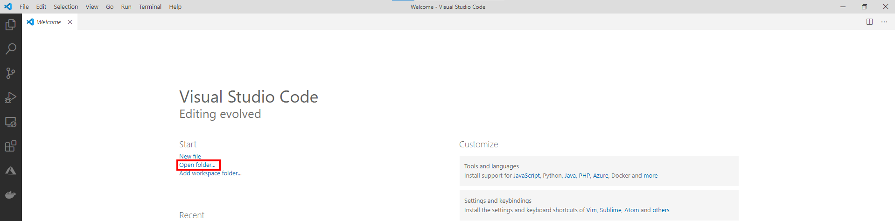
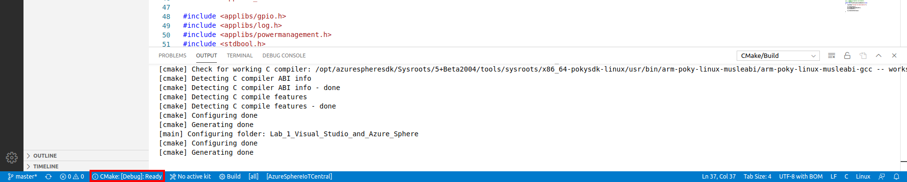
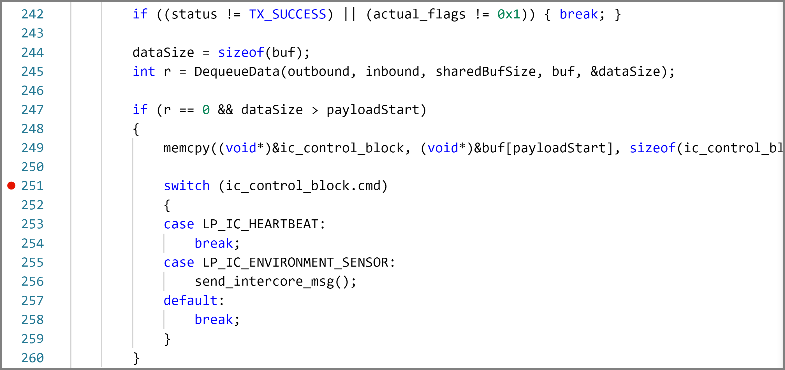

In this exercise, we deploy a real-time application to your Azure Sphere.

## Step 1: Delete the existing applications on the Azure Sphere

1. There will be peripheral reassignments between the existing high-level application that's running on the Azure Sphere and the new real-time application that will be deployed to the Azure Sphere in this exercise. So you need to delete any existing applications on the Azure Sphere to avoid clashes.

    From the Windows **PowerShell command line** or Linux **Terminal**, delete the existing applications by running

    ```
    az sphere device sideload delete
    ```
1. You must restart the Azure Sphere device to clear the existing silicon firewall settings. From the Windows **PowerShell command line** or Linux **Terminal**, run

    ```
    az sphere device restart
    ```

## Step 2: Open the project

1. Start Visual Studio Code to open your project.
1. Select **Open folder**.
1. Open the **Azure-Sphere** folder.
1. Open the **Lab_6_AzureRTOS_Environment** folder.
1. Select **Select Folder** or the **OK** button to open the project.

    > [!NOTE]
    > The folder name and several source files (for example, `demo_azure_rtos.c`) use the original Azure RTOS naming. The RTOS used in this lab is Eclipse ThreadX, formerly Azure RTOS ThreadX. The functionality is unchanged — Microsoft contributed Azure RTOS to the Eclipse Foundation, where it was renamed Eclipse ThreadX.

    
1. If you installed the Visual Studio Code Peacock extension then Visual Studio Code will turn red. We'll be connecting two instances of Visual Studio Code to the Azure Sphere. The red colored instance is connected to the real-time core.

## Step 3: Set your developer board configuration

These labs support developer boards from Avnet and Seeed Studio. The default developer board configuration is for the Avnet Azure Sphere Starter Kit Revision 1. If you're using the Avnet Revision 1 board, no **CMakeLists.txt** change is required.

If you're using any other supported board, update **CMakeLists.txt** so that only one board is selected:

1. Open the **CMakeLists.txt** file.
1. Add a `#` at the beginning of the `set(AVNET TRUE ...)` line to disable the Avnet Revision 1 default.
1. Uncomment exactly one `set` command that matches your Azure Sphere developer board. Leave all other board `set` commands commented out.

   ```text
   set(AVNET TRUE "AVNET Azure Sphere Starter Kit Revision 1 ")
   # set(AVNET_REV_2 TRUE "AVNET Azure Sphere Starter Kit Revision 2 ")
   # set(SEEED_STUDIO_RDB TRUE "Seeed Studio Azure Sphere MT3620 Development Kit (aka Reference Design Board or rdb)")
   # set(SEEED_STUDIO_MINI TRUE "Seeed Studio Azure Sphere MT3620 Mini Dev Board")
   ```
1. Save the file. This will auto-generate the CMake cache.

## Step 4: Deploy the Eclipse ThreadX application to Azure Sphere

1. Select **CMake: [Debug]: Ready** from the Visual Studio Code Status Bar.

    <!--  -->

    :::image type="content" source="../media/visual-studio-code-start-application.png" alt-text="This illustration shows you how to set the the debug build.":::
1. Before pressing <kbd>F5</kbd>, complete these prerequisites:

    - Open the RTApp **.vscode\launch.json** file and verify that the active debug configuration includes the high-level application's component ID in `partnerComponents`. This marks the high-level app as a partner so Visual Studio Code sideload doesn't remove it while you debug the RTApp.

        ```json
        {
            "partnerComponents": [ "<high-level-application-component-id>" ]
        }
        ```

    - If you haven't already enabled RT-core debugging for this device, run the following command from a terminal. On Windows, use an elevated PowerShell or Command Prompt because the `--enable-rt-core-debugging` option installs USB debugger drivers; close the elevated shell after the command completes. On Linux, run the command from your terminal. Replace the placeholders with your resource group, catalog, and device ID values:

        ```azurecli
        az sphere device enable-development --resource-group <resource-group> --catalog <catalog> --device <device-id> --enable-rt-core-debugging
        ```

        For more information, see [Enable development and debugging](/azure-sphere/install/qs-real-time-application?view=azure-sphere-integrated#enable-development-and-debugging&preserve-view=true).
1. From Visual Studio Code, press <kbd>F5</kbd> to build, deploy, start, and attach the remote debugger to the application now running on the Azure Sphere device.

## Step 5: Debugging real-time core applications

You can debug the Eclipse ThreadX application running on the Azure Sphere Cortex-M4F real-time core.

1. From Visual Studio Code, navigate to the **demo_threadx** directory, and open the **demo_azure_rtos.c** file.
1. Scroll down to the function named **intercore_thread**.
    > [!NOTE]
    > Use **Go to Symbol in Editor** in Visual Studio Code. Use the keyboard shortcut Ctrl+Shift+O and start typing *intercore_thread*. You'll often see a function name listed twice in the drop-down. The first is the function prototype or forward signature declaration, and the second is the implementation of the function.
1. Set a breakpoint in the **intercore_thread** function on the line that reads **switch (ic_control_block.cmd)**
    > [!NOTE]
    > You can learn how to set breakpoints from this [Visual Studio Code Debugging](https://code.visualstudio.com/docs/editor/debugging#_debug-actions?azure-portal=true) article.

    <!-- > [!div class="mx-imgBorder"]
    >  -->

    :::image type="content" source="../media/visual-studio-debug-intercore-thread.png" alt-text="The illustration shows how to set a breakpoint in Visual Studio Code.":::
1. Leave Visual Studio Code and the RTApp running with the breakpoint set. Next, deploy the high-level application to the Cortex-A7 core. It will request environment telemetry from the RTApp running on a Cortex-M4F real-time core.
