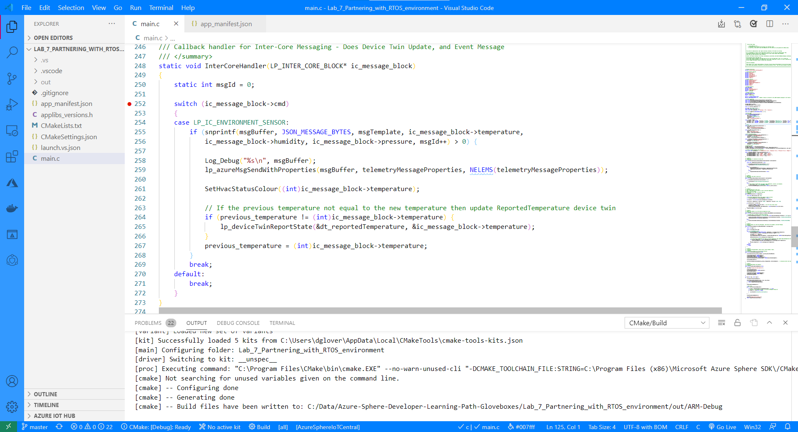
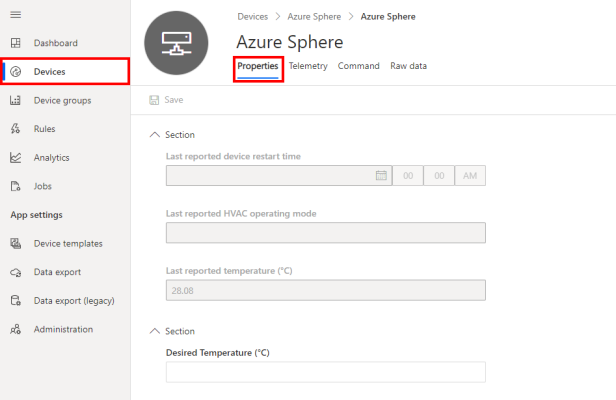
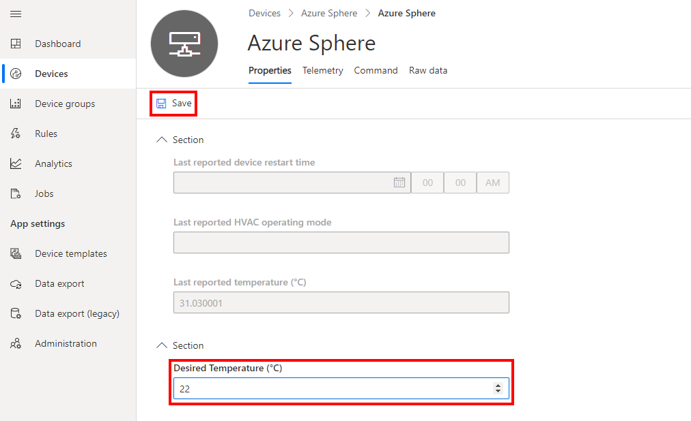

In this exercise, we'll partner a high-level application to send Azure RTOS real-time room environment sensor data to IoT Central.

## Step 1: Open the project

1. Start Visual Studio Code to open your project.

2. Click **Open folder**.

3. Open the **Azure-Sphere lab** folder.

4. Open the **Lab_7_Partnering_with_RTOS_environment** folder.

5. Click **Select Folder** or the **OK** button to open the project.

6. If you installed the Visual Studio Code Peacock extension then Visual Studio Code will turn blue. The blue colored instance is connected to the High-level application running on the Cortex-A7 core.


## Step 2: Set your developer board configuration

These labs support developer boards from Avnet and Seeed Studio. You need to set the configuration that matches your developer board.

The default developer board configuration is for the Avnet Azure Sphere Starter Kit. If you have this board, there's no additional configuration required.

1. Open the **CMakeList.txt** file.

2. Add a `#` at the beginning of the set Avnet line to disable it.

3. Uncomment the `set` command that corresponds to your Azure Sphere device developer board.

   ```text
   set(AVNET TRUE "AVNET Azure Sphere Starter Kit")
   # set(SEEED_STUDIO_RDB TRUE "Seeed Studio Azure Sphere MT3620 Development Kit (aka Reference Design Board or rdb)")
   # set(SEEED_STUDIO_MINI TRUE "Seeed Studio Azure Sphere MT3620 Mini Dev Board")
   ```

4. Save the file. This will auto-generate the CMake cache.


## Step 3: Configure the Azure IoT connection information

1. Open the **app_manifest.json** file.

1. **DO NOT** copy the app_manifest.json that you saved to notepad as there are new properties in this application manifest.

1. Update the connection properties for the Azure IoT Central application.

   - Update **CmdArgs** with your Azure IoT Central ID scope.
   - Update **DeviceAuthentication** with your Azure Sphere Tenant ID. Remember, this was the numeric value returned from running the **azsphere tenant show-selected** command.

1. Update the **AllowedConnections** with the Azure IoT Central application endpoints you copied to Notepad.

1. Review your updated **app_manifest.json** file. It should look similar to the following.

    ```json
    {
        "SchemaVersion": 1,
        "Name": "AzureSphereIoTCentral",
        "ComponentId": "25025d2c-66da-4448-bae1-ac26fcdd3627",
        "EntryPoint": "/bin/app",
        "CmdArgs": [
            "--ConnectionType", "DPS", "--ScopeID", "0ne0099999D",
            "--RTComponentId", "6583cf17-d321-4d72-8283-0b7c5b56442b"
        ],
        "Capabilities": {
            "Gpio": [
            "$NETWORK_CONNECTED_LED",
            "$LED_RED",
            "$LED_GREEN",
            "$LED_BLUE"
            ],
            "PowerControls": [
            "ForceReboot"
            ],
            "AllowedConnections": [
                "global.azure-devices-provisioning.net",
                "iotc-9999bc-3305-99ba-885e-6573fc4cf701.azure-devices.net",
                "iotc-789999fa-8306-4994-b70a-399c46501044.azure-devices.net",
                "iotc-7a099966-a8c1-4f33-b803-bf29998713787.azure-devices.net",
                "iotc-97299997-05ab-4988-8142-e299995acdb7.azure-devices.net",
                "iotc-d099995-7fec-460c-b717-e99999bf4551.azure-devices.net",
                "iotc-789999dd-3bf5-49d7-9e12-f6999991df8c.azure-devices.net",
                "iotc-29999917-7344-49e4-9344-5e0cc9999d9b.azure-devices.net",
                "iotc-99999e59-df2a-41d8-bacd-ebb9999143ab.azure-devices.net",
                "iotc-c0a9999b-d256-4aaf-aa06-e90e999902b3.azure-devices.net",
                "iotc-f9199991-ceb1-4f38-9f1c-13199992570e.azure-devices.net"
            ],
            "DeviceAuthentication": "9d7e79eb-9999-43ce-9999-fa8888888894"
            "AllowedApplicationConnections": [ "6583cf17-d321-4d72-8283-0b7c5b56442b" ]
        },
        "ApplicationType": "Default"
    }
    ```


## Step 4: Set a breakpoint in the InterCoreHandler callback function

1. Open **main.c**.

1. Scroll down to the function named **InterCoreHandler**.
    > [!NOTE]
    > Use **Go to Symbol in Editor** in Visual Studio Code. Use the keyboard shortcut Ctrl+Shift+O and start typing *InterCoreHandler*. You'll often see a function name listed twice in the drop-down. The first is the function prototype or forward signature declaration, and the second is the implementation of the function.

1. Set a breakpoint in the *InterCoreHandler* function on the line that reads **switch (ic_message_block->cmd)**
    > [!NOTE]
    > You can learn how to set breakpoints from this [Visual Studio Code Debugging](https://code.visualstudio.com/docs/editor/debugging#_debug-actions?azure-portal=true) article.

    <!-- > [!div class="mx-imgBorder"]
    >  -->

    :::image type="content" source="../media/visual-studio-debug-intercore-callback.png" alt-text="The illustration shows how to set a breakpoint in the InterCoreHandler callback function.":::

## Step 5: Start the app build deploy process

1. Select **CMake: [Debug]: Ready** from the Visual Studio Code Status Bar.

2. From Visual Studio Code, press F5 to build, deploy, start, and attach the remote debugger to the application that's now running the Azure Sphere device.


## Step 6: Debugging High-level and Real-time core applications

1. When the High-level application has started it will request environment data from the Real-time core application.

2. Without closing or stopping the High-level application, switch to the instance of Visual Studio code that you left connected to the Real-time core.

3. In a moment or two the code execution will stop at the breakpoint set in the Real-time code.

4. Step through the code on the Real-time code and then press **F5** to continue execution.

5. Switch back to the instance of Visual Studio Code connected to the High-level application. The code execution should have stopped at the breakpoint you set in the InterCoreHandler function.

6. Repeat this process a few times and then remove the breakpoints so code continues to execute


## Step 7: Expected device behavior

### Avnet Azure Sphere MT3620 Starter Kit


1. The WLAN LED will blink every 5 seconds when connected to Azure.

1. The RGB LED will turn red if the measured temperature is less than the desired temperature, blue if the measured temperature is greater than the desired temperature and green if the measured temperature is the same as the desired temperature.

### Seeed Studio Azure Sphere MT3620 Development Kit


1. The WLAN LED will blink every 5 seconds when connected to Azure.

1. The RGB LED will turn red if the measured temperature is less than the desired temperature, blue if the measured temperature is greater than the desired temperature and green if the measured temperature is the same as the desired temperature.

### Seeed Studio MT3620 Mini Dev Board


1. The User LED will blink every 5 seconds when connected to Azure.


## Step 8: Display the actual temperature property

1. Switch to Azure IoT Central in your browser.

2. Select **Devices**, then the **Azure Sphere** template, then your device.

3. Select the **Properties** tab.

    > [!NOTE]
    > Azure IoT Central does not update immediately. It might take a minute or two for the device telemetry to be displayed.

<!-- > [!div class="mx-imgBorder"]
>  -->

:::image type="content" source="../media/iot-central-display-telemetry.png" alt-text="The illustration shows how to display telemetry.":::

## Step 9: Set the desired temperature

Setting the desired temperature is like setting a thermostat in a room. A device twin property message for desired temperature is sent to Azure Sphere, where it will be acted upon.

When the temperature sensor is read on the Azure Sphere, it is compared to the desired temperature.

- If the temperature is greater than the desired temperature, the RGB LED will turn blue to indicate the cooler needs be turned on.
- If the temperature is less than the desired temperature, the RGB LED will turn red to indicate the heater needs to be turned on.
- If the temperature is the same as the desired temperature, the RGB LED will turn green to indicate no action required.

   > [!NOTE]
   > The Avnet Azure Sphere Starter Kit has a built-in temperature sensor. For other boards, a random temperature of 25 +/- 5 degrees Celsius is generated.

To set the desired temperature:

1. Update the **Desired Temperature** value.

2. Save the property. This will send the desired temperature property to Azure Sphere. The RGB LED color will change depending on the desired temperature chosen.

<!-- > [!div class="mx-imgBorder"]
>  -->

:::image type="content" source="../media/iot-central-display-settings.png" alt-text="The illustration shows display settings.":::

## Close Visual Studio

Now close Visual Studio.
