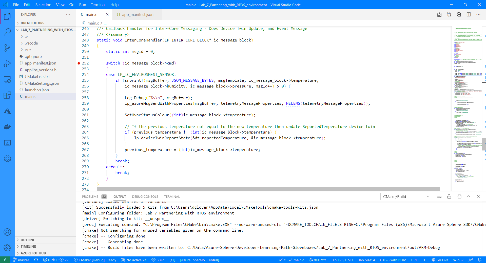

In this exercise, we'll partner a high-level application to send Eclipse ThreadX, formerly Azure RTOS ThreadX, real-time room environment sensor data to IoT Central.

## Step 1: Open the project

1. Start Visual Studio Code to open your project.
1. Select **Open folder**.
1. Open the **Azure-Sphere** folder.
1. Open the **Lab_7_Partnering_with_RTOS_environment** folder.
1. Select **Select Folder** or the **OK** button to open the project.
1. If you installed the Visual Studio Code Peacock extension, then Visual Studio Code turns blue. The blue colored instance is connected to the high-level application running on the Cortex-A7 core.

## Step 2: Set your developer board configuration

These labs support developer boards from Avnet and Seeed Studio. The default developer board configuration is for the Avnet Azure Sphere Starter Kit Revision 1. If you're using the Avnet Revision 1 board, no **CMakeLists.txt** change is required.

If you're using any other supported board, update **CMakeLists.txt** so that only one board is selected:

1. Open the **CMakeLists.txt** file.
1. Add a `#` at the beginning of the `set(AVNET TRUE ...)` line to disable the Avnet Revision 1 default.
1. Uncomment exactly one `set` command that matches your Azure Sphere developer board. Leave all other board `set` commands commented out.

    ```text
    set(AVNET TRUE "AVNET Azure Sphere Starter Kit Revision 1 ")
    # set(AVNET_REV_2 TRUE "AVNET Azure Sphere Starter Kit Revision 2 ")
    # set(SEEED_STUDIO_RDB TRUE "Seeed Studio Azure Sphere MT3620 Development Kit (aka Reference Design Board or rdb)")
    # set(SEEED_STUDIO_MINI TRUE "Seeed Studio Azure Sphere MT3620 Mini Dev Board")
    ```
1. Save the file. This autogenerates the CMake cache.

## Step 3: Configure the Azure IoT connection information

1. Open the **app_manifest.json** file.

1. **DO NOT** copy the app_manifest.json that you saved to notepad as there are new properties in this application manifest.

1. Update the connection properties for the Azure IoT Central application.

   - Update **CmdArgs** with your Azure IoT Central ID scope, and verify that the `--RTComponentId` value matches the Component ID in the real-time application's **app_manifest.json**.
   - Update **DeviceAuthentication** with the Azure Sphere (Legacy) tenant UUID for your catalog. With Azure Sphere Integrated, every catalog exposes this UUID through the Azure Sphere Catalog `properties.tenantId` field. Get it from the following command. Replace `<catalog-name>` with the Azure Sphere catalog name and `<resource-group>` with its Azure resource group:

     ```azurecli
     az sphere catalog show --resource-group <resource-group> --catalog <catalog-name> --query "properties.tenantId" --output tsv
     ```

     `DeviceAuthentication` expects this legacy tenant UUID, not your Azure subscription, or Microsoft Entra directory identifier. Catalogs that were migrated from Azure Sphere (Legacy) also expose the same value via `tags.MigratedCatalogId` for backward compatibility, but `properties.tenantId` works for every Azure Sphere catalog (see the [Azure Sphere Catalog REST API reference](/rest/api/azuresphere/catalogs/get?view=rest-azuresphere-2024-04-01&preserve-view=true)).

1. Update the **AllowedConnections** with the Azure IoT Central application endpoints you copied to Notepad.

1. Confirm that **AllowedApplicationConnections** remains inside the **Capabilities** object and lists the same real-time application Component ID that you used for `--RTComponentId`. If you changed or regenerated the RTApp Component ID, update both values.

    > [!WARNING]
    > `PowerControls` with `ForceReboot` allows an application to force a system reboot, which immediately terminates all running applications. Used incorrectly — for example, on a device that reboots before it can connect to the Azure Sphere Security Service — this can result in the device being **unable to fetch updates and requiring recovery**. Ensure your device leaves enough idle, connected time between reboots to receive operating system and application updates. See [Force Power Down and updates](/azure-sphere/app-development/power-down?view=azure-sphere-integrated&azure-portal=true#force-power-down-and-updates&preserve-view=true) for the official guidance.

1. Review your updated **app_manifest.json** file. It should look similar to the following.

    ```json
    {
        "SchemaVersion": 1,
        "Name": "AzureSphereIoTCentral",
        "ComponentId": "25025d2c-66da-4448-bae1-ac26fcdd3627",
        "EntryPoint": "/bin/app",
        "CmdArgs": [
            "--ConnectionType", "DPS", "--ScopeID", "0ne0099999D",
            "--RTComponentId", "6583cf17-d321-4d72-8283-0b7c5b56442b"
        ],
        "Capabilities": {
            "Gpio": [
            "$NETWORK_CONNECTED_LED",
            "$LED_RED",
            "$LED_GREEN",
            "$LED_BLUE"
            ],
            "PowerControls": [
            "ForceReboot"
            ],
            "AllowedConnections": [
                "global.azure-devices-provisioning.net",
                "iotc-9999bc-3305-99ba-885e-6573fc4cf701.azure-devices.net",
                "iotc-789999fa-8306-4994-b70a-399c46501044.azure-devices.net",
                "iotc-7a099966-a8c1-4f33-b803-bf29998713787.azure-devices.net",
                "iotc-97299997-05ab-4988-8142-e299995acdb7.azure-devices.net",
                "iotc-d099995-7fec-460c-b717-e99999bf4551.azure-devices.net",
                "iotc-789999dd-3bf5-49d7-9e12-f6999991df8c.azure-devices.net",
                "iotc-29999917-7344-49e4-9344-5e0cc9999d9b.azure-devices.net",
                "iotc-99999e59-df2a-41d8-bacd-ebb9999143ab.azure-devices.net",
                "iotc-c0a9999b-d256-4aaf-aa06-e90e999902b3.azure-devices.net",
                "iotc-f9199991-ceb1-4f38-9f1c-13199992570e.azure-devices.net"
            ],
            "DeviceAuthentication": "9d7e79eb-9999-43ce-9999-fa8888888894",
            "AllowedApplicationConnections": [ "6583cf17-d321-4d72-8283-0b7c5b56442b" ]
        },
        "ApplicationType": "Default"
    }
    ```

## Step 4: Set a breakpoint in the InterCoreHandler callback function

1. Open **main.c**.

1. Scroll down to the function named **InterCoreHandler**.
    > [!NOTE]
    > Use **Go to Symbol in Editor** in Visual Studio Code. Use the keyboard shortcut Ctrl+Shift+O and start typing *InterCoreHandler*. You'll often see a function name listed twice in the drop-down. The first is the function prototype or forward signature declaration, and the second is the implementation of the function.

1. Set a breakpoint in the *InterCoreHandler* function on the line that reads **switch (ic_message_block->cmd)**
    > [!NOTE]
    > You can learn how to set breakpoints from this [Visual Studio Code Debugging](https://code.visualstudio.com/docs/editor/debugging#_debug-actions?azure-portal=true) article.

    <!-- > [!div class="mx-imgBorder"]
    >  -->

    :::image type="content" source="../media/visual-studio-debug-intercore-callback.png" alt-text="The illustration shows how to set a breakpoint in the InterCoreHandler callback function.":::

## Step 5: Start the app build deploy process

1. Select **CMake: [Debug]: Ready** from the Visual Studio Code Status Bar.
1. Before pressing F5, open the HLApp **.vscode\launch.json** file and verify that the active debug configuration includes the real-time application's component ID in `partnerComponents`. This marks the RTApp as a partner so Visual Studio Code sideload doesn't remove it while you debug the high-level app.

    ```json
    {
        "partnerComponents": [ "<real-time-application-component-id>" ]
    }
    ```
1. From Visual Studio Code, press F5 to build, deploy, start, and attach the remote debugger to the application that's now running on the Azure Sphere device.

## Step 6: Debugging high-level and real-time core applications

1. When the high-level application has started it requests environment data from the real-time core application.
1. Without closing or stopping the high-level application, switch to the instance of Visual Studio Code that you left connected to the real-time core.
1. In a moment or two the code execution will stop at the breakpoint set in the real-time code.
1. Step through the code on the real-time code and then press **F5** to continue execution.
1. Switch back to the instance of Visual Studio Code connected to the high-level application. The code execution should have stopped at the breakpoint you set in the InterCoreHandler function.
1. Repeat this process a few times and then remove the breakpoints so code continues to execute

## Step 7: Expected device behavior

### Azure Sphere MT3620 Starter Kit Revision 1 and 2


1. The WLAN LED blinks every 5 seconds when connected to Azure.

1. The RGB LED turns red if the measured temperature is less than the desired temperature, blue if the measured temperature is greater than the desired temperature and green if the measured temperature is the same as the desired temperature.

### Seeed Studio Azure Sphere MT3620 Development Kit


1. The WLAN LED blinks every 5 seconds when connected to Azure.

1. The RGB LED turns red if the measured temperature is less than the desired temperature, blue if the measured temperature is greater than the desired temperature and green if the measured temperature is the same as the desired temperature.

### Seeed Studio MT3620 Mini Dev Board


1. The User LED will blink every 5 seconds when connected to Azure.

## Step 8: Display the last reported temperature property

1. Switch to IoT Central in your browser.

1. From the sidebar menu, select **Devices**, then the **Learning Path Lab Monitor** template, then your **device**.

1. Select the **Properties** tab.

:::image type="content" source="../media/iot-central-properties-last-reported-temperature.png" alt-text="The illustration shows how to display telemetry.":::

## Step 9: Set the desired temperature

Setting the desired temperature is like setting a thermostat in a room. IoT Central sends a writable-property update through the application's underlying IoT Hub device twin. The high-level Azure Sphere application receives the desired temperature and acts on it.

When the temperature sensor is read on the Azure Sphere, it is compared to the desired temperature.

- If the temperature is greater than the desired temperature, the RGB LED will turn blue to indicate the cooler needs be turned on.
- If the temperature is less than the desired temperature, the RGB LED will turn red to indicate the heater needs to be turned on.
- If the temperature is the same as the desired temperature, the RGB LED will turn green to indicate no action required.

   > [!NOTE]
   > The Avnet Azure Sphere Starter Kit has a built-in temperature sensor. For other boards, a random temperature of 25 +/- 5 degrees Celsius is generated.

To set the desired temperature:

1. Update the **Desired Temperature** value.

1. Save the property. This will send the desired temperature property to Azure Sphere. The RGB LED color will change depending on the desired temperature chosen.

    :::image type="content" source="../media/iot-central-display-settings.png" alt-text="The illustration shows display settings.":::

1. Update the **Desired Sample Rate in Seconds [1..60]** value.
1. **Save** the property. This will send the desired sample rate property to the Azure Sphere high-level application. This property will then be forwarded to the real-time core application and the sensor sample rate property will be updated.

## Close Visual Studio Code

Now close Visual Studio Code.
