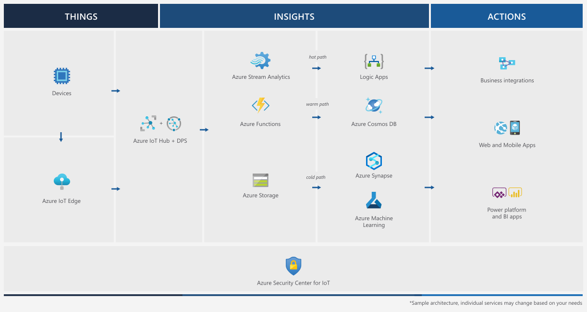

You ran applications on the Azure Sphere to stream room environment data to Azure IoT Central. From IoT Central, you were able to monitor and control your Azure Sphere.

We learned that Azure Sphere is secure by default, with ongoing updates, and multiple layers of security. Azure Sphere protects our IoT devices, our networks, and our solutions, and it also helps to protect against software bugs and mistakes we make in our applications.

We also learned that Azure Sphere is flexible and supports a wide range of application scenarios. The MT3620 Azure Sphere MCU used in these labs has three developer-accessible cores: one Cortex-A7 high-level application core and two Cortex-M4F real-time cores. You ran a high-level application while running a time-sensitive application on a real-time core.

Internet of Things security was critical for this microbiology lab. Without this Azure Sphere-based application, you would need to manually record room conditions at regular intervals. Using this solution, you can record accurate and secure results in near real time.

> [!IMPORTANT]
> Treat this module as Azure Sphere and MT3620 learning and maintenance guidance, not as a recommendation for new MT3620 product designs. Microsoft announced Azure Sphere retirement on March 20, 2026. MT3620 reaches end of life on July 31, 2026, and extended support for Azure Sphere OS and the Azure Sphere Security Service ends on July 31, 2031. For new solutions, evaluate replacement architectures that provide secure device identity, update, attestation, and Azure IoT connectivity. For details, see [Retirement of Azure Sphere](/azure-sphere/product-overview/retirement?view=azure-sphere-integrated&preserve-view=true).

## Azure IoT reference architecture

Azure Sphere and IoT Hub are only part of an Internet of Things solution. You can learn more about IoT solutions by reviewing the [Azure IoT reference architecture](/azure/architecture/reference-architectures/iot?azure-portal=true) guide.

## Next steps

To learn more about Azure Sphere and Azure IoT, review the following resources.

1. [Azure Sphere documentation](/azure-sphere?azure-portal=true)
1. [Azure Sphere retirement guidance](/azure-sphere/product-overview/retirement?view=azure-sphere-integrated&preserve-view=true)
1. [Azure IoT fundamentals](/azure/iot-fundamentals/?azure-portal=true)
1. [Azure IoT Central documentation](/azure/iot-central/?azure-portal=true)
1. [Azure IoT reference architecture](/azure/architecture/reference-architectures/iot?azure-portal=true)

The [Microsoft Certified: Azure IoT Developer Specialty](/credentials/certifications/azure-iot-developer-specialty/?azure-portal=true) certification and the AZ-220 exam are retired. Use the current Azure IoT documentation and Microsoft Learn training content instead of treating that certification as an active next step.

## Learning module feedback

Take a moment to rate this learning module and provide feedback to help us improve the learning experience. Thank you.
