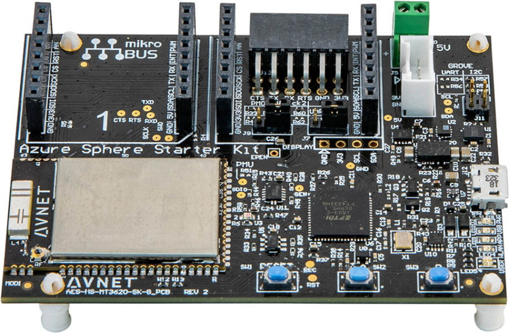
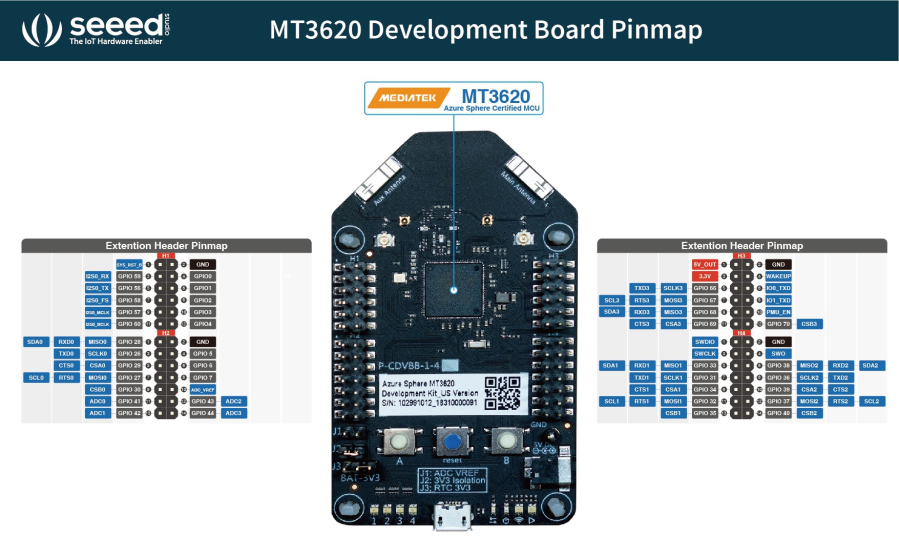
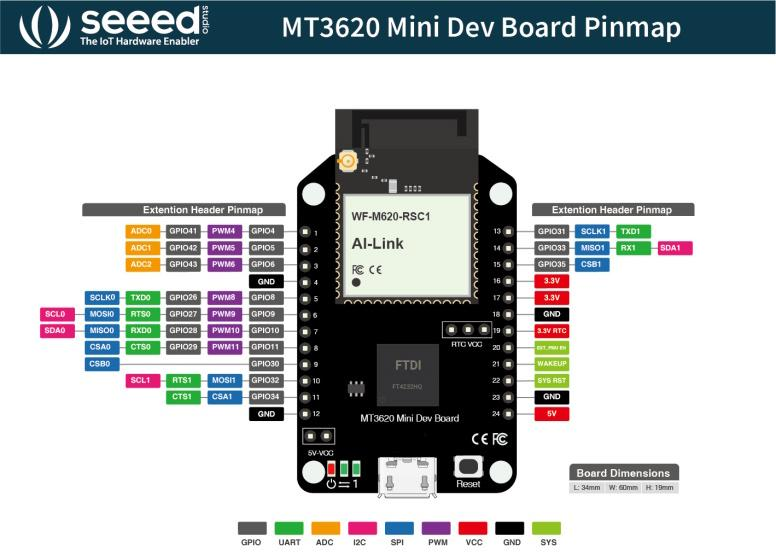

In this unit, you'll learn what Azure Sphere devices are supported by this learning module.

## Azure Sphere devices

Multiple types of devices are available to use; let's look at the first one.

### Avnet Azure Sphere MT3620 Starter Kit Revision 1

This is the default Azure Sphere device for this learning module.

[](https://www.avnet.com/opasdata/d120001/medias/docus/197/K1279_Azure%20MT3620%20Starter%20Kit_v2.pdf?azure-portal=true)

The Avnet Azure Sphere kit can be found [here](https://www.avnet.com/opasdata/d120001/medias/docus/197/K1279_Azure%20MT3620%20Starter%20Kit_v2.pdf?azure-portal=true).

### Avnet Azure Sphere MT3620 Starter Kit Revision 2

[](https://www.avnet.com/opasdata/d120001/medias/docus/203/avt-pb-azurespherev2-v2a.pdf?azure-portal=true)

The Avnet Azure Sphere kit can be found [here](https://www.avnet.com/opasdata/d120001/medias/docus/203/avt-pb-azurespherev2-v2a.pdf?azure-portal=true).

### Seeed Studio Azure Sphere MT3620 Development Kit

[](http://wiki.seeedstudio.com/Azure_Sphere_MT3620_Development_Kit?azure-portal=true)

The Seeed Studio Azure Sphere kit can be found [here](http://wiki.seeedstudio.com/Azure_Sphere_MT3620_Development_Kit?azure-portal=true).

### Seeed Studio Azure Sphere MT3620 Mini Dev Board

[](http://wiki.seeedstudio.com/MT3620_Mini_Dev_Board?azure-portal=true)

The Seeed Studio Mini Azure Sphere kit can be found [here](http://wiki.seeedstudio.com/MT3620_Mini_Dev_Board?azure-portal=true).

<!-- 
## Introduction to the Azure Sphere learning path labs

Several learning path libraries support these labs. These learning path C functions are prefixed with **lp_**, typedefs and enums are prefixed with **LP_**.

Interesting things to note about the learning path libraries:

- They're open source, and contributions are welcome.
- They're built from the [Azure Sphere samples](https://github.com/Azure/azure-sphere-samples?azure-portal=true) and aim to demonstrate best practices.
- They're **not** part of the official Azure Sphere libraries or samples.

For this module, you'll clone the [Azure Sphere Developer Learning Path repository](https://github.com/MicrosoftDocs/Azure-Sphere-Developer-Learning-Path). -->

## General Purpose Input and Output (GPIO) peripherals

In the Azure Sphere Learning Path labs there are several GPIO peripheral variables declared for LEDs. Variables of type **LP_GPIO** declare a GPIO model for **input** and **output** of single pin peripherals, such as LEDs, buttons, reed switches, and relays.

A GPIO peripheral variable holds the GPIO pin number, the initial state of the pin when the program starts, and whether the pin logic needs to be inverted.

The following example declares an LED **output** peripheral.

```c
static LP_GPIO alertLed = {
    .pin = ALERT_LED,                // The GPIO pin number
    .direction = LP_OUTPUT,          // for OUTPUT
    .initialState = GPIO_Value_Low,  // Set the initial state on the pin when opened
    .invertPin = true,               // Should the switching logic be reverse for on/off, high/low
    .name = "alertLed" };            // An arbitrary name for the peripheral
```

### Declaring an input peripheral

The following example declares a button **input** peripheral.

```c
static LP_GPIO buttonA = {
    .pin = BUTTON_A,
    .direction = LP_INPUT,
    .name = "buttonA" };
```

## Useful terms

- **Hardware:** Most IoT solutions are designed to interface with hardware and interact with the real world. The most common interfaces on a device are GPIO, PWM, I2C, SPI, ADC, and UART.
- **GPIO:** Any GPIO pin can be designated (in software) as an input or output pin and can be used for a wide range of purposes. These labs use single-pin GPIO peripherals for input and output, so the following is an introduction to GPIO pins.
- **GPIO output:** If a GPIO pin is designated as an *output* pin, then the software running on the Azure Sphere can set a pin to be either on or off. This equates to 3.3 volts for a pin that has been turned on, and zero volts when a pin is turned off. It's important to check that a peripheral connected to the pin can tolerate 3.3 volts. Otherwise you may destroy the peripheral. Lots of peripherals use single pins, such as LEDs, relays, and reed switches.
- **GPIO input:** If a GPIO pin is designated as an *input* pin, then the software running on Azure Sphere can read a pin to determine if the voltage has been set to 3.3 volts, or zero volts/ground. It's essential to check that a peripheral won't set a voltage on a pin to anything higher than 3.3 volts **before** you connect it. Be warned, if you set a pin to a voltage higher than 3.3 volts you'll destroy Azure Sphere. An example of a GPIO peripheral that uses a single pin is a push button.
- **Other peripheral interface types:** The following is a list of other common peripheral interfaces found on devices, including Azure Sphere. To learn more about each interface type, right mouse click and open the link in a new browser window.
  - [PWM - Pulse width modulation](https://en.wikipedia.org/wiki/Pulse-width_modulation?azure-portal=true)
  - [I2C - Inter-Integrated Circuit](https://en.wikipedia.org/wiki/I²C?azure-portal=true)
  - [SPI - Serial Peripheral Interface](https://en.wikipedia.org/wiki/Serial_Peripheral_Interface?azure-portal=true)
  - [ADC - Analog-to-digital converter](https://en.wikipedia.org/wiki/Analog-to-digital_converter?azure-portal=true)
  - [UART - Universal asynchronous receiver-transmitter](https://en.wikipedia.org/wiki/Universal_asynchronous_receiver-transmitter?azure-portal=true)
- **ISU:** You'll see references to **ISU** in the Azure Sphere and MediaTek documentation. An ISU is a serial interface block and is an acronym for "**I**2C, **S**PI, **U**ART." For more information, see the [MT3620 Support Status](https://docs.microsoft.com/azure-sphere/hardware/mt3620-product-status?azure-portal=true) page.