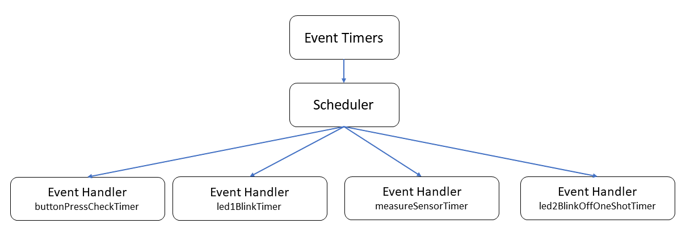

In this unit, you'll learn about event-driven programming and some of the terminology you'll need.

## Event timers

Event timers generate events that are bound to handler functions, which implement desired actions.



For example, blink an LED every second, or read a sensor every 10 seconds. Event-driven programming helps to simplify application design.

The labs use event timers extensively, so there is a generalized model to simplify working with timers.

There are two types of timers:

- Periodic timers
- One-shot timers

### Periodic timers

Periodic timers produce timed triggers with a fixed period of time between occurrences.

The following example is a variable named **measureSensorTimer** of type **LP_TIMER**. This event timer is initialized with a period of 10 seconds **{ 10, 0 }**. When the event timer triggers, the handler function **MeasureSensorHandler** is called to implement the action.

> [!NOTE]
> There are two values used to initialize the **.period** variable. The first is the number of seconds, followed by the number of nanoseconds. If you wanted the timer to trigger events every half a second (500 milliseconds), you would set the .period variable to be { 0, 500000000 }.

```c
static LP_TIMER measureSensorTimer = {
    // Fire the timer event every 10 seconds + zero nanoseconds.
    .period = { 10, 0 },
    // An arbitrary name for the timer, used for error handling
    .name = "measureSensorTimer",
    // The function handler called when the timer triggers.
    .handler = MeasureSensorHandler
};
```

### Reading telemetry

The following code is the implementation of the **MeasureSensorHandler** handler function. This functions reads sensor data, serializes the data as JSON, then displays the JSON in the debug console.

```c
/// <summary>
/// Read sensor and send to Azure IoT
/// </summary>
static void MeasureSensorHandler(EventLoopTimer* eventLoopTimer)
{
    static int msgId = 0;
    static LP_ENVIRONMENT environment;

    if (ConsumeEventLoopTimerEvent(eventLoopTimer) != 0)
    {
        lp_terminate(ExitCode_ConsumeEventLoopTimeEvent);
    }
    else {
        if (lp_readTelemetry(&environment) &&
            snprintf(msgBuffer, JSON_MESSAGE_BYTES, msgTemplate,
                environment.temperature, environment.humidity, environment.pressure, msgId++) > 0)
        {
            Log_Debug("%s\n", msgBuffer);
        }
    }
}
```

### One-shot timers

A one-shot timer, as its name suggests, fires once only.

The following code uses a one-shot timer to blink the alert LED if button A is pressed. The LED turns on, and then a one-shot timer is set. When the one-shot timer triggers, its handler function is called to turn off the LED.

The advantage of this event-driven pattern is that the device can continue to service other events such as checking if a user has pressed a button.

The following is an example of a one-shot timer. The variable named **alertLedOffOneShotTimer** is of type **LP_TIMER**. This timer is initialized with a period of { 0, 0 }. Timers initialized with a period of 0 seconds are one-shot timers.

```c
static LP_TIMER alertLedOffOneShotTimer = {
    .period = { 0, 0 },
    .name = "alertLedOffOneShotTimer",
    .handler = AlertLedOffToggleHandler };
```

In the **ButtonPressCheckHandler** function, the alert LED is turned on when button A is pressed. Then a call is made to the **lp_timerOneShotSet** function to set the timer to 1 second. After 1 second, the **AlertLedOffToggleHandler** function is called.

```c
/// <summary>
/// Handler to check for Button Presses
/// </summary>
static void ButtonPressCheckHandler(EventLoopTimer* eventLoopTimer)
{
    static GPIO_Value_Type buttonAState;

    if (ConsumeEventLoopTimerEvent(eventLoopTimer) != 0) {
        lp_terminate(ExitCode_ConsumeEventLoopTimeEvent);
    }
    else {
        if (lp_gpioStateGet(&buttonA, &buttonAState))
        {
            lp_gpioOn(&alertLed);
            lp_timerOneShotSet(&alertLedOffOneShotTimer, &(struct timespec){1, 0});
        }
    }
}
```

When the one-shot timer triggers, the handler function **AlertLedOffToggleHandler** is called to turn off the alert LED.

```c
/// <summary>
/// One shot timer handler to turn off Alert LED
/// </summary>
static void AlertLedOffToggleHandler(EventLoopTimer* eventLoopTimer) {
    if (ConsumeEventLoopTimerEvent(eventLoopTimer) != 0) {
        lp_terminate(ExitCode_ConsumeEventLoopTimeEvent);
    }
    else {
        lp_gpioOff(&alertLed);
    }
}
```


## Automatic initialization of peripherals and event timers

Peripherals and timers referenced in a set will be automatically opened and closed.

```c
LP_GPIO* gpioSet[] = { &buttonA, &networkConnectedLed, &alertLed };
LP_TIMER* timerSet[] = { &buttonPressCheckTimer, &networkConnectionStatusTimer, &measureSensorTimer, &alertLedOffOneShotTimer };
```

These sets are referenced when **lp_gpioSetOpen** and **lp_timerSetStart** are called from the **InitPeripheralsAndHandlers** function. The sets are also referenced when the peripheral and timer sets are closed in the **ClosePeripheralsAndHandlers** function.

```c
static void InitPeripheralsAndHandlers(void)
{
    lp_initializeDevKit();

    lp_gpioSetOpen(gpioSet, NELEMS(gpioSet));
    lp_timerSetStart(timerSet, NELEMS(timerSet));
}
```


## Easy to extend

This model makes it easy to declare another peripheral or timer and add it to the peripheral set or timer set. The following code is an example of adding a GPIO output peripheral.

```c
static LP_GPIO fanControl = {
    .pin = FAN1,                      // The GPIO pin number
    .direction = LP_OUTPUT,           // for OUTPUT
    .initialState = GPIO_Value_Low,   // Set the initial state on the pin when opened
    .invertPin = true,                // Should the switching logic be reverse for on/off, high/low
    .name = "FanControl"              // An arbitrary name for the senor.
};
```

Remember to add this new peripheral to the gpio set. Adding the gpio peripheral to the set ensures automatic opening and closing.

```c
LP_GPIO* gpioSet[] = { &buttonA, &networkConnectedLed, &alertLed, &fanControl };
```
