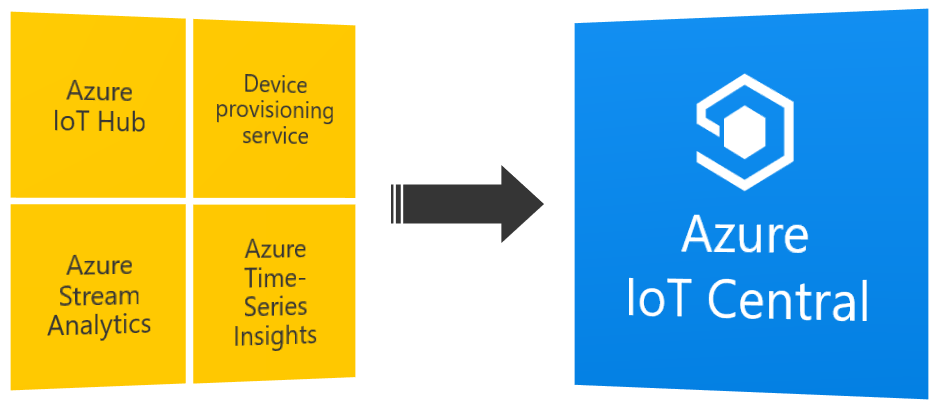

Your Azure Sphere application will connect to Azure IoT Central and send room environment telemetry to Azure IoT Central. You'll learn how to secure, build, deploy, and debug your high-level Azure Sphere application onto the Azure Sphere Cortex-A7 core.

## Components used

The components for this unit:

**Azure IoT Central** This service is an Internet of Things (IoT) application platform. [Azure IoT Central](https://azure.microsoft.com/services/iot-central?azure-portal=true) provides an easy way to connect, monitor, and manage your IoT assets at scale. IoT Central is built on Azure IoT Hub, Azure Device Provisioning Service, Stream Analytics, and Time Series Insights.

Azure IoT Central is built on the [8 attributes of successful IoT solutions](https://azure.microsoft.com/resources/8-attributes-of-successful-iot-solutions?azure-portal=true)

**Azure IoT Central application** An Azure IoT Central application simplifies the creation of IoT solutions. You'll learn how to create, customize, manage, and use an Azure IoT Central application.

### Steps to follow

An overview of the steps you'll follow is:

1. Create an Azure IoT Central application.
1. Set up a trusted relationship between your Azure Sphere tenant and Azure IoT Central.
