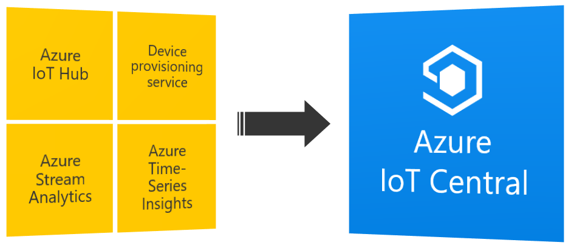

Your Azure Sphere application will connect to Azure IoT Central and send room environment telemetry to Azure IoT Central. You'll learn how to secure, build, deploy, and debug your high-level Azure Sphere application onto the Azure Sphere Cortex-A7 core.

> [!IMPORTANT]
> This unit demonstrates Azure IoT Central integration with an Azure Sphere MT3620 device. Microsoft announced Azure Sphere retirement on March 20, 2026; MT3620 reaches end of life on July 31, 2026; and extended support for Azure Sphere OS and the Azure Sphere Security Service ends on July 31, 2031. The IoT Central concepts for telemetry, dashboards, rules, and device management remain useful learning goals, but new product designs should evaluate replacement device architectures and Azure IoT connectivity patterns before relying on MT3620. For details, see [Retirement of Azure Sphere](/azure-sphere/product-overview/retirement?view=azure-sphere-integrated).

## Components used

The components for this unit:

**Azure IoT Central** This service is an Internet of Things (IoT) application platform as a service (aPaaS). [Azure IoT Central](https://learn.microsoft.com/azure/iot-central/core/overview-iot-central) provides a hosted web UI to connect devices, monitor telemetry, create rules, manage devices and their data throughout the device lifecycle, and integrate with other business applications by using features such as data export and REST APIs.

**Azure IoT Central application** An Azure IoT Central application simplifies the creation of IoT solutions. You'll learn how to create, customize, manage, and use an Azure IoT Central application.

### Steps to follow

An overview of the steps you'll follow is:

1. Create an Azure IoT Central application.
1. Set up a trusted relationship between your Azure Sphere catalog and Azure IoT Central.
