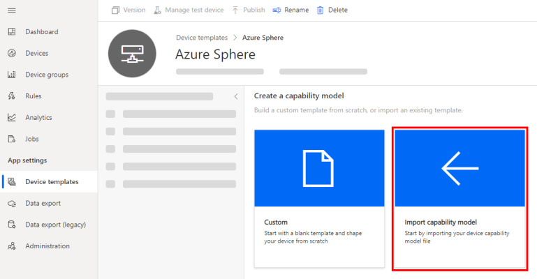
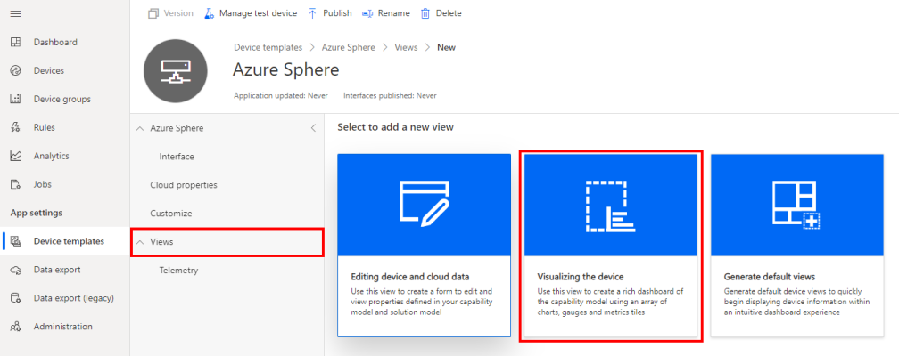

In this exercise, we'll build a high-level Azure Sphere application that connects and sends environment telemetry to Azure IoT Central.

------

## Step 1: Create a new Azure IoT Central application

1. Open this link in a new window: [Azure IoT Central](https://azure.microsoft.com/services/iot-central?azure-portal=true).

2. Click **Build a solution**.

3. You'll need to sign with your Microsoft personal, work, or school account. If you do not have a Microsoft account, then you can create one for free by using the **Create one!** link.

4. Expand the sidebar menu by clicking on the **Menu** icon.

   

5. Navigate to **Build** and click **+ New application** to create a new Azure IoT Central application.

6. Select **Custom app**.

   

7. Specify the **Application name**, specify the **URL**, select the **Free** pricing plan, and complete the registration form.

8. Click **Create**.

### Create a new device template

A device template is a blueprint that defines the characteristics and behaviors of a type of device that connects to an Azure IoT Central application.


1. Navigate to **Device templates**, then **+ New**.

   

1. Click the **IoT device** template type.

1. Select **IoT device**.

1. Click **Next:Customize**.

1. Name your template **Azure Sphere**.

1. Click **Next: Review**.

1. Click **Create**.

### Import a capability model

A capability model is a JSON document that describes the shape of the telemetry sent by a device and the interactions between the device and IoT Central.

1. Click **Import capability model**.
   

2. Navigate to the **Azure-Sphere** lab folder.

3. Navigate to the **iot_central** folder.

4. Select **Azure_Sphere_Developer_Learning_Path.json** and open it.

### Create a device visualization view

1. Navigate to the **Views** menu.

2. Select **Visualizing the device**.
   

3. Name the view **Telemetry**.

4. Select **Temperature** from the **Select a telemetry** dropdown.

5. Click **+ Telemetry**, and add **Humidity** from the **Select a telemetry** dropdown.

6. Click **+ Telemetry**, and add **Pressure** from the **Select a telemetry** dropdown.

7. Click **Add tile**.

8. Click **Save** to save the view.


### Create a properties form

1. Navigate to the **Views** menu.

2. Select **Editing device and cloud data**.
   

3. Name the form **Properties**.

4. Expand the **Properties** section.

5. Select the following properties.
   - Last reported device restart time
   - Last reported HVAC operating mode
   - Last reported temperature

6. Click **Add section**.

7. Select the following property.
   - Desired Temperature

8. Click **Add section**.

9. Click **Save** to save the form.


### Publish the device template

1. Click **Publish** to publish the template. Publishing the template makes it available for devices.

   

2. Confirm and click **Publish**.

------

## Step 2: Download the tenant authentication CA certificate

1. If you're using Windows, open an **Azure Sphere Developer Command Prompt**. If you're using Linux, open your terminal.

2. Log in to your Azure Sphere tenant if you have not already done so.

   ```bash
   azsphere login
   ```

3. Make a note of the current directory or change to the **Azure-Sphere** directory. You'll need the name of this directory in the next step.

4. Download the certificate authority (CA) certificate for your Azure Sphere tenant:

   ```bash
   azsphere ca-certificate download --output CAcertificate.cer
   ```

   The output file must have the .cer extension.

### Create an Enrollment Group

1. From IoT Central, go to **Administration** > **Device Connection** > **Manage primary certificate**.

2. Create an enrollment group

3. Name the enrollment group **Azure Sphere**

4. Select Certificates (X.509) from the Attestation type dropdown.

5. Click Save

### Upload the Azure Sphere tenant CA certificate to Azure IoT Central and generate a verification code

1. Click **+ Manage primary**.

2. Click the folder icon next to the **Primary** box and navigate to the directory where you downloaded the certificate. If you don't see the .cer file in the list, make sure that the view filter is set to **All files (*)**. Select the certificate and then click the gear icon next to the **Primary** box.

3. The **Primary Certificate** dialog box appears. The **Subject** and **Thumbprint** fields contain information about the current Azure Sphere tenant and primary root certificate.

4. Click the **Generate verification code.

5. Copy the verification code to the clipboard.

   

### Verify the tenant CA certificate

1. Return to the command prompt.

2. Download a validation certificate that proves that you own the tenant CA certificate. Replace code in the command with the verification code from the previous step.

   ```bash
   azsphere ca-certificate download-proof --output ValidationCertification.cer --verificationcode <code>
   ```

3. The Azure Sphere Security Service signs the validation certificate with the verification code to prove that you own the Certificate Authority (CA).

### Use the validation certificate to verify the tenant's identity

1. Return to Azure IoT Central and click **Verify**.

2. When prompted, navigate to the validation certificate that you downloaded in the previous step and select it. When the verification process is complete, the **Primary Certificate** dialog box displays the **Verified** message. Click **Close** to dismiss the box.

   


After you complete these steps, any device that is claimed into your Azure Sphere tenant will automatically be enrolled in your Azure IoT Central application when it first connects.
