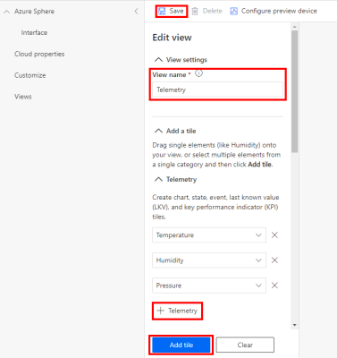
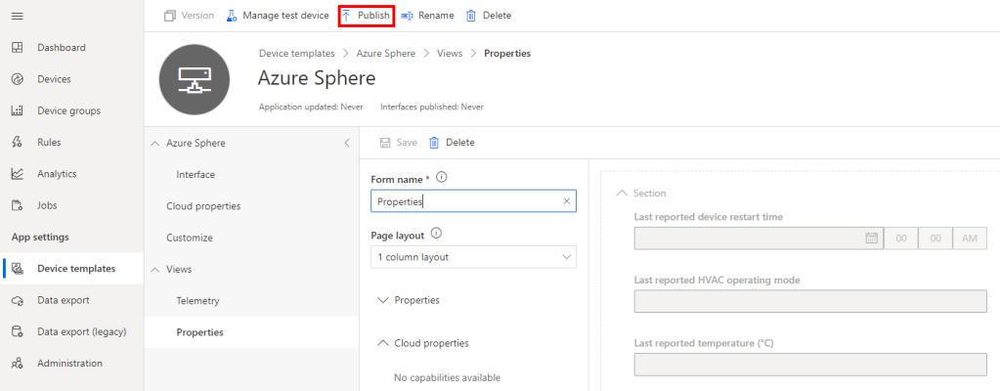
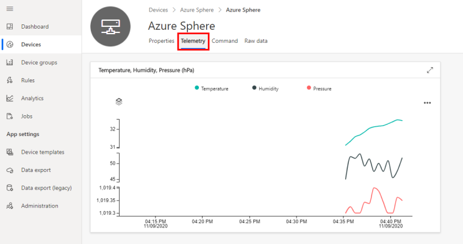

In this exercise, you'll build a High-Level Azure Sphere application that connects and sends environment telemetry to Azure IoT Central. 

## Step 1: Create a new IoT Central Application

1. Click and open this link "[Azure IoT Central](https://azure.microsoft.com/services/iot-central/)" in a new window.

2. Click **Build a solution**.

3. You'll need to sign with your Microsoft Personal, or Work, or School account. If you do not have a Microsoft account, then you can create one for free using the **Create one!** link.

4. Expand the sidebar menu by clicking on the **Burger menu** icon.

   

5. Navigate to Build and click **+ New application** to create a new Azure IoT Central application.

6. Select **Custom app**

   

### Create a new application

1. Specify the **Application name**, the **URL**, select the **Free** pricing plan, and complete the registration form.

   

2. Then click **Create**.

### Create a new device template

A device template is a blueprint that defines the characteristics and behaviors of a type of device that connects to an Azure IoT Central application.

1. Navigate to **Device templates**, then **+ New**.

2. Click the **IoT device** template type.

   

3. Create an **IoT Device** Template.

   1. Select **IoT device**,
   2. Click **Next:Customize**,
   3. Name your template **Azure Sphere**,
   4. Click **Next: Review**,
   5. Click **Create**.

### Import a Capability Model

1. Click **Import capability model**
2. Navigate to the folder you cloned the Azure Sphere Developer Learning Path into.
3. Navigate to the **iot_central** folder.
4. Select **Azure_Sphere_Developer_Learning_Path.json** and open

### Create a device visualization view

1. Navigate Device templates and click **Views**.

   

2. Select **Visualizing the device**.

   

3. Select **Humidity**, **Pressure**, and **Temperature** telemetry items.

   

4. Click **Add Tile**.

5. Click **Save** to save the view.

### Create a properties form

1. Navigate to Device templates and click **Views**.

2. Click the **Editing device and cloud data** option.

   

3. Expand the **Properties** section.

4. Select **all properties**. 

   

5. Click **Add Section**.

6. Click **Save** to save the form.

### Publish the device template

1. Click **Publish** to publish the template. Publishing the template makes it available for devices. 

   

2. Next, confirm and click **Publish**

## Step 2: Link your Azure Sphere Tenant to IoT Central

You need to set up a trust relationship between your Azure Sphere tenant and your IoT Central application.

Devices claimed by your Azure Sphere tenant will be automatically enrolled when it first connects to your IoT Central application.

### Download the tenant authentication CA certificate

1. If you're using Windows, open an **Azure Sphere Developer Command Prompt**. If you're using Linux, open your terminal.

2. Make a note of the current directory, or change to the Azure Sphere Learning path directory. You'll need the name of this directory in the next step.

3. Download the Certificate Authority (CA) certificate for your Azure Sphere tenant:

   ```
   azsphere tenant download-CA-certificate --output CAcertificate.cer
   ```

   The output file must have the .cer extension.

### Upload the tenant CA certificate to Azure IoT Central and generate a verification code

1. In Azure IoT Central, go to Administration > Device Connection > Manage primary certificate.

2. Click the folder icon next to the Primary box and navigate to the directory where you downloaded the certificate. If you don't see the .cer file in the list, make sure that the view filter is set to All files (*). Select the certificate and then click the gear icon next to the Primary box.

3. The Primary Certificate dialog box appears. The Subject and Thumbprint fields contain information about the current Azure Sphere tenant and primary root certificate.

4. Click the Refresh icon to the right of the Verification Code box to generate a verification code. Copy the verification code to the clipboard.

   

### Verify the tenant CA certificate

1. Return to the command prompt.

2. Download a validation certificate that proves that you own the tenant CA certificate. Replace code in the command with the verification code from the previous step.

   ```
   azsphere tenant download-validation-certificate --output ValidationCertification.cer --verificationcode <code>
   ```

3. The Azure Sphere Security Service signs the validation certificate with the verification code to prove that you own the CA.

### Use the validation certificate to verify the tenant identity

1. Return to Azure IoT Central and click Verify.

2. When prompted, navigate to the validation certificate that you downloaded in the previous step and select it. When the verification process is complete, the Primary Certificate dialog box displays the Verified message. Click Close to dismiss the box.

   


After you complete these steps, any device that is claimed into your Azure Sphere tenant will automatically be enrolled in your Azure IoT Central application when it first connects.

------

## Step 3: Explicitly allow connections to Azure IoT Central Endpoints

Remember, applications on Azure Sphere are locked down by default, including hardware and network endpoints. You must explicitly allow connections to the network endpoints of your Azure IoT Central application otherwise your Azure Sphere application will not be able to connect.

Follow these steps:

1. Open the command prompt.

2. Navigate to the **Azure Sphere Learning path** directory. Go to **AzureIoT**  then **Tools** directory.

   - On Windows, navigate to the Samples\AzureIoT\Tools\win-x64 directory.
   - On Linux, navigate to the Samples\AzureIoT\Tools\linux-x64 directory. On Linux, you may need to explicitly set execution permissions for the ShowIoTCentralConfig tool. From a terminal, run `chmod +x ShowIoTCentralConfig` to add execution permissions for the tool.

3. When you run the **ShowIoTCentralConfig** tool, you'll be prompted for input data. The following table outlines what information you'll be prompted for and where to obtain the required data.

   | Input data                                                   | From                                                         |
   | ------------------------------------------------------------ | ------------------------------------------------------------ |
   | **Are you using a legacy (2018) IoT Central application (Y/N)** | Respond **N**                                                |
   | **IoT Central App URL**                                      | This can be found in your browser address bar. For Example https://myiotcentralapp.azureiotcentral.com/ |
   | **API token**                                                | This can be generated from your IoT Central application. In the Azure IoT Central application select **Administration**, select **API Tokens**, select **Generate Token**, provide a name for the token (for example, "AzureSphereSample"), select **Administrator** as the role, and click **Generate**. Copy the token to the clipboard. The token starts with **SharedAccessSignature**. |
   | **ID Scope**                                                 | In the Azure IoT Central application, select **Administration** > **Device Connection** and then copy the **ID Scope** |

4. Run the **ShowIoTCentralConfig** tool. Now follow the prompts that the tool provides, and copy the information from the output into the app_manifest.json file in Visual Studio Code.

   > [!NOTE]
   > Your organization might require consent for the ShowIoTCentralConfig tool to access your Azure IoT Central data in the same way that the Azure API requires such consent.

5. Review the output from the **ShowIoTCentralConfig** tool. It will look similar to the following text.

   Find and modify the CmdArgs, AllowedConnections and DeviceAuthentication lines in your app_manifest.json so each includes the content from the below:

   ```
   "CmdArgs": [ "0ne000BDC00" ],
   "Capabilities": {
       "AllowedConnections": [ "global.azure-devices-provisioning.net", "iotc-9999bc-3305-99ba-885e-6573fc4cf701.azure-devices.net", "iotc-789999fa-8306-4994-b70a-399c46501044.azure-devices.net", "iotc-7a099966-a8c1-4f33-b803-bf29998713787.azure-devices.net", "iotc-97299997-05ab-4988-8142-e299995acdb7.azure-devices.net", "iotc-d099995-7fec-460c-b717-e99999bf4551.azure-devices.net", "iotc-789999dd-3bf5-49d7-9e12-f6999991df8c.azure-devices.net", "iotc-29999917-7344-49e4-9344-5e0cc9999d9b.azure-devices.net", "iotc-99999e59-df2a-41d8-bacd-ebb9999143ab.azure-devices.net", "iotc-c0a9999b-d256-4aaf-aa06-e90e999902b3.azure-devices.net", "iotc-f9199991-ceb1-4f38-9f1c-13199992570e.azure-devices.net" ],
       "DeviceAuthentication": "--- YOUR AZURE SPHERE TENANT ID---",
   }
   ```

6. **Copy** the output from the ShowIoTCentralConfig tool to **Notepad** as you'll need this information soon.

------

## Step 4: Get the Azure Sphere Tenant ID

We need the ID of the Azure Sphere Tenant that is now trusted by Azure IoT Central.

1. From the command Prompt, run the following command.

   `azsphere tenant show-selected`

   - The output of this command will look similar to the following.

     ```
     Default Azure Sphere tenant ID is 'yourSphereTenant' (99999999-e021-43ce-9999-fa9999499994).
     ```

   - The **Tenant ID** is the numeric value inside the parentheses.

2. **Copy the Tenant ID** to Notepad as you'll need it soon.

We can split the module here and do the rest in the next step.

## Step 5: Open project

1. Start Visual Studio Code.
2. Click **Open folder**.
3. Open the Azure-Sphere lab folder.
4. Open the **Lab_2_Send_Telemetry_to_Azure_IoT_Central** folder.
5. Click **Select Folder** or the **OK** button to open the project.

## Step 6: Set your developer board configuration

These labs support developer boards from AVNET and Seeed Studio. You need to set the configuration that matches your developer board. The default developer board configuration is for the AVNET Azure Sphere Starter Kit. If you have this board, there is no additional configuration required.

1. Open CMakeList.txt

2. Add a # at the beginning of the set AVNET line to disable it.

3. Uncomment the **set** command that corresponds to your Azure Sphere developer board.

   ```
   set(AVNET TRUE "AVNET Azure Sphere Starter Kit")
   # set(SEEED_STUDIO_RDB TRUE "Seeed Studio Azure Sphere MT3620 Development Kit (aka Reference Design Board or rdb)")
   # set(SEEED_STUDIO_MINI TRUE "Seeed Studio Azure Sphere MT3620 Mini Dev Board")
   ```

4. Save the file. This will autogenerate the CMake cache.

## Step 7: Understanding Azure Sphere Security

Applications on Azure Sphere are locked down by default. You must grant capabilities to the application. Granting capabilities is key to Azure Sphere security and is also known as the [Principle of least privilege](https://en.wikipedia.org/wiki/Principle_of_least_privilege). You should only grant the capabilities the Azure Sphere application needs to run correctly, and no more.

Application capabilities include what hardware can be accessed, what internet services can be called (including Azure IoT Central and the Azure Device Provisioning Service), and what inter-core communications are allowed.

### Open the Application Manifest File

From Visual Studio Code, open the **app_manifest.json** file. The resources this application can access are limited to those listed in the **Capabilities** section.

> [!NOTE]
> The following example is for the Avnet Azure Sphere device. The resource names and capabilities will differ depending on which Azure Sphere device you are using.

```
{
  "SchemaVersion": 1,
  "Name": "AzureSphereIoTCentral",
  "ComponentId": "25025d2c-66da-4448-bae1-ac26fcdd3627",
  "EntryPoint": "/bin/app",
  "CmdArgs": [ ],
  "Capabilities": {
    "Gpio": [
      "$BUTTON_A",
      "$BUTTON_B",
      "$LED1",
      "$LED2",
      "$NETWORK_CONNECTED_LED",
      "$RELAY"
    ],
    "I2cMaster": [ "$I2cMaster2" ],
    "PowerControls": [ "ForceReboot" ]
  },
  "ApplicationType": "Default"
}
```

### Understanding pin mappings

Each Azure Sphere manufacturer maps pins differently. Follow these steps to understand how the pins are mapped for your developer board.

1. Ensure you have the **main.c** file open. Place the cursor on the line that reads **#include "hw/azure_sphere_learning_path.h"**, then press F12 to open the header file.

2. Review the pin mappings set up for the Azure Sphere Learning Path using the Avnet Starter Kit.

   > Azure Sphere hardware is available from multiple vendors, and each vendor may expose features of the underlying chip in different ways. Azure Sphere applications manage hardware dependencies by using hardware definition files. For further information, review the [Managing target hardware dependencies](https://docs.microsoft.com/azure-sphere/app-development/manage-hardware-dependencies) article.

   ```
   /* Copyright (c) Microsoft Corporation. All rights reserved.
   Licensed under the MIT License. */
   
   // This file defines the mapping from the MT3620 reference development board (RDB) to the
   // 'sample hardware' abstraction used by the samples at https://github.com/Azure/azure-sphere-samples.
   // Some peripherals are on-board on the RDB, while other peripherals must be attached externally if needed.
   // https://docs.microsoft.com/azure-sphere/app-development/manage-hardware-dependencies
   // to enable apps to work across multiple hardware variants.
   
   // This file is autogenerated from ../../azure_sphere_learning_path.json.  Do not edit it directly.
   
   #pragma once
   #include "avnet_mt3620_sk.h"
   
   // Button A
   #define BUTTON_A AVNET_MT3620_SK_USER_BUTTON_A
   
   // Button B
   #define BUTTON_B AVNET_MT3620_SK_USER_BUTTON_B
   
   // LED 1
   #define LED1 AVNET_MT3620_SK_USER_LED_BLUE
   
   // LED 2
   #define LED2 AVNET_MT3620_SK_APP_STATUS_LED_YELLOW
   
   // AVNET: Network Connected
   #define NETWORK_CONNECTED_LED AVNET_MT3620_SK_WLAN_STATUS_LED_YELLOW
   
   // Click Relay
   #define RELAY AVNET_MT3620_SK_GPIO0
   ```

3. Next, from Visual Studio Code, open the main.c file to bring back into focus.

## Step 8: Configure the Azure Sphere Application

1. Open the **app_manifest.json** file

   

2. Update the Azure IoT Central Application connection properties.

   - Update **CmdArgs** with your Azure IoT Central **ID Scope**.
   - Update **DeviceAuthentication** with your **Azure Sphere Tenant ID**. Remember, this was the numeric value output from the `azsphere tenant show-selected` command that you copied to Notepad.

3. Update the network endpoints **AllowedConnections** with your Azure IoT Central Application endpoint URLs you copied to Notepad.

4. **Review** your updated manifest_app.json file. It should look similar to the following.

   ```
   {
       "SchemaVersion": 1,
       "Name": "AzureSphereIoTCentral",
       "ComponentId": "25025d2c-66da-4448-bae1-ac26fcdd3627",
       "EntryPoint": "/bin/app",
       "CmdArgs": [ "0ne0099999D" ],
       "Capabilities": {
           "Gpio": [
               "$BUTTON_A",
               "$BUTTON_B",
               "$LED2",
               "$NETWORK_CONNECTED_LED",
               "$LED_RED",
               "$LED_GREEN",
               "$LED_BLUE"
           ],
           "I2cMaster": [ "$I2cMaster2" ],
           "PowerControls": [ "ForceReboot" ],
           "AllowedConnections": [ 
               "global.azure-devices-provisioning.net",
               "iotc-9999bc-3305-99ba-885e-6573fc4cf701.azure-devices.net", 
               "iotc-789999fa-8306-4994-b70a-399c46501044.azure-devices.net", 
               "iotc-7a099966-a8c1-4f33-b803-bf29998713787.azure-devices.net",
               "iotc-97299997-05ab-4988-8142-e299995acdb7.azure-devices.net", 
               "iotc-d099995-7fec-460c-b717-e99999bf4551.azure-devices.net", 
               "iotc-789999dd-3bf5-49d7-9e12-f6999991df8c.azure-devices.net", 
               "iotc-29999917-7344-49e4-9344-5e0cc9999d9b.azure-devices.net", 
               "iotc-99999e59-df2a-41d8-bacd-ebb9999143ab.azure-devices.net", 
               "iotc-c0a9999b-d256-4aaf-aa06-e90e999902b3.azure-devices.net", 
               "iotc-f9199991-ceb1-4f38-9f1c-13199992570e.azure-devices.net" 
           ],
           "DeviceAuthentication": "9d7e79eb-9999-43ce-9999-fa8888888894"
       },
       "ApplicationType": "Default"
   }
   ```

5. **IMPORTANT**. Copy the contents of your **app_manifest.json** file to **notepad** as you'll need this configuration information for the next labs.

------

## Step 9: Understanding the Azure Sphere Application

### Sending telemetry to Azure IoT Central

Open **main.c**, and scroll down to the **MeasureSensorHandler** function.

> [!NOTE]
> Use **Go to Symbol in Editor** in Visual Studio Code. Use the keyboard shortcut Ctrl+Shift+O and start typing *measure*. You'll often see a function name listed twice in the dropdown. The first is the function prototype declaration, and the second is the implementation of the function.

In the **MeasureSensorHandler** function there is a call to **SendMsgLedOn(msgBuffer);**.

```
/// <summary>
/// Read sensor and send to Azure IoT
/// </summary>
static void MeasureSensorHandler(EventLoopTimer* eventLoopTimer)
{
	static int msgId = 0;
	static LP_ENVIRONMENT environment;
	static const char* MsgTemplate = "{ \"Temperature\": \"%3.2f\", \"Humidity\": \"%3.1f\", \"Pressure\":\"%3.1f\", \"Light\":%d, \"MsgId\":%d }";

	if (ConsumeEventLoopTimerEvent(eventLoopTimer) != 0)
	{
		lp_terminate(ExitCode_ConsumeEventLoopTimeEvent);
		return;
	}

	if (lp_readTelemetry(&environment))
	{
		if (snprintf(msgBuffer, JSON_MESSAGE_BYTES, MsgTemplate, environment.temperature, environment.humidity, environment.pressure, environment.light, msgId++) > 0)
		{
			SendMsgLedOn(msgBuffer);
		}
	}
}
```

Function **SendMsgLedOn** will turn on the send message LED, then **SendMsg(message)** is called to send a JSON formatted message to Azure IoT Central.

```
/// <summary>
/// Turn on LED2, send message to Azure IoT and set a one shot timer to turn LED2 off
/// </summary>
static void SendMsgLedOn(char* message)
{
	lp_gpioOn(&sendMsgLed);
	Log_Debug("%s\n", message);
	lp_sendMsg(message);
	lp_setOneShotTimer(&sendMsgLedOffOneShotTimer, &led2BlinkPeriod);
}
```

------

## Step 10: Deploying the Application to Azure Sphere

### Start the app build and deploy process

1. Ensure main.c is open.

2. Select **CMake: [Debug]: Ready** from the Visual Studio Code Status Bar.

   

3. From Visual Studio Code, press F5 to build, deploy, start, and attached the remote debugger to the application now running the Azure Sphere device.

### View debugger output

1. Open the Visual Studio Code **Output** tab to view the output from **Log_Debug** statements in the code.

   > Pro Tip. You can open the output window by using the Visual Studio Code Ctrl+K Ctrl+H shortcut or click the **Output** tab.

2. You'll see the device negotiating security, and then it will start sending telemetry to Azure IoT Central.

> [!NOTE]
> You may see a couple of *ERROR: failure to create IoTHub Handle* messages displayed. These messages occur while the connection to IoT Central is being negotiated.

## Step 11: Expected Device Behavior

### Avnet Azure Sphere MT3620 Starter Kit


1. The blue LED will start to blink.
2. LED3 will turn yellow when connected to Azure.
3. Press **Button A** on the device to change the blink rate.

### Seeed Studio Azure Sphere MT3620 Development Kit


1. The green LED will start to blink.
2. The network LED will turn red when connected to Azure.
3. Press **Button A** on the device to change the blink rate.

### Seeed Studio MT3620 Mini Dev Board


1. The green LED closest to the USB connector will start to blink.

------

## Step 12: View the device telemetry on the Azure IoT Central Dashboard

1. Switch back to Azure IoT Central in your web browser.

2. You need to wait a minute or two before your Azure Sphere device is automatically enrolled.

3. The newly enrolled device will have a numeric name that matches your Azure Sphere Device ID.

4. To display your Azure Sphere Device ID, start the **Azure Sphere Developer Command Prompt** and run the following command.

   ```
   azsphere device show-attached
   ```

------

## Step 13: Migrate your device to the Azure Sphere Template

You need to **Migrate** the newly enrolled device to the **Azure Sphere** template. The template maps the JSON formatted telemetry to the dashboard.

1. Select the newly enrolled device from the **All devices** template.

2. Click **Migrate**.

   

3. Select the Azure Sphere Template, and then click migrate.

   

## Step 14: Display the Azure Sphere device telemetry

1. Click **Devices** on the sidebar.
2. Select the **Azure Sphere** template.
3. Click on the migrated device.
4. Select the **View** tab to view the device telemetry.
5. Rename your device. Click the **Rename** button and give your device a friendly name.

> Azure IoT Central does not update immediately. It may take a minute or two for the temperature, humidity, and pressure telemetry to be displayed.



## Close Visual Studio

Now close Close Visual Studio.
