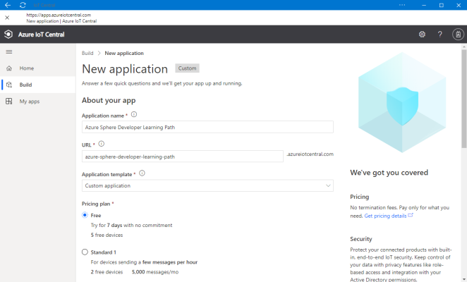
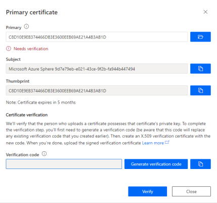
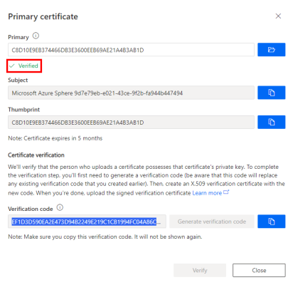

In this exercise, we'll build a high-level Azure Sphere application that connects and sends environment telemetry to Azure IoT Central.

## Step 1: Create a new Azure IoT Central application

1. Open this link in a new window: [Azure IoT Central](https://azure.microsoft.com/services/iot-central?azure-portal=true).

2. Click **Build a solution**.

3. You'll need to sign with your Microsoft personal, work, or school account. If you do not have a Microsoft account, then you can create one for free by using the **Create one!** link.

4. Expand the sidebar menu by clicking on the **Menu** icon.

   <!-- > [!div class="mx-imgBorder"]
   >  -->

   :::image type="content" source="../media/iot-central-burger-menu.png" alt-text="The illustration shows how to expand the sidebar menu.":::

5. Navigate to **Build**, and select **Custom apps**.

   <!-- > [!div class="mx-imgBorder"]
   >  -->

   :::image type="content" source="../media/iot-central-new-application.png" alt-text="The illustration shows how to create custom app.":::

6. Specify the **Application name**, specify the **URL**, select the **Free** pricing plan, and complete the registration form.

7. Click **Create**.

## Step 2: Establish trust between IoT Central and your Azure Sphere Tenant

1. If you're using Windows, open an Windows **PowerShell command line**. If you're using Linux, open **Terminal**.

2. Log in to your Azure Sphere tenant if you have not already done so.

   ```
   azsphere login
   ```

3. Make a note of the current directory or change to the **Azure-Sphere** directory. You'll need the name of this directory in the next step.

4. Download the certificate authority (CA) certificate for your Azure Sphere tenant:

   ```
   azsphere ca-certificate download --destination-file CAcertificate.cer
   ```

   The output file must have the .cer extension.

### Create an Enrollment Group

1. From IoT Central, go to **Administration** > **Device Connection**.

2. Click **+ Create an enrollment group**

3. Name the enrollment group **Azure Sphere**

4. Select Certificates (X.509) from the Attestation type dropdown.

5. Click Save

### Upload the Azure Sphere tenant CA certificate to Azure IoT Central and generate a verification code

1. Click **+ Manage primary**.

2. Click the folder icon next to the **Primary** box and navigate to the directory where you downloaded the certificate. If you don't see the .cer file in the list, make sure that the view filter is set to **All files (*)**. Select the certificate and then click the gear icon next to the **Primary** box.

3. The **Primary Certificate** dialog box appears. The **Subject** and **Thumbprint** fields contain information about the current Azure Sphere tenant and primary root certificate.

4. Click the **Generate verification code**.

5. Copy the verification code to the clipboard.

   <!-- > [!div class="mx-imgBorder"]
   >    -->

   :::image type="content" source="../media/iot-central-certificate-verify.png" alt-text="The illustration shows how to verify a certificate.":::

### Verify the tenant CA certificate

1. Return to the PowerShell Command Line or Linux Terminal.

2. Download a validation certificate that proves that you own the tenant CA certificate. Replace **<code\>** in the command with the verification code from the previous step.

   ```
   azsphere ca-certificate download-proof --destination-file ValidationCertification.cer --verification-code <code>
   ```

3. The Azure Sphere Security Service signs the validation certificate with the verification code to prove that you own the Certificate Authority (CA).

### Use the validation certificate to verify the tenant's identity

1. Return to Azure IoT Central and click **Verify**.

2. When prompted, select the validation certificate that you generated in the previous step. When the verification process is complete, the **Primary Certificate** dialog box displays the **Verified** message.

3. Click **Close** to dismiss the box.

   <!-- > [!div class="mx-imgBorder"]
   >  -->

   :::image type="content" source="../media/iot-central-certificate-verified.png" alt-text="The illustration shows a verified certificate.":::

4. Click **Save**.

After you complete these steps, any device that is claimed into your Azure Sphere tenant will automatically be enrolled in your Azure IoT Central application when it first connects.
