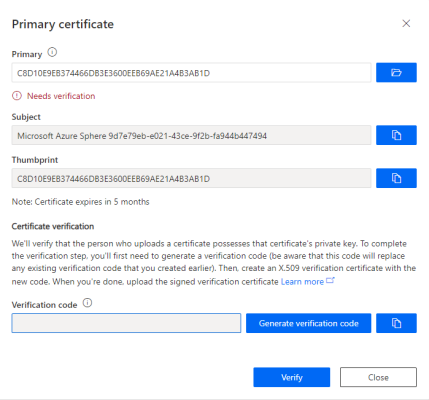
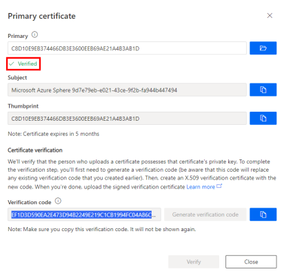

In this exercise, we'll build a high-level Azure Sphere application that connects and sends environment telemetry to Azure IoT Central.

## Step 1: Create a new Azure IoT Central application

1. Open the [Create IoT Central Application](https://portal.azure.com/#create/Microsoft.IoTCentral) page in a new browser window.
1. Sign in with an Azure account that has an active subscription. You should have at least **Contributor** access to the subscription or resource group where you create the application.
1. Enter the application details:

   | Field | Value |
   | --- | --- |
   | **Subscription** | The Azure subscription you want to use. |
   | **Resource group** | Create a new resource group or select an existing resource group. |
   | **Resource name** | A valid Azure resource name for the IoT Central application. |
   | **Application URL** | A unique subdomain for your application. The application URL looks like `https://<your-app-name>.azureiotcentral.com`. |
   | **Template** | **Custom application** |
   | **Region** | The Azure region you want to use. |
   | **Pricing plan** | Select a **Standard** plan, such as **Standard 2**. |

   Standard plans are billed on a per-device basis. They include two free devices plus a plan-specific monthly message allocation (S0: 400 messages/device/month; S1: 5,000; S2: 30,000); extra devices and usage beyond the included message allocation can affect charges. See [Azure IoT Central pricing](https://azure.microsoft.com/pricing/details/iot-central/?azure-portal=true) for current rates and the [Create an IoT Central application](https://learn.microsoft.com/azure/iot-central/core/howto-create-iot-central-application?azure-portal=true) article for details on the available plans.
1. Select **Review + create**, then select **Create**.
1. When the application is ready, open it from the Azure portal by selecting the application URL.

## Step 2: Establish trust between IoT Central and your Azure Sphere catalog

1. If you're using Windows, open a Windows **PowerShell command line**. If you're using Linux, open **Terminal**.
1. Sign in with Azure CLI if you have not already done so.

   ```
   az login
   ```
1. Select the Azure subscription that contains your Azure Sphere catalog, unless it's already the current default subscription. If you don't set it as the default, add `--subscription <subscription-id-or-name>` to each Azure Sphere resource command in this exercise.

   ```
   az account set --subscription <subscription-id-or-name>
   ```
1. Make a note of the current directory or change to a directory where you have write permission. You'll download certificate files to this directory.
1. Download the certificate authority (CA) certificate for your Azure Sphere catalog. Replace `<resource-group-name>` and `<catalog-name>` with your Azure Sphere resource group and catalog name.

   ```
   az sphere ca-certificate download --resource-group <resource-group-name> --catalog <catalog-name> --output-file CACertificate.cer
   ```

   The output file must have the .cer extension.

### Create an X.509 enrollment group

IoT Central manages group authentication settings as enrollment groups. In the UI, these settings are under **Device connection groups**.

1. From your IoT Central application, in the left pane select **Permissions**, then select **Device connection groups**.
1. Select **+ New**.
1. Name the enrollment group **Azure Sphere**.
1. Select **Certificates (X.509)** from the attestation type dropdown.
1. Select **Save**.

   The **ID scope** for your IoT Central application is shown on the device connection groups page. You'll use the ID scope in a later exercise.

### Upload the Azure Sphere catalog CA certificate to Azure IoT Central

1. In the **Azure Sphere** device connection group, scroll to **Certificates (X.509)**. Under **Primary**, select **Manage Primary**.
1. In the **Primary certificate** dialog box, select **Add certificate**. Navigate to the directory where you downloaded `CACertificate.cer`, select the certificate, and then select **Open**.
1. Verify the certificate by using one of the following options. Use automatic verification only when you trust the CA certificate and know that you own it; otherwise, use manual verification to prove possession with a verification certificate.

   - **Automatic verification**: Leave **Set certificate status to verified on upload** set to **On**, select **Upload**, confirm that the certificate status is **Verified**, and then select **Close**.
   - **Manual verification**: Set **Set certificate status to verified on upload** to **Off**, select **Upload**, select **Generate verification code**, and copy the verification code.

      Return to the PowerShell Command Line or Linux Terminal and download a validation certificate that proves that you own the catalog CA certificate. Replace `<code>` with the verification code from IoT Central.

      ```
      az sphere ca-certificate download-proof --resource-group <resource-group-name> --catalog <catalog-name> --verification-code <code> --output-file ValidationCertificate.cer
      ```

      The Azure Sphere Security Service signs the validation certificate with the verification code to prove that you own the CA.

      Return to Azure IoT Central, select **Verify**, and select `ValidationCertificate.cer`. When the verification process completes, the **Primary certificate** dialog box displays the **Verified** status. Select **Close**.

   <!-- > [!div class="mx-imgBorder"]
   >    -->

   :::image type="content" source="../media/iot-central-certificate-verify.png" alt-text="The illustration shows how to verify a certificate.":::

   <!-- > [!div class="mx-imgBorder"]
   >  -->

   :::image type="content" source="../media/iot-central-certificate-verified.png" alt-text="The illustration shows a verified certificate.":::
1. Select **Save** at the top of the device connection group page.

After you complete these steps, the IoT Central X.509 enrollment group trusts device authentication certificates issued by your Azure Sphere catalog CA. A catalog device can be authenticated by the Device Provisioning Service (DPS) and provisioned into this IoT Central application when its application connects with this app's ID scope, valid X.509 credentials, a unique device ID, and the model ID that IoT Central uses to assign the device template. If **Auto approve** is disabled for the device connection group, an operator may need to approve the device before it can start sending data.
