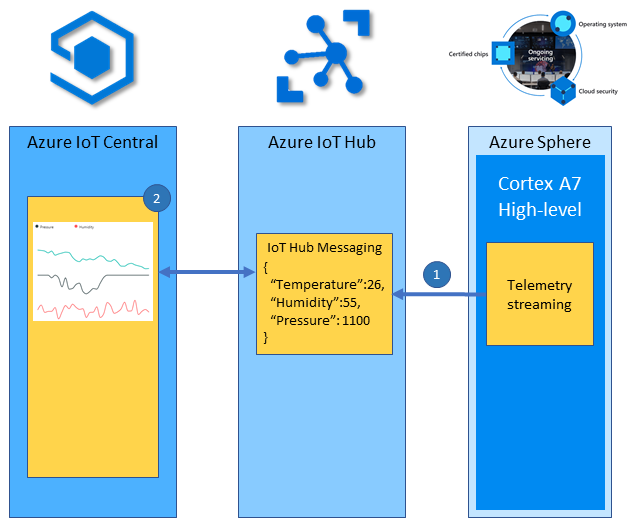
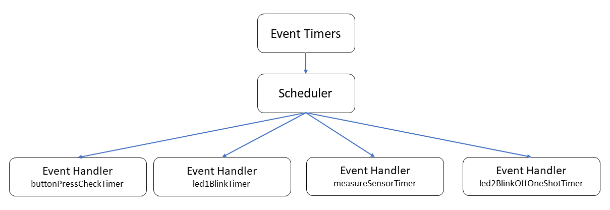

In this unit, you'll learn how to deploy a high-level application to your Azure Sphere and stream telemetry to IoT Central.

## Solution architecture

The following diagram outlines how Azure Sphere streams telemetry to IoT Central.



1. After provisioning through the IoT Central application's DPS ID scope, the device connects to the application's underlying IoT Hub. The high-level application running on the Cortex-A7 reads the environment sensors every 6 seconds, serializes the data as JSON, and sends telemetry through that connection.
1. Azure IoT Central ingests the telemetry from the underlying IoT Hub and displays the data to the user.

## Understanding the Azure Sphere application

These labs make extensive use of event timers, so there's a generalized model to simplify working with timers. Event-driven programming helps to simplify application design.

There are two types of timers:

- Periodic timers
- One-shot timers

Event timers generate events that are bound to handler functions, which implement desired actions.



The application declares a periodic **measureSensorTimer** event timer. When initialized, this timer triggers every 6 seconds calling the **MeasureSensorHandler** handler function.

```c
static LP_TIMER measureSensorTimer = {
    .period = { 6, 0 },
    .name = "measureSensorTimer",
    .handler = MeasureSensorHandler };
```

The **MeasureSensorHandler** function is called when the **measureSensorTimer** timer triggers.

The MeasureSensorHandler function reads the environment sensor, format the data into a JSON string, display the JSON data in the **Debug Console** during Visual Studio Code debugging, and then send the telemetry to Azure IoT Central.

```c
/// <summary>
/// Read sensor and send to Azure IoT
/// </summary>
static void MeasureSensorHandler(EventLoopTimer* eventLoopTimer)
{
    static int msgId = 0;
    static LP_ENVIRONMENT environment;

    if (ConsumeEventLoopTimerEvent(eventLoopTimer) != 0)
    {
        lp_terminate(ExitCode_ConsumeEventLoopTimeEvent);
    }
    else {
        if (lp_readTelemetry(&environment) &&
            snprintf(msgBuffer, JSON_MESSAGE_BYTES, msgTemplate,
                environment.temperature, environment.humidity, environment.pressure, msgId++) > 0)
        {
            Log_Debug("%s\n", msgBuffer);
            lp_azureMsgSendWithProperties(msgBuffer, telemetryMessageProperties, NELEMS(telemetryMessageProperties));
        }
    }
}
```

## Introduction to IoT Plug and Play

IoT Plug and Play enables solution builders to integrate smart devices with their solutions without any manual configuration. At the core of IoT Plug and Play, is a device model that a device uses to advertise its capabilities to an IoT Plug and Play-enabled application. To learn more, visit "[What is IoT Plug and Play](/azure/iot/overview-iot-plug-and-play?azure-portal=true)".

The IoT Plug and Play model for this learning module can be found in the **IoTPlugAndPlay** directory. This model has been uploaded to the public device model repository so IoT Central can discover it from the model ID.

The IoT Plug and Play model used by this learning module is declared in main.c.

```c
#define IOT_PLUG_AND_PLAY_MODEL_ID "dtmi:com:example:azuresphere:labmonitor;1"
```

IoT Central is an IoT Plug and Play-enabled application. When your device first connects to IoT Central, the device sends the IoT Plug and Play model ID. If a matching device template is already published in the application, IoT Central assigns the device to that template. If not, IoT Central looks for the model in the public device model repository and, when found, generates a basic device template from the model definition. You can then add or customize views in IoT Central for the visualizations and forms you want operators to use.
