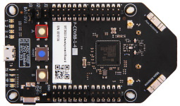

In this exercise, we'll deploy a high-level application to your Azure Sphere.

## Step 1: Open the sample project

1. Start Visual Studio Code.
1. Click **Open folder**.
1. Open the **Azure-Sphere** folder.
1. Open the **Lab_2_Send_Telemetry_to_Azure_IoT** folder.
1. Click **Select Folder** or the **OK** button to open the project.

## Step 2: Configure the Azure Sphere application

1. From Visual Studio Code, open the **app_manifest.json** file. The resources this application requires must be declared in the **Capabilities** section.

1. Update the connection properties for the Azure IoT Central application.

    - Keep the existing **SchemaVersion**, **Name**, **ComponentId**, **EntryPoint**, and **ApplicationType** fields.
    - Update **CmdArgs** with your Azure IoT Central ID scope. Keep the `--ConnectionType`, `DPS`, and `--ScopeID` entries, and replace only the scope ID value.
    - Preserve the existing **Gpio**, **I2cMaster**, and **PowerControls** capabilities from the sample manifest. The **PowerControls** entry is set to `[ "ForceReboot" ]` for the controlled-reboot lab later in this learning path. Because `ForceReboot` and `ForcePowerDown` allow an application to immediately terminate all running applications, applications that use these values **must** ensure the device can still receive Azure Sphere OS and application updates (see [Force Power Down and updates](/azure-sphere/app-development/power-down?view=azure-sphere-integrated#force-power-down-and-updates)). Remove **PowerControls** from production applications that don't call the power management APIs, and don't add `ForcePowerDown` or any other capability unless the application requires it.
    - Update **DeviceAuthentication** with the Azure Sphere (Legacy) tenant UUID for your catalog. With Azure Sphere Integrated, every catalog exposes this UUID through the Azure Sphere Catalog `properties.tenantId` field. Run the following Azure CLI command, using the resource group and catalog name for your Azure Sphere catalog:

      ```azurecli
      az sphere catalog show --resource-group <resource-group-name> --catalog <catalog-name> --query "properties.tenantId" --output tsv
      ```

      Use the returned GUID. This value is the legacy tenant UUID expected by `DeviceAuthentication`; don't use the Azure Resource Manager catalog resource ID. Catalogs that were migrated from Azure Sphere (Legacy) also expose the same value via `tags.MigratedCatalogId` for backward compatibility, but `properties.tenantId` works for every Azure Sphere catalog.

1. Update the **AllowedConnections** with the Azure IoT Central application endpoints you copied to Notepad.

1. You can format the app_manifest.json document by right-clicking the document and selecting **Format Document** from the context menu.

1. Review your updated **app_manifest.json** file. It should look similar to the following.

    ```json
    {
        "SchemaVersion": 1,
        "Name": "AzureSphereIoTCentral",
        "ComponentId": "25025d2c-66da-4448-bae1-ac26fcdd3627",
        "EntryPoint": "/bin/app",
        "CmdArgs": [ "--ConnectionType", "DPS", "--ScopeID", "0ne0099999D" ],
        "Capabilities": {
            "Gpio": [
                "$NETWORK_CONNECTED_LED",
                "$LED_RED",
                "$LED_GREEN",
                "$LED_BLUE"
            ],
            "I2cMaster": [
                "$I2cMaster2"
            ],
            "PowerControls": [
                "ForceReboot"
            ],
            "AllowedConnections": [
                "global.azure-devices-provisioning.net",
                "iotc-9999bc-3305-99ba-885e-6573fc4cf701.azure-devices.net",
                "iotc-789999fa-8306-4994-b70a-399c46501044.azure-devices.net",
                "iotc-7a099966-a8c1-4f33-b803-bf29998713787.azure-devices.net",
                "iotc-97299997-05ab-4988-8142-e299995acdb7.azure-devices.net",
                "iotc-d099995-7fec-460c-b717-e99999bf4551.azure-devices.net",
                "iotc-789999dd-3bf5-49d7-9e12-f6999991df8c.azure-devices.net",
                "iotc-29999917-7344-49e4-9344-5e0cc9999d9b.azure-devices.net",
                "iotc-99999e59-df2a-41d8-bacd-ebb9999143ab.azure-devices.net",
                "iotc-c0a9999b-d256-4aaf-aa06-e90e999902b3.azure-devices.net",
                "iotc-f9199991-ceb1-4f38-9f1c-13199992570e.azure-devices.net"
            ],
            "DeviceAuthentication": "9d7e79eb-9999-43ce-9999-fa8888888894"
        },
        "ApplicationType": "Default",
        "MallocVersion": 2
    }
    ```

    > [!NOTE]
    > `"MallocVersion": 2` opts in to the mallocng allocator, which the [app_manifest reference](/azure-sphere/app-development/app-manifest?view=azure-sphere-integrated) recommends for all new Azure Sphere applications. The official Azure Sphere AzureIoT sample sets the same value.

1. Save the updated app_manifest.json file.

1. **IMPORTANT**. Copy the contents of your **app_manifest.json** file to Notepad or your text editor of choice, as you'll need this configuration information for the next labs.

## Step 3: Select your developer board configuration

These labs support developer boards from Avnet and Seeed Studio. The default developer board configuration is the Avnet Azure Sphere Starter Kit Revision 1. Select exactly one board configuration in **CMakeLists.txt**.

1. Open **CMakeLists.txt**.
1. If you're using the Avnet Azure Sphere Starter Kit Revision 1, leave the **set AVNET** line uncommented and leave all other board lines commented. No **CMakeLists.txt** change is required.
1. If you're using any other supported board, add **#** at the beginning of the **set AVNET** line to disable it, and then uncomment exactly one **set** command that matches your Azure Sphere developer board. Only one board line should be uncommented.

    ```text
    set(AVNET TRUE "AVNET Azure Sphere Starter Kit Revision 1 ")
    # set(AVNET_REV_2 TRUE "AVNET Azure Sphere Starter Kit Revision 2 ")
    # set(SEEED_STUDIO_RDB TRUE "Seeed Studio Azure Sphere MT3620 Development Kit (aka Reference Design Board or rdb)")
    # set(SEEED_STUDIO_MINI TRUE "Seeed Studio Azure Sphere MT3620 Mini Dev Board")
    ```
1. Save the file. Visual Studio Code and CMake Tools will update the CMake configuration for the selected board.

## Step 4: Build and sideload the application to Azure Sphere

This step uses Visual Studio Code to build the high-level application, create an image package, sideload it to the attached Azure Sphere device, and start a debug session. Sideloading is a local development deployment over USB; it is different from a cloud deployment through the Azure Sphere Security Service to a product and device group. The attached device must be enabled for development and debugging before you can sideload.

### Start the app build and sideload process

1. Open **main.c**.

1. Select **CMake: [Debug]: Ready** from the Visual Studio Code status bar.

   <!--  -->

   :::image type="content" source="../media/visual-studio-code-start-application.png" alt-text="The illustration shows CMake status.":::

1. From Visual Studio Code, press F5 to build, create the image package, sideload it to the attached device, start the application, and attach the remote debugger to the application now running on the Azure Sphere device.

1. Try setting a breakpoint in the **MeasureSensorHandler** function. This sensor timer runs every 6 seconds.

    The connection-status LED timer runs every 5 seconds.

    > [!NOTE]
    > You can learn how to set breakpoints from this [Visual Studio Code Debugging](https://code.visualstudio.com/docs/editor/debugging#_debug-actions?azure-portal=true) article.

### View debugger output

1. Select the Visual Studio Code **Output** tab to monitor CMake, build, image package, and sideload progress.

   > [!TIP]
   > You can open the output tab by using the Visual Studio Code **Ctrl+Shift+U** shortcut or clicking the **Output** tab.
1. Select the **Debug Console** to view debugger output and messages from **Log_Debug** statements in the code. After sideloading completes, Visual Studio Code typically focuses the Debug Console.
1. In the Debug Console, you'll see the device establish networking, DPS provisioning, and the secured IoT Hub connection, and then it will start sending telemetry to Azure IoT Central.

    > [!NOTE]
    > During startup, you may briefly see transient IoT status messages while networking, DPS provisioning, and IoT Hub connection setup complete, such as `IOTHUB_CLIENT_CONNECTION_NO_NETWORK` or `device auth not ready`. If errors such as `ERROR: Failed to create client IoT Hub Client Handle` persist and telemetry doesn't appear, recheck the ID scope, **AllowedConnections**, **DeviceAuthentication**, Wi-Fi/network connectivity, and IoT Central device approval state. For more detail, see the [Azure IoT troubleshooting guide](https://github.com/Azure/azure-sphere-samples/blob/main/Samples/AzureIoT/AzureIoTTroubleshooting.md).

## Step 5: Expected device behavior

### Azure Sphere MT3620 Starter Kit Revision 1 and 2


1. The WLAN LED will blink every 5 seconds when connected to Azure.

### Seeed Studio Azure Sphere MT3620 Development Kit



1. The WLAN LED will blink every 5 seconds when connected to Azure.

### Seeed Studio MT3620 Mini Dev Board


1. The User LED will blink every 5 seconds when connected to Azure.

## Step 6: Display the device telemetry in IoT Central

1. Switch back to the **IoT Central** web portal.

1. From the sidebar menu, select **Devices**, then the **Learning Path Lab Monitor** template, then your **device**.

    The device name is your Azure Sphere Device ID. You can display your Device ID for the attached device by running the following command from the Windows **PowerShell command line** or Linux **Terminal**.

    ```azurecli
    az sphere device show-attached
    ```

    If more than one device is attached, list the attached devices with `az sphere device list-attached`, then add `--device <DeviceIdValue>` to target the correct device. To show the device record in your Azure Sphere catalog, use your resource group, catalog name, and device ID:

    ```azurecli
    az sphere device show --resource-group <resource-group-name> --catalog <catalog-name> --device <DeviceIdValue>
    ```

1. Select the **Overview** tab to view the device telemetry.

1. Optional. You can also rename your device. Click the **Rename** button and give your device a friendly name.

    > [!NOTE]
    > Azure IoT Central does not update immediately. It may take a minute or two for the temperature, humidity, and pressure telemetry to be displayed. You can check that data is flowing into IoT Central by checking the **Raw data** tab.

:::image type="content" source="../media/iot-central-display-measurements.png" alt-text="The illustration shows how to display measurements.":::

## Close Visual Studio Code

Now close Visual Studio Code.
