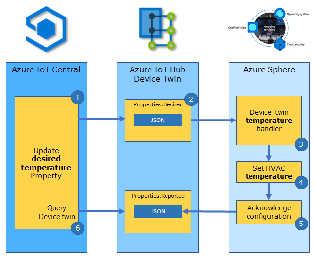
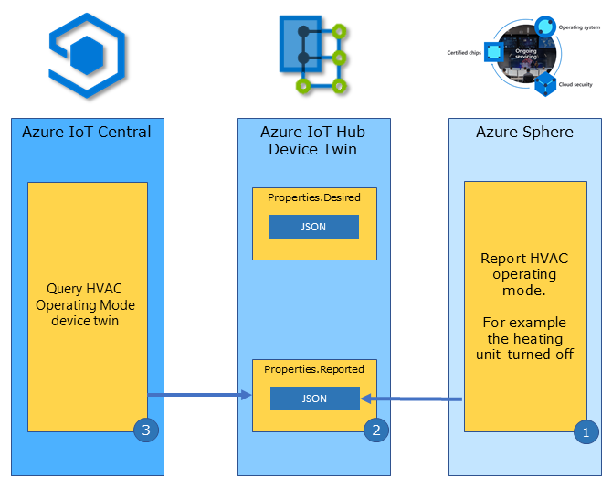
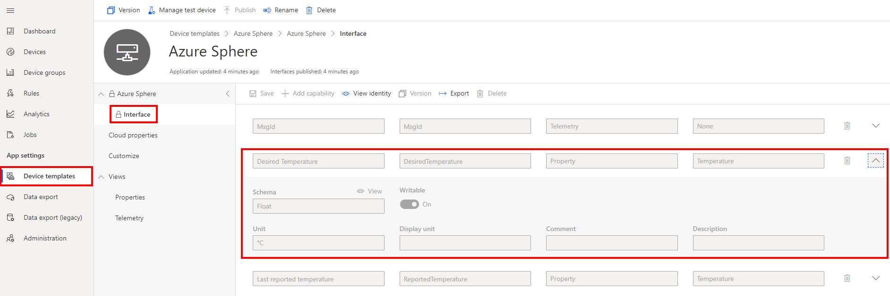

In this unit, you will learn how to control an Azure Sphere connected heating, ventilation, and air conditioning unit (HVAC) from Azure IoT Central.

<!-- ------

## Azure IoT cloud-to-device control

Azure IoT Central uses Azure IoT Hub to control devices. Options to control devices include:

- **Direct methods** for control that require immediate confirmation of the result. Direct methods are often used for interactive control of devices, such as turning on a fan.
- **Device twins** are for long-running commands intended to put the device into a certain desired state. For example, set the desired room temperature.

This unit will cover Azure IoT Hub device twins and how **DeviceTwinBindings** simplify the use of Azure IoT device twins. -->

------

## Understanding IoT Central properties

Azure IoT Central uses properties to represent point-in-time values. IoT Central can use properties to set state on a device, for example, set the desired room temperature. A device can also use properties to report its current state, for example, report the operating mode of an HVAC (Heating, Ventilation, and Air Conditioning) unit, is it currently heating, cooling, or turned off.

IoT Central is an Azure IoT Hub application and it sets device properties using IoT Hub device twins. Device twins are JSON documents that Azure IoT Hub keeps in the cloud for all devices and is used for storing device information, including metadata, configurations, and conditions. IoT Hub device twins are often used for long-running commands intended to put the device into a certain state and return it to that state after a device restart. For example, setting the desired room temperature.

Properties can be used in the following ways:

- Cloud-to-device updates
- Device-to-cloud updates
- Querying reported properties

<!-- ### Using device twins

- Cloud-to-device updates.

    A user sets an Azure IoT Central device property such as setting the desired temperature of the room. Azure IoT Central requests Azure IoT Hub to send a device twin message to the device. The device actions and acknowledges the request. Azure IoT Hub updates the device twin reported property and IoT Central can then query and display this reported property.

- Device-to-cloud updates.

    A device can send a device twin message for a reported property to Azure IoT Hub, such as reporting its firmware level on startup. Azure IoT Hub stores the reported property.

- Querying reported properties.

    With the reported state of device twins stored in Azure, it is possible to query the stored device twin properties on the cloud side. For example, list all devices with a firmware version less than 2.0, as these devices require an update. Or, list all rooms with a temperature setting higher than 25 degrees Celsius. -->

------

## Controlling the heating, ventilation, and air conditioning unit (HVAC) using Azure IoT Central properties

From the IoT Central device properties tab, you can set the desired temperature property. Azure IoT Central requests Azure IoT Hub to send a device twin message to the device. The device actions and acknowledges the request. Azure IoT Hub updates the device twin reported property and IoT Central then queries and display this reported property.



### Steps to controlling the HVAC unit from IoT Central

The following steps outline how Azure IoT Central uses device twins to set properties on a device:

1. A user sets the desired room temperature property in Azure IoT Central. IoT Central then requests IoT Hub to update the property.
1. Azure IoT Hub updates the device twin desired property and sends a device twin message to the device.
1. The corrosponding device twin handler function is called.
1. The device implements the desired property; in this case, turn on the heater or cooler to bring the room to the desired temperature.
1. The device acknowledges the updated configuration to Azure IoT Hub. Azure IoT Hub updates the device twin reported property.
1. IoT Central queries and displays the device twin reported property data to the user.

------

## Getting started with device twin bindings

Remember, Azure IoT Central properties are implemented using Azure IoT Hub device twins. A device twin binding maps a device twin property name with a handler function that will be called to implement the action.

The following example declares a Device Twin Binding to set the desired room temperature. This declaration maps the Azure IoT Central `DesiredTemperature` property with a handler function named `DeviceTwinSetTemperatureHandler`.

```c
static LP_DEVICE_TWIN_BINDING dt_desiredTemperature = {
    .twinProperty = "DesiredTemperature",
    .twinType = LP_TYPE_FLOAT,
    .handler = DeviceTwinSetTemperatureHandler };
```

### Setting the desired temperature

The following is the implementation of the handler function `DeviceTwinSetTemperatureHandler`. The handler function is called when the device receives a `DesiredTemperature` desired property message from Azure IoT Hub.

> [!NOTE]
> As part of the [IoT Plug and Play](https://docs.microsoft.com/en-us/azure/iot-pnp/concepts-convention) conventions, the device should acknowledge the device twin update with a call to **lp_deviceTwinAckDesiredState**.

```c
/// <summary>
/// Device Twin Handler to set the desired temperature value
/// </summary>
static void DeviceTwinSetTemperatureHandler(LP_DEVICE_TWIN_BINDING* deviceTwinBinding)
{
    // validate data is sensible range before applying
    if (deviceTwinBinding->twinType == LP_TYPE_FLOAT && *(float*)deviceTwinBinding->twinState >= -20.0f && *(float*)deviceTwinBinding->twinState <= 80.0f)
    {
        lp_deviceTwinAckDesiredState(deviceTwinBinding, deviceTwinBinding->twinState, LP_DEVICE_TWIN_COMPLETED);
        SetHvacStatusColour((int)previous_temperature);
    }
    else {
        lp_deviceTwinAckDesiredState(deviceTwinBinding, deviceTwinBinding->twinState, LP_DEVICE_TWIN_ERROR);
    }
}
```

------

## Reporting the current HVAC operating mode

The HVAC operating mode depends on the room temperature, it can be heating, or cooling, or turned off. We can use a device-to-cloud device twin update to report the current operating mode of the HVAC unit.

### Device-to-cloud updates



1. The Azure Sphere detects the HVAC operating mode has changed.
1. The Azure Sphere sends a device twin message to report the new operating mode of the HVAC to Azure IoT Hub.
1. IoT Central queries and displays the updated operating mode of the HVAC unit.

The following example declares a **ReportedHvacState** device twin property of type **string**. A handler function is not required as this is a one-way device-to-cloud binding.

```c
static LP_DEVICE_TWIN_BINDING dt_reportedHvacState = {
    .twinProperty = "ReportedHvacState",
    .twinType = LP_TYPE_STRING };
```

The device updates the **ReportedHvacState** property by calling the **lp_deviceTwinReportState** function. You must pass a property of the correct type.

```c
lp_deviceTwinReportState(&dt_reportedHvacState, (void*)hvacState[(int)current_led]);
```

------

## How device twin messages are mapped to handlers

All declared device twin bindings must be added by reference to the deviceTwinBindingSet array. When a device twin message is received by the device from Azure IoT Hub it is checked for a matching *twinProperty* name in the deviceTwinBindingSet array. When a match is found, the corresponding handler function is called.

```c
LP_DEVICE_TWIN_BINDING* deviceTwinBindingSet[] = { &dt_desiredTemperature, &dt_reportedTemperature, &dt_reportedHvacState };
```

### Opening the device twin binding set

Device twin binding sets are initialized in the **InitPeripheralsAndHandlers** function in **main.c**.

```c
lp_deviceTwinSetOpen(deviceTwinBindingSet, NELEMS(deviceTwinBindingSet));
```

### Closing the device twin binding set

Device twin bindings sets are closed in the **ClosePeripheralsAndHandlers** function in **main.c**.

```c
lp_deviceTwinSetClose();
```

------

## Azure IoT Central device properties

Azure IoT Central device properties are defined in device templates.

[](../media/iot-central-device-template-interface-led1.png)

### Review the IoT Central property definition 

1. From Azure IoT Central web portal, navigate to **Device templates**, and select the **Azure Sphere** template.
2. Click on **Interface** to list the interface capabilities.
3. Scroll down and expand the **Desired Temperature** capability.
4. Review the definition of **Desired Temperature**. The capability type is **Property**, the schema type is **Float**, and the property is **Writeable**. Writeable means this property is enabled for cloud-to-device updates.
5. This must match the DesiredTemperature Device Twin Binding declaration on the Azure Sphere.
