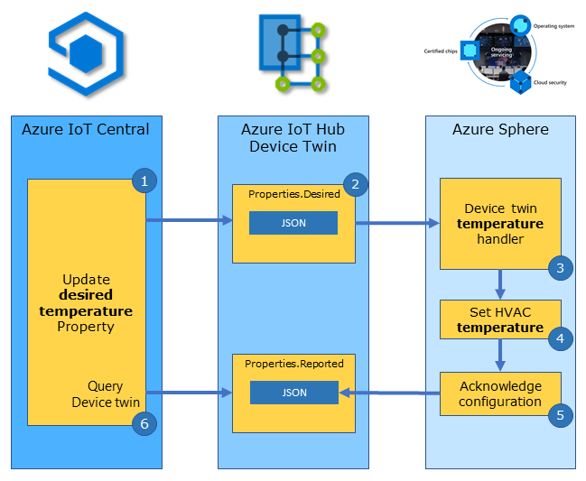
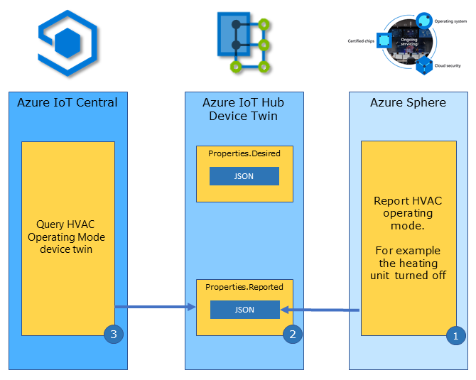
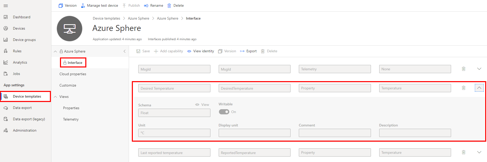

In this unit, you will learn how to control an Azure Sphere connected heating, ventilation, and air conditioning unit (HVAC) from Azure IoT Central.

## Understanding IoT Central properties

Azure IoT Central uses properties to represent point-in-time values. Read-only properties let a device report state, such as the operating mode of an HVAC (Heating, Ventilation, and Air Conditioning) unit. Writable properties let an operator set desired state, such as the target room temperature.

IoT Central is built on Azure IoT Hub and synchronizes device properties by using IoT Hub device twins. Device twins are JSON documents that Azure IoT Hub keeps in the cloud for each device to store metadata, configurations, and conditions. Use writable properties and device twin desired properties for durable configuration or state changes that should be retained and re-applied after a device reconnects or restarts, such as setting a desired room temperature.

Properties can be used in the following ways:

- Writable cloud-to-device property updates
- Read-only device-to-cloud reported property updates
- Querying reported property state

## Controlling the heating, ventilation, and air conditioning unit (HVAC) using Azure IoT Central properties

From the IoT Central device properties view, you can set the **DesiredTemperature** writable property. Azure IoT Central requests Azure IoT Hub to update the device twin desired property. The device receives the desired property update, applies or rejects it, and acknowledges it by sending a reported property with an IoT Plug and Play acknowledgment that includes the acknowledged value, an HTTP-style status code (`ac`), the desired-property version (`av`), and an optional acknowledgment description (`ad`). IoT Central then displays the reported property value and status.



### Steps to controlling the HVAC unit from IoT Central

The following steps outline how Azure IoT Central uses device twins to set properties on a device:

1. A user sets the desired room temperature writable property in Azure IoT Central. IoT Central then requests IoT Hub to update the device twin desired property.
1. Azure IoT Hub updates the device twin desired property and notifies the device.
1. The corresponding device twin handler function is called.
1. The device validates and implements the desired property; in this case, turn on the heater or cooler to bring the room to the desired temperature.
1. The device acknowledges the updated configuration to Azure IoT Hub by sending a reported property response that includes the acknowledged value, an HTTP-style status code (`ac`), the desired-property version (`av`), and an optional acknowledgment description (`ad`).
1. IoT Central displays the reported property value and acknowledgment status to the user.

## Getting started with device twin bindings

Remember, Azure IoT Central properties are implemented using Azure IoT Hub device twins. A device twin binding maps a device twin property name with a handler function that will be called to implement the action.

The following example declares a Device Twin Binding to set the desired room temperature. This declaration maps the Azure IoT Central `DesiredTemperature` property with a handler function named `DeviceTwinSetTemperatureHandler`.

> [!NOTE]
> Throughout this learning module, types and functions named with the `LP_` / `lp_` prefix (such as `LP_DEVICE_TWIN_BINDING` and `lp_deviceTwinAckDesiredState`) come from the Learning Path helper library bundled with the lab projects. They wrap the underlying Azure Sphere SDK and Azure IoT C SDK device-twin and direct-method APIs to reduce boilerplate. They are not part of the Azure Sphere `applibs` or the Azure IoT C SDK and won't be found in those reference docs.

```c
static LP_DEVICE_TWIN_BINDING dt_desiredTemperature = {
    .twinProperty = "DesiredTemperature",
    .twinType = LP_TYPE_FLOAT,
    .handler = DeviceTwinSetTemperatureHandler };
```

### Setting the desired temperature

The following is the implementation of the handler function `DeviceTwinSetTemperatureHandler`. The handler function is called when the device receives a `DesiredTemperature` desired property message from Azure IoT Hub.

> [!NOTE]
> As part of the [IoT Plug and Play writable property conventions](https://learn.microsoft.com/azure/iot/concepts-convention#writable-properties), the device should acknowledge the desired property update with a call to **lp_deviceTwinAckDesiredState**.

```c
/// <summary>
/// Device Twin Handler to set the desired temperature value
/// </summary>
static void DeviceTwinSetTemperatureHandler(LP_DEVICE_TWIN_BINDING* deviceTwinBinding)
{
    // validate data is sensible range before applying
    if (deviceTwinBinding->twinType == LP_TYPE_FLOAT && *(float*)deviceTwinBinding->twinState >= -20.0f && *(float*)deviceTwinBinding->twinState <= 80.0f)
    {
        lp_deviceTwinAckDesiredState(deviceTwinBinding, deviceTwinBinding->twinState, LP_DEVICE_TWIN_COMPLETED);
        SetHvacStatusColour((int)previous_temperature);
    }
    else {
        lp_deviceTwinAckDesiredState(deviceTwinBinding, deviceTwinBinding->twinState, LP_DEVICE_TWIN_ERROR);
    }
}
```

## Reporting the current HVAC operating mode

The HVAC operating mode depends on the room temperature. It can be heating, cooling, or turned off. We can use a read-only device property, implemented as a device twin reported property, to report the current operating mode of the HVAC unit.

### Device-to-cloud updates



1. The Azure Sphere application detects the HVAC operating mode has changed.
1. The Azure Sphere application sends a device twin reported property update with the new operating mode of the HVAC to Azure IoT Hub.
1. IoT Central queries and displays the updated operating mode of the HVAC unit.

The following example declares a read-only **ReportedHvacState** device twin property of type **string**. A handler function is not required because this is a one-way device-to-cloud reported property binding.

```c
static LP_DEVICE_TWIN_BINDING dt_reportedHvacState = {
    .twinProperty = "ReportedHvacState",
    .twinType = LP_TYPE_STRING };
```

The device updates the **ReportedHvacState** property by calling the **lp_deviceTwinReportState** function. You must pass a property of the correct type.

```c
lp_deviceTwinReportState(&dt_reportedHvacState, (void*)hvacState[(int)current_led]);
```

## How device twin messages are mapped to handlers

All declared device twin bindings must be added by reference to the deviceTwinBindingSet array. When a desired property update is received by the device from Azure IoT Hub, it is checked for a matching *twinProperty* name in the deviceTwinBindingSet array. When a match is found for a writable property, the corresponding handler function is called. Reported-only bindings do not need a handler.

```c
LP_DEVICE_TWIN_BINDING* deviceTwinBindingSet[] = { &dt_desiredTemperature, &dt_reportedTemperature, &dt_reportedHvacState };
```

### Opening the device twin binding set

The device twin binding set is initialized in the **InitPeripheralsAndHandlers** function in **main.c**.

```c
lp_deviceTwinSetOpen(deviceTwinBindingSet, NELEMS(deviceTwinBindingSet));
```

### Closing the device twin binding set

The device twin bindings set is closed in the **ClosePeripheralsAndHandlers** function in **main.c**.

```c
lp_deviceTwinSetClose();
```

## Azure IoT Central device properties

IoT Central properties are defined in the device template model. In this example, the **DesiredTemperature** property schema type is **Float**, and the property is **Writable**. Writable means IoT Central can send property updates to the device, and the device should report an acknowledgment. The property name must match the **DesiredTemperature** device twin binding declaration on the Azure Sphere device.

<!-- > [!div class="mx-imgBorder"]
> [](../media/iot-central-device-template-interface-led1.png) -->

:::image type="content" source="../media/iot-central-device-template-interface-led1.png" alt-text="The illustration shows device properties.":::
