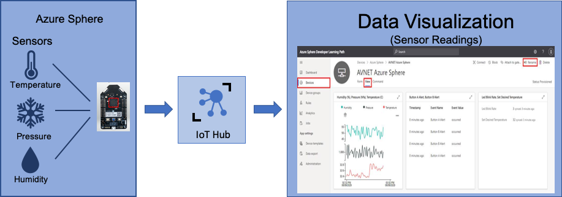

Building and running an application on microcontroller IoT devices can be challenging. You might have problems securely capturing and transferring the data to a server, or with developing the application.

With Azure Sphere, you can build IoT solutions that help secure your device, your application, and your data in transit. You can build applications with Visual Studio, Visual Studio Code, or that integrate with your existing toolchains on Windows and Linux. Visual Studio and Visual Studio Code development environments provide integrated microcontroller debuggers, full source code control, and collaboration and productivity tools.

## Measuring the environment

Suppose you're a scientist in a microbiology laboratory. You're responsible for storing samples from tests, and you want to build a system that monitors the environment around the laboratory equipment in real time. This system will monitor the following room conditions:

- Pressure
- Light
- Temperature
- Humidity

Previously, these were recorded manually by lab assistants, using sensors at regular intervals. Manual recording of ambient conditions is a tedious job that's  prone to human error. Having any issues with the sensors would invalidate the tests performed in the lab environment. 

Maintaining the room conditions accurately is critical for managing the laboratory. The lab needs to maintain the right conditions to help you get more accurate results. Any variation in the conditions can affect the equipment temperature during the storage and manipulation of the samples, specimens, and lab equipment. This can affect the ability to produce the correct and stable results, and can also have an economic impact on the organization.

## Proposed new system

The proposed new system needs the following:

- Sensors within the lab at multiple points.
- These sensors automate the reading of air pressure, temperature, humidity, and light conditions at defined intervals.
- The sensor data from the devices is transmitted securely for the analysis of data trends.

This solution thus provides a platform to create secure IoT solutions, without worrying about the underlying security vulnerabilities. Additionally, the system can trigger an alarm or alert message to a concerned authority when any of the defined variables drops below a specific threshold range.

## Learning objectives

In this module, you will:

- Create an Azure IoT hub and device provisioning services.
- Configure your Azure Sphere device application to Azure IoT Hub.
- Build and deploy the Azure Sphere application.
- View the environment telemetry from Azure Cloud Shell.
- Control an Azure Sphere application by using Azure IoT Hub direct method.

## Prerequisites

- Azure Sphere kit
- Visual Studio Code installed in your computer
- Ability to use Visual Studio Code
- Git installed on your computer
- Ability to use Git/GitHub
- Basic knowledge of Azure Sphere
- Basic knowledge of Azure IoT
