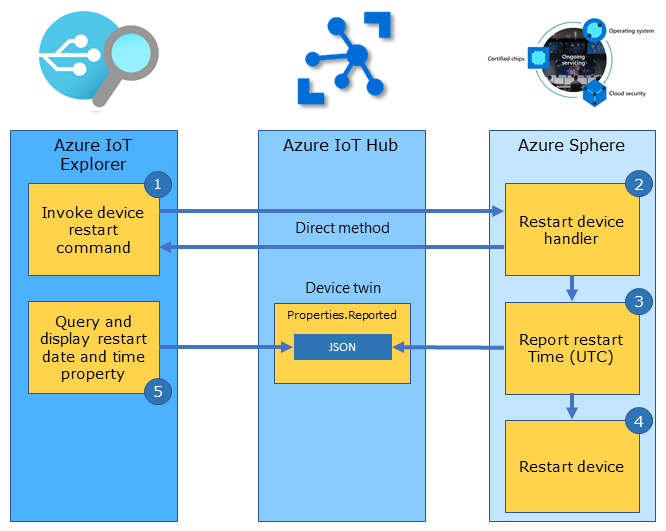

You'll learn how to control an Azure Sphere application by using Azure IoT Hub direct method. This unit also explains direct method bindings to simplify the implementation of Azure IoT.

## Azure IoT direct method

The following diagram shows how Azure IoT direct method works:



## Steps to manage cloud-to-device control

Take the following steps to use Azure IoT Hub direct method for cloud-to-device control.

1. Azure IoT Hub sends a direct method message to the device. For example, you might want to reset the device. This message includes the method name and an optional payload.
2. The device receives the direct method message and calls the associated handler function.
3. The device implements the direct method (in this case, to reset the device).
4. The device responds with an HTTP status code, and optionally with a response message.

## Direct method bindings

Direct method bindings map a direct method with a handler function that implements an action.

### Cloud-to-device commands

#### Define the reset device binding

In **main.c**, the variable named `resetDevice` of type `DirectMethodBinding` is declared. This variable maps the Azure IoT hub direct method `ResetMethod` command with a handler function named `ResetDirectMethod`.

```
static LP_DIRECT_METHOD_BINDING resetDevice = { 
	.methodName = "ResetMethod", 
	.handler = ResetDirectMethodHandler 
};
```

## Direct method handler function

1. Typically, an Azure IoT hub application invokes the `Reset Azure Sphere` command.

   A direct method named `ResetMethod`, along with a JSON payload, is sent to the device. The JSON payload `{"reset_timer":5}` specifies how many seconds to wait before resetting the device.

2. The `ResetDirectMethod` function handler is called.

   When the device receives a direct method message, the `DirectMethodBindings` set is checked for a matching `DirectMethodBinding` `methodName` name. When a match is found, the associated `DirectMethodBinding` handler function is called.

3. The current UTC time is reported to Azure IoT by using a device twin binding property named `DeviceResetUTC`.

4. The direct method responds with an HTTP status code and a message.

5. The device is reset.

6. Your application can then query the `DeviceResetUTC` device twin report property.


```
/// <summary>
/// Start Device Power Restart Direct Method 'ResetMethod' {"reset_timer":5}
/// </summary>
static LP_DIRECT_METHOD_RESPONSE_CODE ResetDirectMethodHandler(JSON_Object* json, LP_DIRECT_METHOD_BINDING* directMethodBinding, char** responseMsg)
{
	const char propertyName[] = "reset_timer";
	const size_t responseLen = 60; // Allocate and initialize a response message buffer. The calling function is responsible for the freeing memory
	static struct timespec period;

	*responseMsg = (char*)malloc(responseLen);
	memset(*responseMsg, 0, responseLen);

	if (!json_object_has_value_of_type(json, propertyName, JSONNumber))
	{
		return LP_METHOD_FAILED;
	}
	int seconds = (int)json_object_get_number(json, propertyName);

	// leave enough time for the device twin deviceResetUtc to update before restarting the device
	if (seconds > 2 && seconds < 10)
	{
		// Report Device Reset UTC
		lp_deviceTwinReportState(&deviceResetUtc, lp_getCurrentUtc(msgBuffer, sizeof(msgBuffer))); // LP_TYPE_STRING

		// Create Direct Method Response
		snprintf(*responseMsg, responseLen, "%s called. Reset in %d seconds", directMethodBinding->methodName, seconds);

		// Set One Shot LP_TIMER
		period = (struct timespec){ .tv_sec = seconds, .tv_nsec = 0 };
		lp_setOneShotTimer(&resetDeviceOneShotTimer, &period);

		return LP_METHOD_SUCCEEDED;
	}
	else
	{
		snprintf(*responseMsg, responseLen, "%s called. Reset Failed. Seconds out of range: %d", directMethodBinding->methodName, seconds);
		return LP_METHOD_FAILED;
	}
}
```

## Work with direct method binding

You must add direct method bindings to the `directMethodBindingSet`. When a direct method message is received from Azure, this set is checked for a matching `methodName` name. When a match is found, the corresponding handler function is called.

```
LP_DIRECT_METHOD_BINDING* directMethodBindingSet[] = { &resetDevice };
```

### Opening

Sets are initialized in the `InitPeripheralsAndHandlers` function found in **main.c**.

```
lp_openDirectMethodSet(directMethodBindingSet, NELEMS(directMethodBindingSet));
```

### Dispatching

When a direct method message is received, the set is checked for a matching `methodName` name. When a match is found, the corresponding handler function is called.

### Closing

Sets are closed in the `ClosePeripheralsAndHandlers` function found in **main.c**.

```
lp_closeDirectMethodSet();
```
