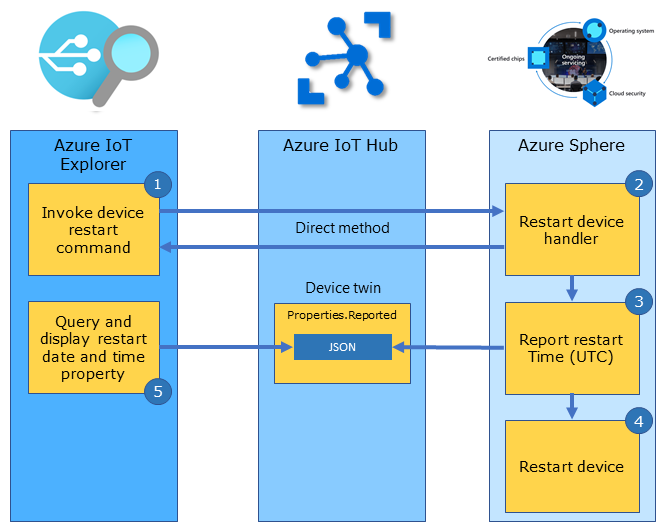

In this unit, you will learn how to remotely restart an Azure Sphere device from Azure IoT Explorer.

## Understanding IoT Hub direct method commands

Azure IoT Hub uses direct method commands to invoke an action on a device. Commands are often used for interactive control of devices, such as turning on a fan, a light, or in the case of this unit, to restart the Azure Sphere.

IoT Hub direct methods represent a request-reply interaction with a device, similar to an HTTP call: the call returns either a success or a failure result within a configurable timeout window. The response timeout (`responseTimeoutInSeconds`) defaults to 30 seconds and is configurable between 5 and 300 seconds (5 minutes). The connect timeout (`connectTimeoutInSeconds`) defaults to 0 seconds — meaning the device must already be online when the method is invoked — and can be set up to 300 seconds. Direct-method request and response payloads are JSON documents and are each limited to 128 KB. This pattern is useful when the next step depends on whether the device responded in time. See [Understand and invoke direct methods from IoT Hub](/azure/iot-hub/iot-hub-devguide-direct-methods?azure-portal=true).

> [!NOTE]
> There are several reasons you might need to remotely restart an Azure Sphere device. Azure Sphere checks for OS and application updates each time it boots, when it initially connects to the internet, and at 24-hour intervals thereafter. You may have an operational reason to force an update check sooner by restarting the device.

## Remote restarting an Azure Sphere

From the IoT Explorer you can invoke a direct method command to restart the device. You need to set the number of seconds the device will wait before restarting. Azure IoT Hub sends a direct method message with an optional payload to the device. The device responds with a status code and optionally a message indicating if the command succeeded or failed.



### Steps to restarting an Azure Sphere from Azure IoT Explorer

The following steps outline how Azure IoT Explorer and Azure IoT Hub direct methods are used for cloud-to-device control.

1. From Azure IoT Explorer you can invoke the **Restart Device** IoT Hub direct method command.
1. Azure IoT Hub then sends the direct method command message to the device.
1. On the Azure Sphere, the **RestartDeviceHandler** function is called.
1. Next the device sends a device twin reported property update for **ReportedRestartUTC** to Azure IoT Hub to record the time the restart was requested.
1. When Azure IoT Explorer invokes the direct method through the IoT Hub Service API, IoT Hub returns an HTTP response for the service-side invoke operation. If the device receives and responds to the request, the HTTP response body contains the device-supplied status code (an integer set by the device handler — for example `200` for success, `404` if the requested method isn't found, or `500` for a generic device-side failure) and the device's JSON response payload. If the device is offline or doesn't respond within the timeout configured by the caller (default 30 seconds, maximum 300 seconds), IoT Hub returns an error such as a timeout instead of a queued command.
1. The Azure Sphere is then restarted.
1. Azure IoT Explorer queries and displays the device **ReportedRestartUTC** property.

## Getting started with direct method bindings

A direct method binding maps an IoT Hub direct method command name with a handler function that will be called to implement the action.

The following example declares a Direct Method Binding to restart the Azure Sphere. This declaration maps the Azure IoT Hub `RestartDevice` direct method command with a handler function named `RestartDeviceHandler`.

```c
static LP_DIRECT_METHOD_BINDING dm_restartDevice = {
    .methodName = "RestartDevice",
    .handler = RestartDeviceHandler };
```

### Remote restarting the Azure Sphere

The following is the implementation of the handler function `RestartDeviceHandler`. The handler function is called when the device receives a direct method message named `RestartDevice` from Azure IoT Hub. The command payload is a JSON number that specifies the restart delay in seconds, and the response payload is a JSON object so it follows the IoT Hub direct-method request and response contract.

```c
/// <summary>
/// Start Device Power Restart Direct Method 'RestartDevice' with an integer payload of seconds before restart, e.g. 5
/// </summary>
static LP_DIRECT_METHOD_RESPONSE_CODE RestartDeviceHandler(JSON_Value* json, LP_DIRECT_METHOD_BINDING* directMethodBinding, char** responseMsg)
{
    const size_t responseLen = 160; // The calling function is responsible for freeing this buffer.
    static struct timespec period;

    *responseMsg = (char*)malloc(responseLen);
    if (*responseMsg == NULL) { return LP_METHOD_FAILED; }
    memset(*responseMsg, 0, responseLen);

    if (json == NULL || json_value_get_type(json) != JSONNumber) {
        snprintf(*responseMsg, responseLen, "{\"message\":\"RestartDevice expects a JSON number payload.\"}");
        return LP_METHOD_FAILED;
    }

    int seconds = (int)json_value_get_number(json);

    // leave enough time for the device twin dt_reportedRestartUtc to update before restarting the device
    if (seconds > 2 && seconds < 10)
    {
        // Report Device Restart UTC
        lp_deviceTwinReportState(&dt_reportedRestartUtc, lp_getCurrentUtc(msgBuffer, sizeof(msgBuffer))); // LP_TYPE_STRING

        // Create Direct Method Response
        snprintf(*responseMsg, responseLen, "{\"message\":\"%s accepted\",\"restartDelaySeconds\":%d}", directMethodBinding->methodName, seconds);

        // Set One Shot LP_TIMER
        period = (struct timespec){ .tv_sec = seconds, .tv_nsec = 0 };
        lp_timerOneShotSet(&restartDeviceOneShotTimer, &period);

        return LP_METHOD_SUCCEEDED;
    }
    else
    {
        snprintf(*responseMsg, responseLen, "{\"message\":\"%s rejected\",\"error\":\"Seconds out of range\",\"restartDelaySeconds\":%d}", directMethodBinding->methodName, seconds);
        return LP_METHOD_FAILED;
    }
}
```

## Azure Sphere PowerControls capability

The RestartDeviceHandler function sets up a one-shot timer that invokes the **DelayRestartDeviceTimerHandler** function after the specified restart period measured in seconds. In the DelayRestartDeviceTimerHandler function a call is made to the **PowerManagement_ForceSystemReboot** API. The PowerManagement_ForceSystemReboot API requires the **PowerControls** capability to be declared in the app_manifest.json file.

```json
"PowerControls": [
    "ForceReboot"
]
```

Declare **PowerControls** only for applications that intentionally control the device power state. The **ForceReboot** value allows the application to terminate running applications by forcing a reboot, so make sure the device can still receive OS and application updates after using this capability.

## How direct methods are mapped to handlers

All declared direct method bindings must be added by reference to the directMethodBindingSet array. When a direct method message is received by the device from Azure IoT Hub, it is checked for a matching *methodName* name in the directMethodBindingSet array. When a match is found, the corresponding handler function is called.

```c
LP_DIRECT_METHOD_BINDING* directMethodBindingSet[] = { &dm_restartDevice };
```

### Opening the direct method binding set

The direct method binding set is initialized in the **InitPeripheralAndHandlers** function in **main.c**.

```c
lp_directMethodSetOpen(directMethodBindingSet, NELEMS(directMethodBindingSet));
```

### Closing the direct method binding set

The direct method bindings set is closed in the **ClosePeripheralAndHandlers** function in **main.c**.

```c
lp_directMethodSetClose();
```
