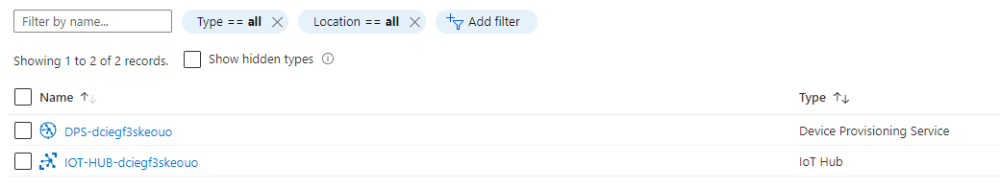

## Build and deploy your application

1. Start Visual Studio Code to open your project.

2. Select **Open folder**, and open the **Azure-Sphere** lab folder.

3. Open the **Lab_4_Direct_Methods** folder.

4. Choose **Select Folder** or **OK** to open the project.

5. Set your developer board configuration.

   1. Open the **CMakeList.txt** file.
   2. Uncomment the `set` command that corresponds to your Azure Sphere device developer board.
   3. Save the file. This will auto-generate the CMake cache.

6. Configure the Azure IoT connection information.

   1. Open the **app_manifest.json** file.
   2. Redo the settings for the **app_manifest.json** file. Either copy from Notepad if you still have it open, or copy from the **app_manifest.json** file that you created in the previous exercise.
   3. Paste the contents of the clipboard into **app_manifest.json**, and save the file.

7. Ensure **main.c** is open.

8. Select **CMake: [Debug]: Ready** from the Visual Studio Code status bar.

9. From Visual Studio Code, press F5 to build, deploy, start, and attach the remote debugger to the application that's now running the Azure Sphere device.

## Expected device behavior

### Avnet Azure Sphere MT3620 Starter Kit


- LED3 turns yellow when connected to Azure.

### Seeed Studio Azure Sphere MT3620 Development Kit


- The network LED turns red when connected to Azure.

### Seeed Studio MT3620 Mini Dev Board


- The green LED closest to the USB connector turns on when connected to Azure.

## Test IoT Hub direct method

Use the Azure command-line tool to invoke Azure IoT hub direct method. For more information, see [invoke-device-method](https://docs.microsoft.com/cli/azure/ext/azure-cli-iot-ext/iot/hub?view=azure-cli-latest#ext-azure-cli-iot-ext-az-iot-hub-invoke-device-method).

Follow these steps to invoke the `resetDevice` direct method, which restarts the device:

1. You need the name of the Azure IoT hub you created. You can get the name from the Azure portal.

   

2. You need the Azure Sphere device ID. Run the following command from the **Azure Sphere Developer Command Prompt**.

   ```
   azsphere dev show-attached
   ```

3. Open Azure Cloud Shell by right-clicking the following link, and opening in a new tab "[https://shell.azure.com](https://shell.azure.com/)".

4. In Cloud Shell, run the [az extension add](https://docs.microsoft.com/cli/azure/extension?view=azure-cli-latest#az-extension-add) command to add the Microsoft Azure IoT extension to the Azure CLI shell. The Azure IoT extension adds IoT Hub, IoT Edge, and IoT device provisioning service specific commands to the Azure CLI.

   ```
   az extension add --name azure-iot
   ```

5. Set a bash variable in Cloud Shell for your Azure Sphere device ID. Make sure there are no spaces on either side of the `=` character.

   ```
   DEVICE_ID={your Azure Sphere device ID}
   ```

6. Set a bash variable in Cloud Shell for your IoT hub name. Make sure there are no spaces on either side of the `=` character.

   ```
   HUB_NAME={your hub name}
   ```

7. Invoke the direct method as follows.

   ```
   az iot hub invoke-device-method --method-name "ResetMethod" --method-payload '{"reset_timer":5}' --device-id "${DEVICE_ID,,}" -n $HUB_NAME
   ```

    > [!NOTE]
    > IoT Hub requires device IDs to be lowercase. The bash command `"${DEVICE_ID,,}"` in the invoke device method converts the device ID to lowercase.

8. `invoke-device-method` displays the result of the call as follows.

   ```
   {
   "payload": "ResetMethod called. Reset in 5 seconds",
   "status": 200
   }
   ```

Now you can close Visual Studio and clean up your resources in Azure.
