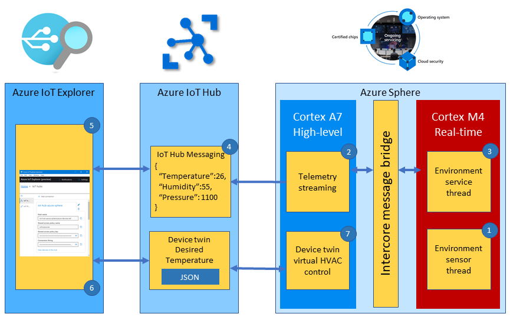

The microbiology laboratory is to run a set of experiments for a new customer. The experiments require the lab temperature, humidity, and pressure to be very stable. After much investigation a new environment sensor is found that meets the customer's needs. However, it's discovered the new sensor is very timing sensitive and needs to be deployed onto one of the Azure Sphere real-time cores.

In this unit, you will learn how to deploy a real-time application onto the Azure Sphere to support the new temperature, humidity, and pressure sensor.

## Azure Sphere architecture

The Azure Sphere microcontroller unit (MCU) has three developer-accessible cores, a Cortex-A7, which runs a Linux kernel, and two Cortex-M4 cores that can run bare-metal code, or a real-time operating system such as Azure RTOS or FreeRTOS.

High-level applications running on the Cortex-A7 Linux kernel are used for less timing-sensitive tasks such as establishing network connections, negotiating security, updating device state, communicating with real-time core applications, and sending telemetry messages to cloud gateways such as IoT Hub.


## What is an RTOS (Real-Time Operating System)

A system is said to be real-time if the total correctness of an operation depends not only upon its logical correctness, but also upon the time in which it is performed [Link to Wikipedia Article](https://en.wikipedia.org/wiki/Real-time_computing?azure-portal=true)

A Real-Time Operating System is system software that provides services and manages processor resources for applications. These resources include processor cycles, memory, peripherals, and interrupts. The main purpose of a real-time Operating System is to allocate processing time among various duties the embedded software must perform.

This typically involves a division of the software into pieces, commonly called “tasks” or “threads,” and creating a run-time environment that provides each thread with its own virtual microprocessor (“Multithreading”). Basically, a virtual microprocessor consists of a virtual set of microprocessor resources, for example, register set, program counter, stack memory area, and a stack pointer. Only while executing does a thread use the physical microprocessor resources, but each thread retains its own copy of the contents of these resources as if they were its own private resources (the thread”s “context”).

## Introducing Azure RTOS

Azure RTOS is a Real-Time Operating System available from Microsoft. Azure RTOS is an embedded development suite including a small but powerful operating system called ThreadX that provides reliable, ultra-fast performance for resource-constrained devices. The [Azure RTOS](https://azure.microsoft.com/services/rtos?azure-portal=true) suite includes other components such as GUI design tools and libraries. In this unit, we will be using Azure RTOS ThreadX.

Azure RTOS ThreadX is an advanced Real-Time Operating System (RTOS) designed specifically for deeply embedded applications. Among the multiple benefits it provides are real-time multithreading, inter-thread communication and synchronization, and memory management. Azure RTOS ThreadX has many advanced features, including picokernel architecture, preemption threshold, event chaining, and a rich set of system services.

## Why build and deploy real-time applications

The reasons to run code on the Cortex M4 real-time cores include:

1. You are migrating existing Cortex M4 code to an Azure Sphere.
1. Your application requires precise or deterministic timing that cannot be guaranteed on the Cortex-A7 Linux kernel core where it would have to complete with other services.
1. Your application may benefit from running across multiple cores to take advantage of all the memory and processing resources on the Azure Sphere.

To learn more, review the [Real-Time Operating System - What it is and why you might want to use one](https://azure.microsoft.com/resources/real-time-operating-system?azure-portal=true) guide.

## Inter-core communications

For security reasons, applications running on the real-time cores cannot access any network resources. However, applications can communicate with applications running on other cores through a secure mailbox mechanism. There also needs to be a shared understanding or contract that describes the shape of the data being passed between the cores. Where possible describe the shape of the data messages using basic types like C ints, floats, enums, and characters. For more complex needs, such as passing an array of objects, then you will need to implement a serialization scheme.

The following structure declares the inter-core contract used in this unit. You can find this contact in the **IntercoreContract** directory.

```c
typedef enum
{
    LP_IC_UNKNOWN,
    LP_IC_HEARTBEAT,
    LP_IC_ENVIRONMENT_SENSOR,
    LP_IC_SAMPLE_RATE
} LP_INTER_CORE_CMD;

typedef struct
{
    LP_INTER_CORE_CMD cmd;
    float temperature;
    float pressure;
    float humidity;
    int sample_rate;
} LP_INTER_CORE_BLOCK;
```

## Solution architecture



The solution architecture is as follows:

1. The Azure RTOS real-time environment sensor thread runs every 2 seconds. The thread stores in memory the latest environment temperature, humidity, and pressure data.
2. The high-level telemetry streaming app requests from the real-time core the latest environment data.
3. The Azure RTOS real-time environment service thread responses with the latest environment data.
4. The high-level application serializes the environment data as JSON and sends the telemetry message to IoT Hub.
5. Azure IoT Explorer subscribes to telemetry messages sent to IoT Hub by the device and displays the telemetry.
6. You can also set the desired temperature for the room by setting a property. The property is set on the device via an IoT Hub device twin message.
7. The Azure Sphere then sets the HVAC operating mode to meet the desired temperature.

## Real-time core security and communications

Like high-level applications, real-time applications are secure by default and you must declare all resources the application requires. This includes access to peripherals and what applications the real-time core can communicate with. To communicate, applications running across cores must be configured with corresponding Component IDs.

### Real-time inter-core capabilities

To communicate, applications running across cores must be configured with corresponding Component IDs.

The Component ID for the high-level application can be found in its **app_manifest.json** file.

```json
{
  "SchemaVersion": 1,
  "Name": "AzureSphereIoTCentral",
  "ComponentId": "25025d2c-66da-4448-bae1-ac26fcdd3627",
  ...
}
```

The **AllowedApplicationConnections** property in the real-time **app_manifest.json** file is set to the Component ID of the Azure Sphere high-level application.

```json
{
    ...
    "AllowedApplicationConnections": [ "25025d2c-66da-4448-bae1-ac26fcdd3627" ]
    ...
}
```
