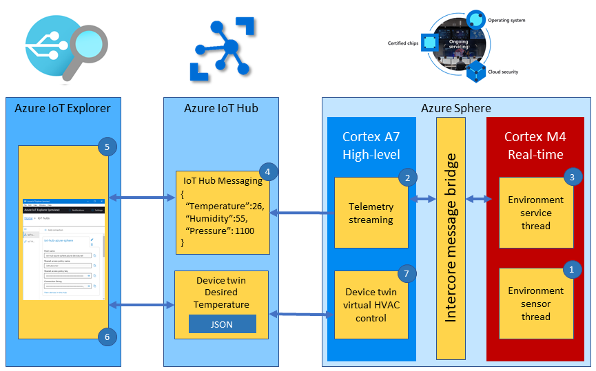

The microbiology laboratory is to run a set of experiments for a new customer. The experiments require the lab temperature, humidity, and pressure to be stable. After much investigation, a new environment sensor is found that meets the customer's needs. However, it's discovered the new sensor is very timing sensitive and needs to be deployed onto one of the Azure Sphere real-time cores.

In this unit, you'll learn how to deploy a real-time application onto the Azure Sphere to support the new temperature, humidity, and pressure sensor.

## Azure Sphere architecture

The Azure Sphere microcontroller unit (MCU) has three developer-accessible cores: a Cortex-A7 that runs a Linux kernel, and two Cortex-M4F cores (with hardware floating-point unit) that can run bare-metal code or a real-time operating system such as [Eclipse ThreadX](https://threadx.io?azure-portal=true) (formerly Azure RTOS) or FreeRTOS.

High-level applications running on the Cortex-A7 Linux kernel are used for less timing-sensitive tasks such as establishing network connections, negotiating security, updating device state, communicating with real-time core applications, and sending telemetry messages to cloud gateways such as IoT Hub.


## What is an RTOS (Real-Time Operating System)

A system is said to be real-time if the total correctness of an operation depends not only upon its logical correctness, but also upon the time in which it's performed [Link to Wikipedia Article](https://en.wikipedia.org/wiki/Real-time_computing?azure-portal=true)

A Real-Time Operating System is system software that provides services and manages processor resources for applications. These resources include processor cycles, memory, peripherals, and interrupts. The main purpose of a real-time Operating System is to allocate processing time among various duties the embedded software must perform.

This typically involves a division of the software into pieces, commonly called "tasks" or "threads", and creating a run-time environment that provides each thread with its own virtual microprocessor ("multithreading"). A virtual microprocessor is a virtual set of microprocessor resources — for example, register set, program counter, stack memory area, and stack pointer. Only while executing does a thread use the physical microprocessor resources, but each thread retains its own copy of the contents of these resources as if they were its own private resources (the thread's "context").

## Introducing Eclipse ThreadX (formerly Azure RTOS)

The real-time operating system used in this module is **Eclipse ThreadX**, which until 2024 was known as **Azure RTOS**. On 21 November 2023, Microsoft announced that it was contributing the Azure RTOS source code to the Eclipse Foundation. The first open-source release under the MIT license, **Eclipse ThreadX 6.4.1**, was published on 29 February 2024, and Microsoft announced on 4 April 2024 that the transition to the Eclipse Foundation was complete. The project is now governed by the Eclipse Foundation and is hosted at [threadx.io](https://threadx.io?azure-portal=true), with source on [GitHub (eclipse-threadx)](https://github.com/eclipse-threadx?azure-portal=true).

Eclipse ThreadX is an embedded development suite that includes a small but powerful real-time kernel — ThreadX — which delivers reliable, ultra-fast performance for resource-constrained devices. The suite also includes networking (NetX Duo), file system (FileX), USB (USBX), graphical user interface (GUIX), flash wear-leveling for NAND/NOR memory (LevelX), and a host-based system analysis tool (TraceX). In this unit, you use the ThreadX kernel.

ThreadX is an advanced real-time operating system (RTOS) designed specifically for deeply embedded applications. Its benefits include real-time multithreading, inter-thread communication and synchronization, and memory management. ThreadX has many advanced features, including a picokernel architecture, preemption threshold, event chaining, and a rich set of system services.

> [!NOTE]
> Some Microsoft documentation, sample folder names (such as `Lab_6_AzureRTOS_Environment`), and example projects still use the legacy "Azure RTOS" name. Functionally these are the same as Eclipse ThreadX.

## Why build and deploy real-time applications

The reasons to run code on the Cortex M4 real-time cores include:

1. You're migrating existing Cortex M4 code to an Azure Sphere.
1. Your application requires precise or deterministic timing that cannot be guaranteed on the Cortex-A7 Linux kernel core where it would have to compete with the Azure Sphere OS, networking stack, and high-level application work.
1. Your application may benefit from running across multiple cores to take advantage of all the memory and processing resources on the Azure Sphere.

To learn more, review the [Overview of Azure Sphere applications](/azure-sphere/app-development/applications-overview?view=azure-sphere-integrated&preserve-view=true), the [What is Eclipse ThreadX?](/azure/rtos/?azure-portal=true) overview, and the [Eclipse ThreadX project](https://threadx.io?azure-portal=true).

## Inter-core communications

For security reasons, applications running on the real-time cores can't access the internet, Azure Sphere applibs, or other Azure Sphere OS features. Azure Sphere supports inter-core communication between a high-level application and a real-time capable application (RTApp). The high-level (Cortex-A7) app calls `Application_Connect` with the RTApp component ID; this returns a connected socket file descriptor that the app uses with POSIX `send()` and `recv()` calls. Each message body can be up to 1 KB. On the real-time (Cortex-M4F) side, the Azure Sphere inter-core mechanism uses mailbox notifications and a ring buffer mapped to shared memory; the helper code in this lab wraps those operations as `EnqueueData` and `DequeueData`.

Both application manifests must declare the partner application's component ID in `AllowedApplicationConnections`; otherwise `Application_Connect` fails with a permissions error. During development, the applications must also be marked as partners in the Visual Studio Code launch configuration so that deploying one app doesn't delete the other. There also needs to be a shared data contract that describes the shape of the data being passed between the cores. Keep the contract fixed-size and identical in both projects, don't pass pointers, and use scalar fields such as integers, floats, enums, and characters. For more complex data, such as arrays or variable-length objects, implement an explicit serialization scheme.

The following structure declares the inter-core contract used in this unit. You can find this contract in the **IntercoreContract** directory.

```c
typedef enum
{
    LP_IC_UNKNOWN,
    LP_IC_HEARTBEAT,
    LP_IC_ENVIRONMENT_SENSOR,
    LP_IC_SAMPLE_RATE
} LP_INTER_CORE_CMD;

typedef struct
{
    LP_INTER_CORE_CMD cmd;
    float temperature;
    float pressure;
    float humidity;
    int sample_rate;
} LP_INTER_CORE_BLOCK;
```

## Solution architecture



The solution architecture is as follows:

1. The Eclipse ThreadX real-time environment sensor thread runs every 2 seconds. The thread stores in memory the latest environment temperature, humidity, and pressure data.
2. The high-level telemetry streaming app requests from the real-time core the latest environment data.
3. The Eclipse ThreadX real-time environment service thread responds with the latest environment data.
4. The high-level application serializes the environment data as JSON and sends the telemetry message to IoT Hub.
5. Azure IoT Explorer subscribes to telemetry messages sent to IoT Hub by the device and displays the telemetry.
6. You can also set the desired temperature for the room by setting a property. The property is set on the device via an IoT Hub device twin message.
7. The Azure Sphere then sets the HVAC operating mode to meet the desired temperature.

## Real-time core security and communications

Like high-level applications, real-time applications are secure by default and you must declare all resources the application requires. This includes access to peripherals and what applications the real-time core can communicate with. To communicate, applications running across cores must be configured with corresponding Component IDs.

### Real-time inter-core capabilities

To communicate, applications running across cores must be configured with corresponding Component IDs.

The Component ID for the high-level application can be found in its **app_manifest.json** file.

```json
{
  "SchemaVersion": 1,
  "Name": "AzureSphereIoTCentral",
  "ComponentId": "25025d2c-66da-4448-bae1-ac26fcdd3627",
  ...
}
```

The **AllowedApplicationConnections** property in the real-time **app_manifest.json** file is set to the Component ID of the Azure Sphere high-level application. The following example includes the inter-core setting and the sensor peripheral setting used by this lab. In an RTApp manifest, peripheral capabilities such as `I2cMaster` use raw **AppManifestValue** strings such as `ISU2`; don't use the high-level application's `$...` hardware-definition constants in the RTApp manifest.

```json
{
  "SchemaVersion": 1,
  "Name": "demo_threadx",
  "ComponentId": "6583cf17-d321-4d72-8283-0b7c5b56442b",
  "EntryPoint": "/bin/app",
  "CmdArgs": [],
  "ApplicationType": "RealTimeCapable",
  "Capabilities": {
    "Gpio": [],
    "I2cMaster": [ "ISU2" ],
    "AllowedApplicationConnections": [ "25025d2c-66da-4448-bae1-ac26fcdd3627" ]
  }
}
```
