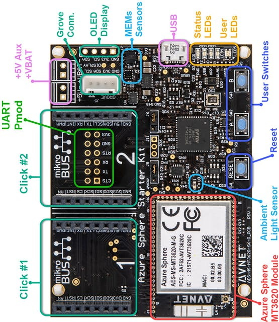
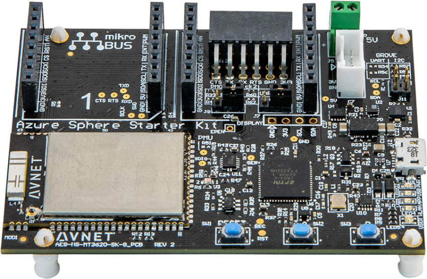
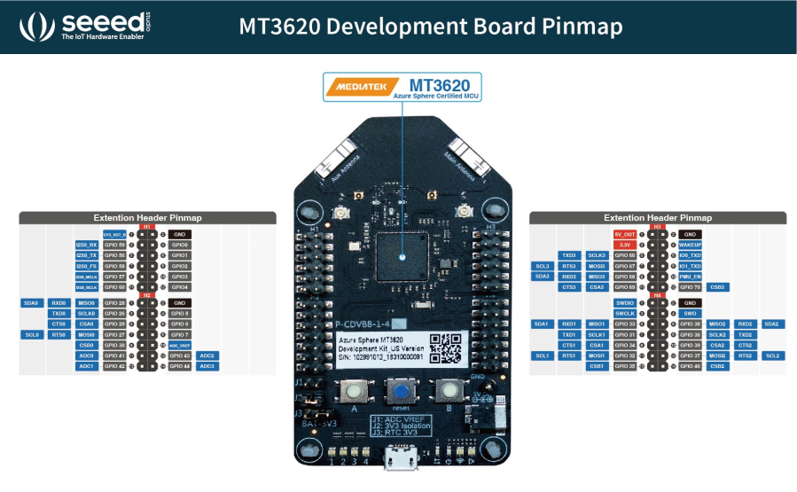
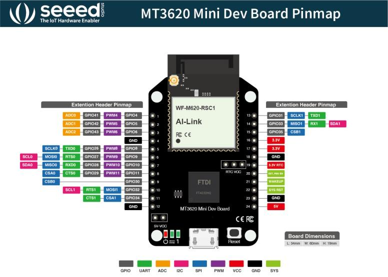

In this unit, you'll learn what Azure Sphere devices are supported by this learning module.

## Azure Sphere devices

Multiple types of devices are available to use; let's look at the first one.

### Avnet Azure Sphere MT3620 Starter Kit Revision 1

This is the default Azure Sphere device for this learning module.

[](https://www.avnet.com/opasdata/d120001/medias/docus/197/K1279_Azure%20MT3620%20Starter%20Kit_v2.pdf?azure-portal=true)

The Avnet Azure Sphere kit can be found [here](https://www.avnet.com/opasdata/d120001/medias/docus/197/K1279_Azure%20MT3620%20Starter%20Kit_v2.pdf?azure-portal=true).

### Avnet Azure Sphere MT3620 Starter Kit Revision 2

[](https://www.avnet.com/opasdata/d120001/medias/docus/203/avt-pb-azurespherev2-v2a.pdf?azure-portal=true)

The Avnet Azure Sphere kit can be found [here](https://www.avnet.com/opasdata/d120001/medias/docus/203/avt-pb-azurespherev2-v2a.pdf?azure-portal=true).

### Seeed Studio Azure Sphere MT3620 Development Kit

[](https://wiki.seeedstudio.com/Azure_Sphere_MT3620_Development_Kit?azure-portal=true)

The Seeed Studio Azure Sphere kit can be found [here](https://wiki.seeedstudio.com/Azure_Sphere_MT3620_Development_Kit?azure-portal=true).

### Seeed Studio Azure Sphere MT3620 Mini Dev Board

[](https://wiki.seeedstudio.com/MT3620_Mini_Dev_Board?azure-portal=true)

The Seeed Studio Mini Azure Sphere kit can be found [here](https://wiki.seeedstudio.com/MT3620_Mini_Dev_Board?azure-portal=true).

<!-- 
## Introduction to the Azure Sphere learning path labs

Several learning path libraries support these labs. These learning path C functions are prefixed with **lp_**, typedefs and enums are prefixed with **LP_**.

Interesting things to note about the learning path libraries:

- They're open source, and contributions are welcome.
- They're built from the [Azure Sphere samples](https://github.com/Azure/azure-sphere-samples?azure-portal=true) and aim to demonstrate best practices.
- They're **not** part of the official Azure Sphere libraries or samples.

For this module, you'll clone the [Azure Sphere Developer Learning Path repository](https://github.com/MicrosoftDocs/Azure-Sphere-Developer-Learning-Path). -->

## General Purpose Input and Output (GPIO) peripherals

In the Azure Sphere Learning Path labs, there are several GPIO peripheral variables declared for LEDs. Variables of type **LP_GPIO** declare a GPIO model for single-pin input and output peripherals, such as LED outputs, relay-driver outputs, button inputs, and reed-switch inputs.

A GPIO peripheral variable holds the GPIO pin number, the initial state of the pin when the program starts, and whether the pin logic needs to be inverted.

The following example declares an LED **output** peripheral.

```c
static LP_GPIO alertLed = {
    .pin = ALERT_LED,                // The GPIO pin number
    .direction = LP_OUTPUT,          // for OUTPUT
    .initialState = GPIO_Value_Low,  // Set the initial state on the pin when opened
    .invertPin = true,               // Should the switching logic be reverse for on/off, high/low
    .name = "alertLed" };            // An arbitrary name for the peripheral
```

### Declaring an input peripheral

The following example declares a button **input** peripheral.

```c
static LP_GPIO buttonA = {
    .pin = BUTTON_A,
    .direction = LP_INPUT,
    .name = "buttonA" };
```

## Useful terms

- **Hardware:** Most IoT solutions are designed to interface with hardware and interact with the real world. The most common interfaces on a device are GPIO, PWM, I2C, SPI, ADC, and UART.
- **GPIO:** A GPIO-capable pin that is exposed by the development board and not reserved for another function can be configured in software as an input or output pin. Use the board's hardware definition files and vendor pinout to confirm which pins are available before wiring external hardware.
- **GPIO output:** If a GPIO pin is designated as an *output* pin, then the software running on Azure Sphere can drive the pin to a logic high or logic low. On MT3620 GPIO pins, logic high is normally the board I/O voltage of 3.3 V and logic low is ground. Before connecting a peripheral, verify that the circuit is 3.3 V-tolerant, stays within the board's current limits, and includes any required current-limiting resistor or driver circuitry. LEDs and relay driver inputs are common GPIO outputs; reed switches are normally read as inputs, not driven as outputs.
- **GPIO input:** If a GPIO pin is designated as an *input* pin, then the software running on Azure Sphere can read whether the pin is at a logic high or logic low level. Never drive an MT3620 GPIO input above the permitted GPIO voltage range, and use level shifting or a divider when connecting higher-voltage signals. Pins GPIO41 through GPIO48 can also be configured as ADC inputs; when used as ADC inputs, the maximum input voltage is 2.5 V rather than the 3.3 V GPIO level, and VREF_ADC has a maximum voltage of 2.5 V. If an application uses the MT3620 ADC, Azure Sphere allocates the entire eight-pin ADC/GPIO block, so none of GPIO41 through GPIO48 can be used as GPIO at the same time. Use external filtering, scaling, or an external ADC device for analog signals above 2.5 V. For details, see the [MT3620 hardware notes](/azure-sphere/hardware/mt3620-hardware-notes?azure-portal=true).
- **Other peripheral interface types:** The following list is of common peripheral interfaces found on devices, including Azure Sphere. To learn more about each interface type, right-click and open the link in a new browser window.
  - [PWM - Pulse width modulation](https://en.wikipedia.org/wiki/Pulse-width_modulation?azure-portal=true)
  - [I2C - Inter-Integrated Circuit](https://en.wikipedia.org/wiki/I%C2%B2C?azure-portal=true)
  - [SPI - Serial Peripheral Interface](https://en.wikipedia.org/wiki/Serial_Peripheral_Interface?azure-portal=true)
  - [ADC - Analog-to-digital converter](https://en.wikipedia.org/wiki/Analog-to-digital_converter?azure-portal=true)
  - [UART - Universal asynchronous receiver-transmitter](https://en.wikipedia.org/wiki/Universal_asynchronous_receiver-transmitter?azure-portal=true)
- **ISU:** You'll see references to **ISU** in the Azure Sphere and MediaTek documentation. An ISU is a serial interface block and is an acronym for "**I**2C, **S**PI, **U**ART." For more information, see the [MT3620 Support Status](/azure-sphere/hardware/mt3620-product-status?azure-portal=true) page.
