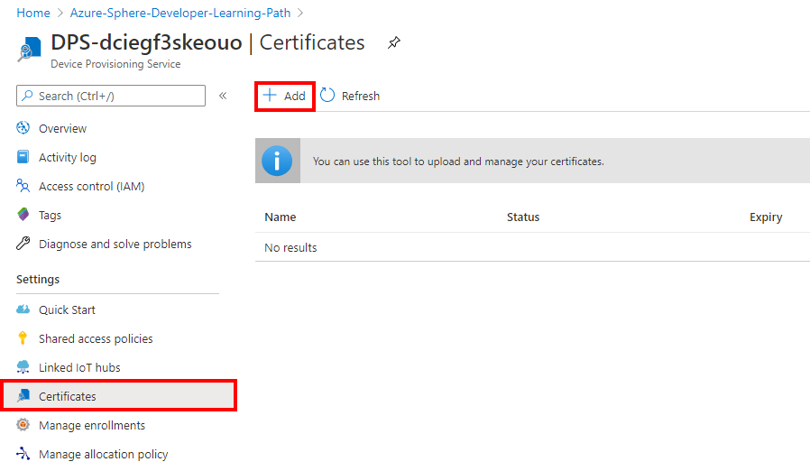
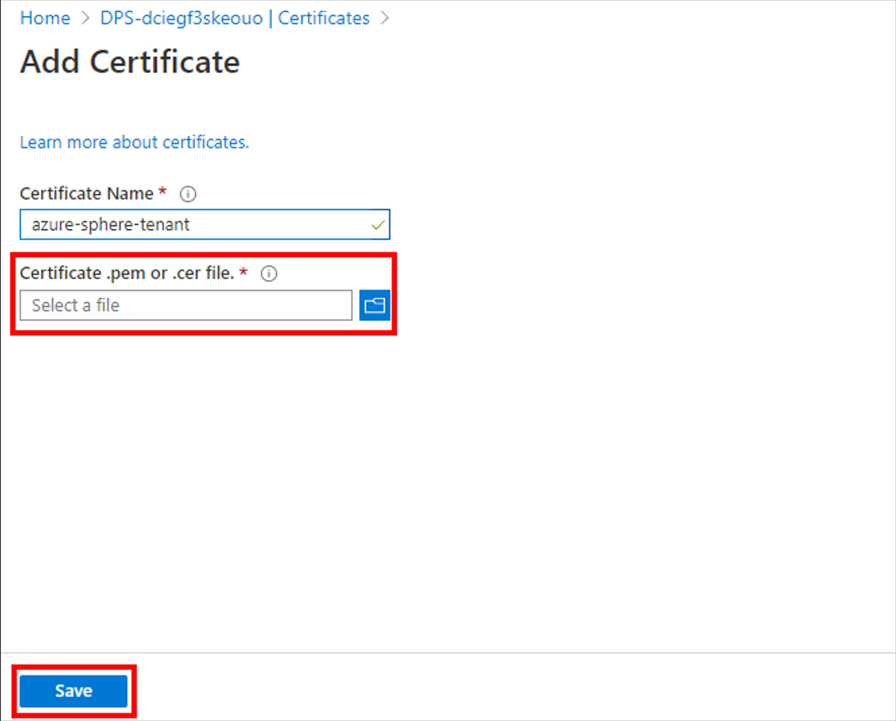
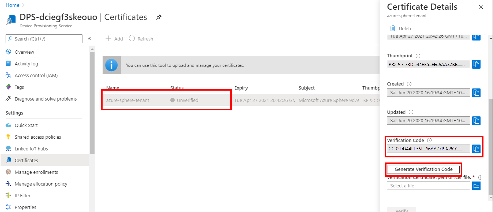
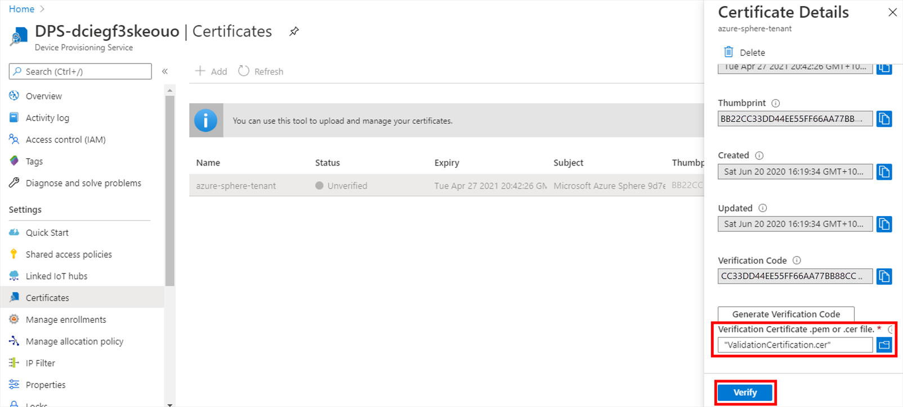
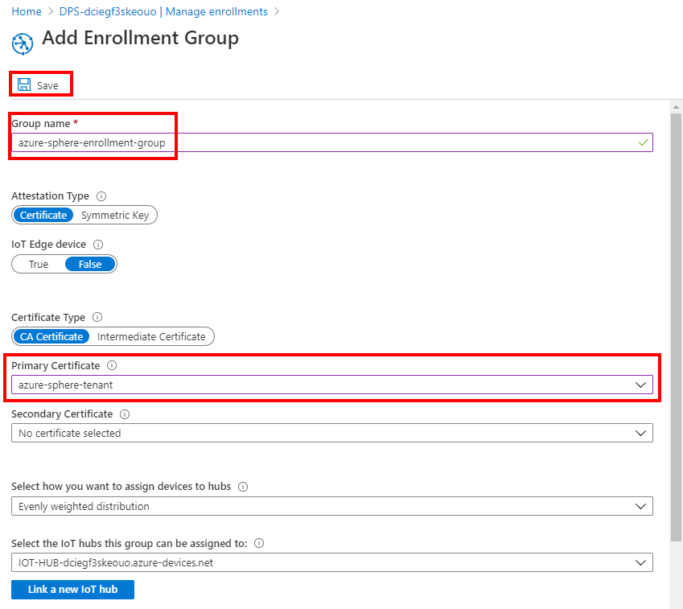
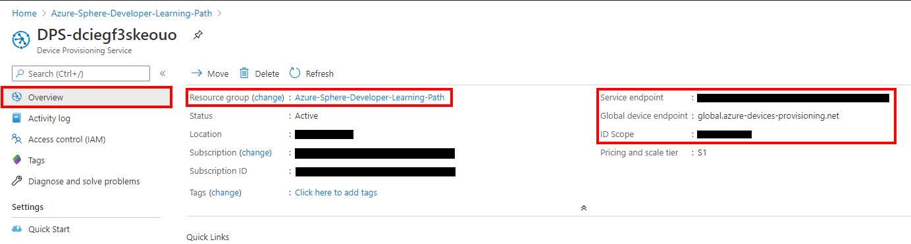
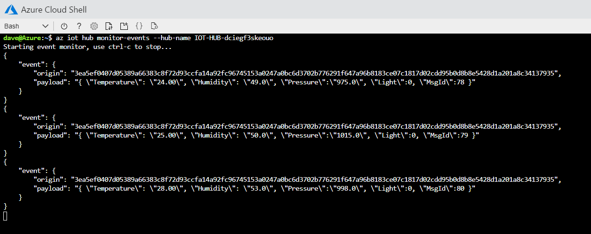

In this exercise, we'll build a high-level Azure Sphere application that connects and sends environment telemetry to Azure IoT Hub.

------

## Step 1: Prepare Azure resources

You can prepare Azure cloud resources with the Azure CLI, the Azure portal (a web interface), or deployment templates. For this module, you'll use an Azure deployment template. Select **Deploy to Azure** to deploy a device provisioning service and a linked Azure IoT hub.

[](https://portal.azure.com/#create/Microsoft.Template/uri/https%3A%2F%2Fraw.githubusercontent.com%2FMicrosoftDocs%2FAzure-Sphere-Developer-Learning-Path%2Fmaster%2Fdocs%2Fdocs_vs_code_iot_hub%2FLab_2_Send_Telemetry_to_Azure_IoT_Hub%2Fsetup%2Fazuredeploy.json)

1. Select or create a new resource group.

2. Choose the site located closest to you.

3. Select the tier for Azure IoT Hub. The default tier is **F1**, which is free. You can only have one free IoT hub per subscription. If you already have a free IoT hub, then either select **S1** ([pricing](https://azure.microsoft.com/pricing/details/iot-hub/)) or delete your existing free IoT hub before proceeding.

4. Select **Next** > **Deploy**. The deployment will take three to four minutes to complete.

5. When the deployment has completed, select **Manage your resources**. You will see two services listed in the Azure portal: the device provisioning service and IoT Hub. Appended to the resource names is a random string to ensure that the names are globally unique.

   

Don't close the Azure Web portal. You will need to access it again.

------

## Step 2: Link your Azure Sphere device tenant to the device provisioning service

You need to set up a trust relationship between your Azure Sphere device tenant and your device provisioning service.

Devices claimed by your Azure Sphere device tenant are automatically enrolled with the linked IoT hub by the device provisioning service when the device first connects.


### Download the Azure Sphere device tenant authentication CA certificate

1. Open an **Azure Sphere Developer Command Prompt**.

2. Sign in to your Azure Sphere device tenant if you haven't already done so.

   ```
   azsphere login
   ```

3. Make a note of the current directory, or change to the Azure Sphere Learning Path directory. You'll need the name of this directory in the next step.

4. Download the Certificate Authority (CA) certificate for your Azure Sphere device tenant:

   ```
   azsphere ca-certificate download --output CAcertificate.cer
   ```

### Upload the Azure Sphere device tenant certificate to Azure device provisioning service

1. Switch back to the Azure portal.

2. Select **DPS** > **Certificates** > **+ Add**.

   

3. Name your certificate, and then select the **CAcertificate.cer** file you downloaded in the previous step to upload into the device provisioning service. Then select **Save**.

   


### Verify the uploaded certificate

1. Select the certificate you just uploaded to display the certificate details.

2. From the certificate details panel, scroll down and select **Generate Verification Code**.

3. Copy the verification code to the clipboard.

   

### Generate the verification certificate

1. Return to the **Azure Sphere Developer Command Prompt**.

2. Run the following command. Replace `<code>` with the verification code that you just copied to the clipboard. This generates a verification certificate that you need to upload to the device provisioning service.

   ```
   azsphere ca-certificate download-proof --output ValidationCertification.cer --verificationcode <code>
   ```

### Upload the verification certificate

1. Return to the Azure portal.

2. Select the **Verification Certificate** file selector icon.

3. From the file manager, select the **ValidationCertification.cer** certificate that you generated in the previous step.

4. Select **Verify**.

   

------

## Step 3: Create a device provisioning service enrollment group

From the Azure portal:

1. Select **Manage Enrollments** from the device provisioning service sidebar menu.

2. Select **+ Add enrollment group**, and name the enrollment group.

3. Select the primary certificate you just uploaded, and select **Save**.

   

------

## Step 4: Explicitly allow connections to Azure IoT endpoints

Remember, applications on Azure Sphere are locked down by default, including hardware and network endpoints. You must explicitly allow connections to the network endpoints of your Azure IoT hub and your device provisioning service. Otherwise, your Azure Sphere device application won't be able to connect.

You must allow communications to the following Azure IoT network endpoints:

- The device provisioning service global device endpoint
- The device provisioning service service endpoint
- The IoT hub hostname endpoint

Follow these steps:

1. Return to the Azure portal.

2. Select **Overview** from the device provisioning service sidebar menu.

3. Copy the device provisioning service **Global device endpoint** URI to Notepad.

4. Copy the device provisioning service **Service endpoint** URI to Notepad.

5. Copy the **ID Scope** to Notepad.

6. Select the **Resource group URL** to return to the resource group. 

   

7. Select the **IoT Hub** resource.

8. Copy the IoT hub **Hostname** URL to Notepad.

   

------

## Step 5: Get the Azure Sphere tenant ID

Next, you need the ID of the Azure Sphere tenant that is now trusted by the device provisioning service.

1. From the **Azure Sphere Developer Command Prompt**, run `azsphere tenant show-selected`.

   - The output of this command will look similar to the following:
   
      ```output
      Default Azure Sphere tenant ID is 'yourSphereTenant' (99999999-e021-43ce-9999-fa9999499994).
      ```

   - The tenant ID is the numeric value inside the parentheses.

2. Copy the tenant ID to Notepad, as you will need it soon.

------

## Step 6: Open the project

1. Start Visual Studio Code.

2. Select **Open folder**, and open the **Azure-Sphere** lab folder.

3. Open the **Lab_2_Send_Telemetry_to_Azure_IoT** folder.

4. Choose **Select Folder** to open the project.

------

## Step 7: Set your developer board configuration

These labs support developer boards from Avnet and Seeed Studio. You need to set the configuration that matches your developer board.

The default developer board configuration is for the Avnet Azure Sphere Starter Kit. If you have this board, there's no additional configuration required.

1. Open the **CMakeList.txt** file.

2. Add a `#` at the beginning of the set Avnet line to disable it.

3. Uncomment the `set` command that corresponds to your Azure Sphere device developer board.

   ```
   set(AVNET TRUE "AVNET Azure Sphere Starter Kit")
   # set(SEEED_STUDIO_RDB TRUE "Seeed Studio Azure Sphere MT3620 Development Kit (aka Reference Design Board or rdb)")
   # set(SEEED_STUDIO_MINI TRUE "Seeed Studio Azure Sphere MT3620 Mini Dev Board")
   ```

4. Save the file. This will auto-generate the CMake cache.
   

------

## Step 8: Understand Azure Sphere security

Applications on Azure Sphere are locked down by default. You must grant capabilities to the application. Granting capabilities is key to Azure Sphere security and is also known as the *principle of least privilege*. You should only grant the capabilities the Azure Sphere application needs to run correctly, and no more.

Application capabilities include what hardware can be accessed, what internet services can be called (including Azure IoT Central and the Azure device provisioning service), and what inter-core communications are allowed.

### Open the application manifest file

From Visual Studio Code, open the **app_manifest.json** file. The resources this application can access are limited to those listed in the **Capabilities** section.

> [!NOTE]
> The following example is for the Avnet Azure Sphere device. The resource names and capabilities will differ depending on which Azure Sphere device you are using.

```
{
  "SchemaVersion": 1,
  "Name": "AzureSphereIoTCentral",
  "ComponentId": "25025d2c-66da-4448-bae1-ac26fcdd3627",
  "EntryPoint": "/bin/app",
  "CmdArgs": [ "--ConnectionType", "DPS", "--ScopeID", "Your_ID_Scope" ],
  "Capabilities": {
    "Gpio": [
      "$BUTTON_A",
      "$NETWORK_CONNECTED_LED",
      "$ALERT_LED"
    ],
    "I2cMaster": [
      "$I2cMaster2"
    ],
    "PowerControls": [
      "ForceReboot"
    ],
    "AllowedConnections": [
      "global.azure-devices-provisioning.net"
    ],
    "DeviceAuthentication": "Replace_with_your_Azure_Sphere_Tenant_ID"
  },
  "ApplicationType": "Default"
}
```

### Understand pin mappings

Each Azure Sphere manufacturer maps pins differently. Follow these steps to understand how the pins are mapped for your developer board.

1. Ensure you have the **main.c** file open. Place the cursor on the line that reads `#include "hw/azure_sphere_learning_path.h"`, and then press F12 to open the header file.

2. Review the pin mappings set up for the Azure Sphere Learning Path by using the Avnet Starter Kit.

    > [!NOTE]
    > Azure Sphere hardware is available from multiple vendors, and each vendor can expose features of the underlying chip in different ways. Azure Sphere applications manage hardware dependencies by using hardware definition files. For further information, see [Managing target hardware dependencies](https://docs.microsoft.com/azure-sphere/app-development/manage-hardware-dependencies).

    ```
    /* Copyright (c) Microsoft Corporation. All rights reserved.
    Licensed under the MIT License. */
      
    // This file defines the mapping from the MT3620 reference development board (RDB) to the
    // 'sample hardware' abstraction used by the samples at https://github.com/Azure/azure-sphere-samples.
    // Some peripherals are on-board on the RDB, while other peripherals must be attached externally if needed.
    // https://docs.microsoft.com/azure-sphere/app-development/manage-hardware-dependencies
    // to enable apps to work across multiple hardware variants.
      
    // This file is autogenerated from ../../azure_sphere_learning_path.json.  Do not edit it directly.
      
    #pragma once
    #include "avnet_mt3620_sk.h"
      
    // Button A
    #define BUTTON_A AVNET_MT3620_SK_USER_BUTTON_A
      
    // Button B
    #define BUTTON_B AVNET_MT3620_SK_USER_BUTTON_B
      
    // LED 1
    #define LED1 AVNET_MT3620_SK_USER_LED_BLUE
      
    // LED 2
    #define LED2 AVNET_MT3620_SK_APP_STATUS_LED_YELLOW
      
    // AVNET: Network Connected
    #define NETWORK_CONNECTED_LED AVNET_MT3620_SK_WLAN_STATUS_LED_YELLOW
      
    // Click Relay
    #define RELAY AVNET_MT3620_SK_GPIO0
    ```

3. Next, from Visual Studio Code, open the **main.c** file.

------

## Step 9: Configure the Azure Sphere application

1. Open the **app_manifest.json** file.

   

2. Update the Azure IoT application connection properties.

   - Update `CmdArgs` with the device provisioning service **ID Scope** that you copied to Notepad.
   - Update `DeviceAuthentication` with your **Azure Sphere tenant ID**. Remember, this was the numeric value output from the `azsphere tenant show-selected` command that you copied to Notepad.

3. Update the network endpoints `AllowedConnections` with your Azure IoT hub and device provisioning endpoint URLs you copied to Notepad.

4. Review your updated **manifest_app.json** file. It should look similar to the following.

   ```
   {
       "SchemaVersion": 1,
       "Name": "AzureSphereIoTCentral",
       "ComponentId": "25025d2c-66da-4448-bae1-ac26fcdd3627",
       "EntryPoint": "/bin/app",
       "CmdArgs": [ "--ConnectionType", "DPS", "--ScopeID", "0ne0099999D" ],
       "Capabilities": {
           "Gpio": [
               "$BUTTON_A",
               "$NETWORK_CONNECTED_LED",
               "$ALERT_LED"
           ],
           "I2cMaster": [ "$I2cMaster2" ],
           "PowerControls": [ "ForceReboot" ],
           "AllowedConnections": [
               "global.azure-devices-provisioning.net",
               "<Your device provisioning service endpoint>",
               "<Your Azure IoT hub endpoint>"
           ],
           "DeviceAuthentication": "9d7e79eb-9999-43ce-9999-fa8888888894"
       },
       "ApplicationType": "Default"
   }
   ```

5. Copy the contents of your **app_manifest.json** file to Notepad. You'll need this configuration information for the next labs.

------

## Step 10: Understand the Azure Sphere application

### Send telemetry to Azure IoT Hub

Open **main.c**, and scroll down to the `MeasureSensorHandler` function.

> [!NOTE]
> Use **Go to Symbol in Editor** in Visual Studio Code. Use the keyboard shortcut Ctrl+Shift+O and start typing *measure*. You'll often see a function name listed twice in the drop-down. The first is the function prototype declaration, and the second is the implementation of the function.

```
/// <summary>
/// Read sensor and send to Azure IoT
/// </summary>
static void MeasureSensorHandler(EventLoopTimer* eventLoopTimer)
{
    static int msgId = 0;
    static LP_ENVIRONMENT environment;

    if (ConsumeEventLoopTimerEvent(eventLoopTimer) != 0)
    {
        lp_terminate(ExitCode_ConsumeEventLoopTimeEvent);
    }
    else {
        if (lp_readTelemetry(&environment) &&
            snprintf(msgBuffer, JSON_MESSAGE_BYTES, msgTemplate,
                environment.temperature, environment.humidity, environment.pressure, msgId++) > 0)
        {
            Log_Debug(msgBuffer);
            lp_azureMsgSendWithProperties(msgBuffer, telemetryMessageProperties, NELEMS(telemetryMessageProperties));
        }
    }
}
```

------

## Step 11: Deploy the application to Azure Sphere

### Start the app build deploy process

1. Ensure main.c is open.

2. Select **CMake: [Debug]: Ready** from the Visual Studio Code status bar.

   

3. From Visual Studio Code, press F5 to build, deploy, start, and attach the remote debugger to the application that is now running the Azure Sphere device.

### View debugger output

1. Open the Visual Studio Code **Output** tab to view the output from `Log_Debug` statements in the code.

    > [!NOTE]
    > You can also open the output window by using the Visual Studio Code shortcut (Ctrl+K Ctrl+H).

2. The device negotiates security, and then starts sending telemetry to Azure IoT Hub.

    > [!NOTE]
    > You might see a couple of error messages. These messages occur while the connection to Azure IoT is being negotiated.

------

## Step 12: Expected device behavior

### Avnet Azure Sphere MT3620 Starter Kit


1. The WLAN LED will blink every 5 seconds when connected to Azure.

### Seeed Studio Azure Sphere MT3620 Development Kit


1. The WLAN LED will blink every 5 seconds when connected to Azure.


### Seeed Studio MT3620 Mini Dev Board


1. The User LED will blink every 5 seconds when connected to Azure.

------

## Step 13: View the device telemetry from Azure Cloud Shell

1. You will need to know the name of the Azure IoT hub you created. You can get the name from the Azure portal.
   

2. Open [Azure Cloud Shell](https://shell.azure.com/).

3. In Cloud Shell, run the following command to add the Microsoft Azure IoT extension to your shell. The IoT extension adds Azure IoT Hub, Azure IoT Edge, and Azure IoT device provisioning service specific commands to the Azure CLI.

   ```
   az extension add --name azure-iot
   ```

4. Start the IoT hub events monitor with the following command. Be sure to use your IoT hub name.

   ```
   az iot hub monitor-events --hub-name {your IoT hub name}
   ```

5. Observe telemetry in the cloud. The output will be similar to the following.
  

6. Use **ctrl+c** to stop the event monitor.


Now close Visual Studio.
