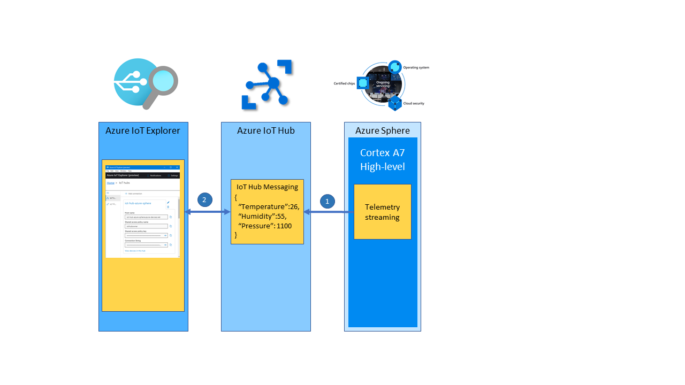

In this unit, you will learn how to deploy a high-level application to your Azure Sphere and stream telemetry to IoT Hub.

## Solution architecture

The following outlines how the Azure Sphere stream telemetry to IoT Hub.



1. The high-level application running on the Cortex-A7 reads the environment sensors every 6 seconds, serializes the data as JSON, and sends the telemetry message to IoT Hub.
2. Azure IoT Explorer subscribes to telemetry messages sent to IoT Hub by the device and displays the data to the user.

## Understanding the Azure Sphere application

These labs make extensive use event timers, so there is a generalized model to simplify working with timers. Event-driven programming helps to simplify application design.

There are two types of timers:

- Periodic timers
- One-shot timers

Event timers generate events that are bound to handler functions, which implement desired actions.


The application declares a periodic **measureSensorTimer** event timer. When initialized, this timer will trigger every 6 seconds calling the **MeasureSensorHandler** handler function.

```c
static LP_TIMER measureSensorTimer = {
    .period = { 6, 0 },
    .name = "measureSensorTimer",
    .handler = MeasureSensorHandler };
```

The **MeasureSensorHandler** function is called when the **measureSensorTimer** timer triggers.

The MeasureSensorHandler function will read the environment sensor, format the data into a JSON string, display the JSON data on the **Output** tab, and then send the telemetry to Azure IoT Hub.

```c
/// <summary>
/// Read sensor and send to Azure IoT
/// </summary>
static void MeasureSensorHandler(EventLoopTimer* eventLoopTimer)
{
    static int msgId = 0;
    static LP_ENVIRONMENT environment;

    if (ConsumeEventLoopTimerEvent(eventLoopTimer) != 0)
    {
        lp_terminate(ExitCode_ConsumeEventLoopTimeEvent);
    }
    else {
        if (lp_readTelemetry(&environment) &&
            snprintf(msgBuffer, JSON_MESSAGE_BYTES, msgTemplate,
                environment.temperature, environment.humidity, environment.pressure, msgId++) > 0)
        {
            Log_Debug("%s\n", msgBuffer);
            lp_azureMsgSendWithProperties(msgBuffer, telemetryMessageProperties, NELEMS(telemetryMessageProperties));
        }
    }
}
```

## Introduction to IoT Plug and Play

IoT Plug and Play enables solution builders to integrate smart devices with their solutions without any manual configuration. At the core of IoT Plug and Play, is a device model that a device uses to advertise its capabilities to an IoT Plug and Play enabled application. To learn more, visit "[What is IoT Plug and Play](https://docs.microsoft.com/azure/iot-pnp/overview-iot-plug-and-play?azure-portal=true)".

The IoT Plug and Play model for this learning module can be found in the **IoTPlugAndPlay** directory. This model has been uploaded to the public repository of IoT Plug and Play models.

The IoT Plug and Play model used by this learning module is declared in main.c.

```c
#define IOT_PLUG_AND_PLAY_MODEL_ID "dtmi:com:example:azuresphere:labmonitor;1"
```

Azure IoT Explorer along with IoT Central are IoT Plug and Play enabled applications. IoT Plug and Play is an open specification. You can also build Plug and Play compliant applications. For more information, read the [Introduction to IoT Plug and Play](https://azure.microsoft.com/resources/videos/iot-plug-play-intro?azure-portal=true) article.

When your device first connects to IoT Hub, the IoT Plug and Play Model ID is passed to IoT Hub. Azure IoT Explorer then retrieves the IoT Plug and Play model from the public repository of IoT Plug and Play models. The telemetry is display using the model.
