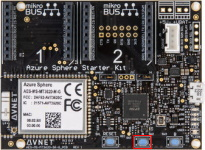
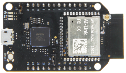

In this exercise, we'll deploy a high-level application to your Azure Sphere.

## Step 1: Open the lab project

1. Start Visual Studio Code.

2. From the menu, click **File**, then **Open Folder**.

3. Open the **Azure-Sphere lab** folder.

4. Open the **Lab_2_Send_Telemetry_to_Azure_IoT** folder.

5. Click **Select Folder** or the **OK** button to open the project.

## Step 2: Configure the Azure Sphere application

1. From Visual Studio Code, open the **app_manifest.json** file. The resources this application requires must be declared in the **Capabilities** section.

1. Update the connection properties for the Azure IoT Hub.

    - Update **CmdArgs** with your Azure IoT DPS ID scope. You can find the ID scope on the **Overview** page for your Device Provisioning Service instance.
    - Update **DeviceAuthentication** with your Azure Sphere (Legacy) tenant UUID/GUID. This is the Azure Sphere tenant UUID/GUID returned in the `Id` field of `azsphere tenant show-selected` (legacy CLI). On the Azure Sphere Integrated (`az sphere`) CLI, obtain it from the catalog's `tags.MigratedCatalogId` value: `az sphere catalog show --resource-group <rg> --catalog <name> --query "tags.MigratedCatalogId" -o tsv`. Don't use the catalog name, Azure resource ID, Microsoft Entra tenant ID, Azure subscription ID, IoT Hub name, DPS name, or DPS ID Scope.

1. Update the **AllowedConnections** capability so it lists the DPS global endpoint and the hostname of each IoT hub that DPS can assign the device to. For example: `"AllowedConnections": [ "global.azure-devices-provisioning.net", "<your-iot-hub>.azure-devices.net" ]`. Don't include the per-instance DPS *Service endpoint* (`<dpsName>.azure-devices-provisioning.net`) — Azure Sphere devices reach DPS only through the global endpoint.

1. You can format the app_manifest.json document by right mouse clicking on the document and selecting **Format Document** from the context menu.

1. Review your updated **app_manifest.json** file. It should look similar to the following.

    ```json
    {
        "SchemaVersion": 1,
        "Name": "AzureSphereIoTHub",
        "ComponentId": "25025d2c-66da-4448-bae1-ac26fcdd3627",
        "EntryPoint": "/bin/app",
        "CmdArgs": [ "--ConnectionType", "DPS", "--ScopeID", "0ne0099999D" ],
        "Capabilities": {
            "Gpio": [
                "$NETWORK_CONNECTED_LED",
                "$LED_RED",
                "$LED_GREEN",
                "$LED_BLUE"
            ],
            "I2cMaster": [
                "$I2cMaster2"
            ],
            "AllowedConnections": [
                "global.azure-devices-provisioning.net",
                "<your-iot-hub>.azure-devices.net"
            ],
            "DeviceAuthentication": "9d7e79eb-9999-43ce-9999-fa8888888894"
        },
        "ApplicationType": "Default"
    }
    ```

    > [!NOTE]
    > This lab follows the principle of least privilege and does not require the `PowerControls` capability. You will add it later in the remote-reboot direct-method lab, where the device actually performs a reboot.

1. If your cloned **app_manifest.json** already contains a `PowerControls` capability (for example, `"PowerControls": [ "ForceReboot" ]`), remove that entry now.

1. Save the updated app_manifest.json file.

1. **IMPORTANT**. Record the connection values you just configured: the DPS ID scope in **CmdArgs**, the **AllowedConnections** list, and the **DeviceAuthentication** GUID. You'll reuse those values in the next labs. Do not overwrite a later lab's **ComponentId** or lab-specific capabilities when you reuse these values.

## Step 3: Select your developer board configuration

These labs support developer boards from Avnet and Seeed Studio. You need to set the configuration that matches your developer board. The default developer board configuration is for the Avnet Azure Sphere Starter Kit Revision 1. If you have this board, there is no additional configuration required.

1. Open **CMakeLists.txt**.

2. In **CMakeLists.txt**, exactly one `set(<BOARD> TRUE ...)` line must be active.

    - If your hardware is the **Avnet Azure Sphere MT3620 Starter Kit Rev 1**, leave `set(AVNET TRUE ...)` uncommented and ensure all other `set(<BOARD> TRUE ...)` lines are commented out.
    - If your hardware is a **different supported board** (for example, `AVNET_REV_2`, `SEEED_STUDIO_RDB`, or `SEEED_STUDIO_MINI`), comment out the `set(AVNET TRUE ...)` line by adding `#` at the beginning, and uncomment the matching `set(<your board> TRUE ...)` line.

    ```text
    set(AVNET TRUE "AVNET Azure Sphere Starter Kit Revision 1 ")
    # set(AVNET_REV_2 TRUE "AVNET Azure Sphere Starter Kit Revision 2 ")
    # set(SEEED_STUDIO_RDB TRUE "Seeed Studio Azure Sphere MT3620 Development Kit (aka Reference Design Board or rdb)")
    # set(SEEED_STUDIO_MINI TRUE "Seeed Studio Azure Sphere MT3620 Mini Dev Board")
    ```

3. Save **CMakeLists.txt** after making the change. This will autogenerate the CMake cache.

## Step 4: Deploy the application to Azure Sphere

### Start the app build and deployment process

1. Open **main.c**.

1. Ensure that your Azure Sphere device is connected by USB and is enabled for development and sideloading. If Visual Studio Code reports that the device isn't enabled for development, run the current Azure Sphere CLI command `az sphere device enable-development --resource-group <resource-group> --catalog <catalog-name> --device <device-id>` from a command line, then try again. This command enables sideloading and debugging and assigns the device to a development device group that disables cloud application updates, so don't use it as a manufacturing or production provisioning step.

1. Confirm that CMake is configured for the project. If the Visual Studio Code status bar shows **CMake: [Debug]: Ready**, select it only if you need to change the build preset.

   :::image type="content" source="../media/visual-studio-code-start-application.png" alt-text="The illustration shows CMake status." lightbox="../media/visual-studio-code-start-application.png":::

1. From Visual Studio Code, press F5 to build, deploy, start, and attach the remote debugger to the application now running the Azure Sphere device.

1. Try setting a breakpoint in the **MeasureSensorHandler** function. The function will be called every 6 seconds (matching the `measureSensorTimer` period defined in the application).

    > [!NOTE]
    > You can learn how to set breakpoints from this [Visual Studio Code Debugging](https://code.visualstudio.com/docs/editor/debugging#_debug-actions?azure-portal=true) article.

### View debugger output

1. Select the Visual Studio Code **Output** tab to view the output from **Log_Debug** statements in the code.

   > [!TIP]
   > You can open the output tab by using the Visual Studio Code **Ctrl+Shift+U** shortcut or clicking the **Output** tab.

2. You'll see the device negotiating security, and then it will start sending telemetry to Azure IoT Hub.

    > [!NOTE]
    > You may see a couple of *ERROR: failure to create IoTHub Handle* messages displayed. These messages occur while the connection to Azure IoT Hub is being negotiated.

## Step 5: Expected device behavior

### Azure Sphere MT3620 Starter Kit Revision 1 and 2



- The network-connected LED toggles approximately every 5 seconds while the device is connected to Azure IoT Hub.
- A telemetry message is sent to Azure IoT Hub approximately every 6 seconds.

### Seeed Studio Azure Sphere MT3620 Development Kit


- The network-connected LED toggles approximately every 5 seconds while the device is connected to Azure IoT Hub.
- A telemetry message is sent to Azure IoT Hub approximately every 6 seconds.

### Seeed Studio MT3620 Mini Dev Board



- The network-connected LED toggles approximately every 5 seconds while the device is connected to Azure IoT Hub.
- A telemetry message is sent to Azure IoT Hub approximately every 6 seconds.

## Step 6: Display the device telemetry using Azure IoT Explorer

1. Start **Azure IoT Explorer** and connect to your IoT hub.

1. If Azure IoT Explorer opens on the home page, click **View devices in this hub**. Otherwise, open the **Devices** list for the connected hub.

    :::image type="content" source="../media/iot-explorer-view-devices-in-this-hub.png" alt-text="The illustration shows how to select devices in this hub." lightbox="../media/iot-explorer-view-devices-in-this-hub.png":::

1. Click your **device** in the **Device ID** column.

    The device name is your Azure Sphere Device ID. You can display your Device ID by running one of the following commands from the Windows **PowerShell command line** or Linux **Terminal**.

    - Azure Sphere Integrated CLI (current):

      ```
      az sphere device show-attached
      ```

    - Legacy CLI (still supported):

      ```
      azsphere device show-attached
      ```

    The output lists the attached device's ID and hardware information.

1. Click **IoT Plug and Play components** from the side menu.

    If the **IoT Plug and Play components** view doesn't appear, verify that the application is connected to IoT Hub, that the model ID was sent by the device, and that Azure IoT Explorer has a model source configured for the public repository.

    :::image type="content" source="../media/iot-explorer-iot-pnp.png" alt-text="The illustration shows how to select IoT Plug and Play components." lightbox="../media/iot-explorer-iot-pnp.png":::

1. Click **Default component**.
    
    :::image type="content" source="../media/iot-explorer-pnp-default-component.png" alt-text="The illustration shows how to select the default component." lightbox="../media/iot-explorer-pnp-default-component.png":::

1. Select **Telemetry** from the menu.

    :::image type="content" source="../media/iot-explorer-pnp-telemetry.png" alt-text="The illustration shows how to select telemetry." lightbox="../media/iot-explorer-pnp-telemetry.png":::

1. Click the **Start** button.

1. If the **Show modeled events** option is available, enable it to use the IoT Plug and Play model to display the telemetry.

## Close Visual Studio Code

Now close Visual Studio Code.
