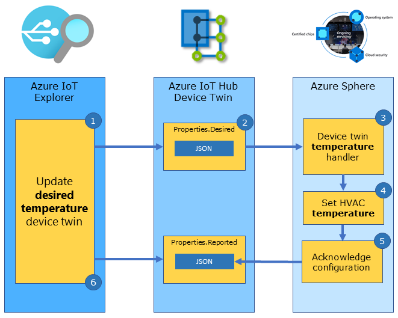

In this unit, you will learn how to control an Azure Sphere connected heating, ventilation, and air conditioning unit (HVAC) from Azure IoT Hub.

## Understanding IoT Hub device twins

Azure IoT Hub uses device twins to represent point-in-time values. IoT Hub can use device twins to set state on a device, for example, set the desired room temperature. A device can also use device twins to report its current state, for example, report the operating mode of an HVAC (Heating, Ventilation, and Air Conditioning) unit, is it currently heating, cooling, or turned off.

Device twins are JSON documents that Azure IoT Hub keeps in the cloud for all devices and is used for storing device information, including metadata, configurations, and conditions. IoT Hub device twins are often used for long-running commands intended to put the device into a certain state and return it to that state after a device restart. For example, setting the desired room temperature.

Properties can be used in the following ways:

- Cloud-to-device updates
- Device-to-cloud updates
- Querying reported properties

## Controlling the heating, ventilation, and air conditioning unit (HVAC) using Azure IoT Hub device twins

From Azure IoT Explorer you can set the desired temperature twin. The device actions and acknowledges the request. Azure IoT Hub updates the device twin reported property and IoT Explorer then queries and display this reported property.



### Steps to controlling the HVAC unit from IoT Explorer

The following steps outline how Azure IoT Explorer uses device twins to set properties on a device:

1. You can set the desired room temperature from Azure IoT Explorer.
1. Azure IoT Hub updates the device twin desired property and sends a device twin message to the device.
1. The corresponding device twin handler function is called.
1. The device implements the desired property; in this case, turn on the heater or cooler to bring the room to the desired temperature.
1. The device acknowledges the updated configuration to Azure IoT Hub. Azure IoT Hub updates the device twin reported property.
1. IoT Explorer queries and displays the device twin reported property data.

## Getting started with device twin bindings

A device twin binding maps a device twin property name with a handler function that will be called to implement the action.

The following example declares a Device Twin Binding to set the desired room temperature. This declaration maps the Azure IoT Hub `DesiredTemperature` device twin with a handler function named `DeviceTwinSetTemperatureHandler`.

```c
static LP_DEVICE_TWIN_BINDING dt_desiredTemperature = {
    .twinProperty = "DesiredTemperature",
    .twinType = LP_TYPE_FLOAT,
    .handler = DeviceTwinSetTemperatureHandler };
```

### Setting the desired temperature

The following is the implementation of the handler function `DeviceTwinSetTemperatureHandler`. The handler function is called when the device receives a `DesiredTemperature` desired property message from Azure IoT Hub.

> [!NOTE]
> As part of the [IoT Plug and Play](https://docs.microsoft.com/azure/iot-pnp/concepts-convention?azure-portal=true) conventions, the device should acknowledge the device twin update with a call to **lp_deviceTwinAckDesiredState**.

```c
/// <summary>
/// Device Twin Handler to set the desired temperature value
/// </summary>
static void DeviceTwinSetTemperatureHandler(LP_DEVICE_TWIN_BINDING* deviceTwinBinding)
{
    // validate data is sensible range before applying
    if (deviceTwinBinding->twinType == LP_TYPE_FLOAT && *(float*)deviceTwinBinding->twinState >= -20.0f && *(float*)deviceTwinBinding->twinState <= 80.0f)
    {
        lp_deviceTwinAckDesiredState(deviceTwinBinding, deviceTwinBinding->twinState, LP_DEVICE_TWIN_COMPLETED);
        SetHvacStatusColour((int)previous_temperature);
    }
    else {
        lp_deviceTwinAckDesiredState(deviceTwinBinding, deviceTwinBinding->twinState, LP_DEVICE_TWIN_ERROR);
    }
}
```

## Reporting the current HVAC operating mode

The HVAC operating mode depends on the room temperature, it can be heating, or cooling, or turned off. We can use a device-to-cloud device twin update to report the current operating mode of the HVAC unit.

### Device-to-cloud updates


1. The Azure Sphere detects the HVAC operating mode has changed.
1. The Azure Sphere sends a device twin message to report the new operating mode of the HVAC to Azure IoT Hub.
1. IoT Explorer queries and displays the updated operating mode of the HVAC unit.

The following example declares a **ReportedHvacState** device twin property of type **string**. A handler function is not required as this is a one-way device-to-cloud binding.

```c
static LP_DEVICE_TWIN_BINDING dt_reportedHvacState = {
    .twinProperty = "ReportedHvacState",
    .twinType = LP_TYPE_STRING };
```

The device updates the **ReportedHvacState** property by calling the **lp_deviceTwinReportState** function. You must pass a property of the correct type.

```c
lp_deviceTwinReportState(&dt_reportedHvacState, (void*)hvacState[(int)current_led]);
```

## How device twin messages are mapped to handlers

All declared device twin bindings must be added by reference to the deviceTwinBindingSet array. When a device twin message is received by the device, it is checked for a matching *twinProperty* name in the deviceTwinBindingSet array. When a match is found, the corresponding handler function is called.

```c
LP_DEVICE_TWIN_BINDING* deviceTwinBindingSet[] = { &dt_desiredTemperature, &dt_reportedTemperature, &dt_reportedHvacState };
```

### Opening the device twin binding set

The device twin binding set is initialized in the **InitPeripheralsAndHandlers** function in **main.c**.

```c
lp_deviceTwinSetOpen(deviceTwinBindingSet, NELEMS(deviceTwinBindingSet));
```

### Closing the device twin binding set

The device twin bindings set is closed in the **ClosePeripheralsAndHandlers** function in **main.c**.

```c
lp_deviceTwinSetClose();
```
