This exercise requires a sandbox. A sandbox gives you access to free resources. Your personal subscription won't be charged. 

You can use the sandbox only to complete training on Microsoft Learn. Using the sandbox for any other reason is prohibited and may result in permanent loss of access to the sandbox.

To make your site available to the public, you'll deploy it to Azure. You'll use the Azure App Service extension in Visual Studio Code to streamline the process.

## Install the Azure App Service extension

Start by installing the Azure App Service extension in Visual Studio Code:

1. In **Visual Studio Code**, select the **Extensions** icon.

    

1. In the **Search Extensions** field, type *App Service*.

1. Under **Azure App Service**, select **Install**.

If you already have the [Azure App Service extension](https://marketplace.visualstudio.com/items?itemName=ms-azuretools.vscode-azureappservice), make sure it's updated to the latest version. See the last updated date on the extension page. If you're working with the latest version, you should see a **RESOURCES** node with an **App Services** node.

## Deploy the application

When you followed the steps to clone the starter repository, you should have also changed directory to the *starter* folder before opening VS Code. The *starter* directory contains the *manage.py* file that signals to App Service that you're deploying a Django web app.

1. In **Visual Studio Code**, on the toolbar, select the **Azure** icon.

    

1. Select **Sign in** to sign in to Azure by using the same account you used to create the sandbox.

1. On the **RESOURCES** bar of the Azure extension, hover, and select the **+** (plus sign) icon to create a resource.

    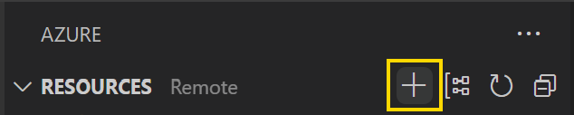

1. If prompted to choose a subscription, choose your Azure subscription.

1. Select **Create App Service Web App...**.

    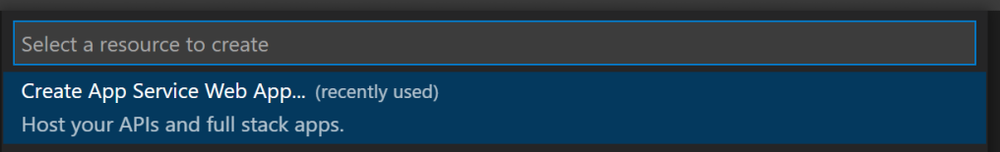

1. Provide a unique name for your application.

    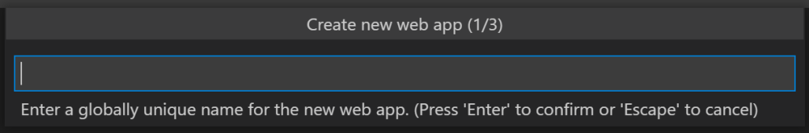

1. Select **Python 3.9** as the runtime stack.

    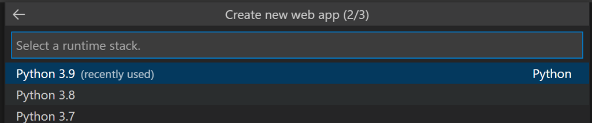

1. Select a pricing tier.

    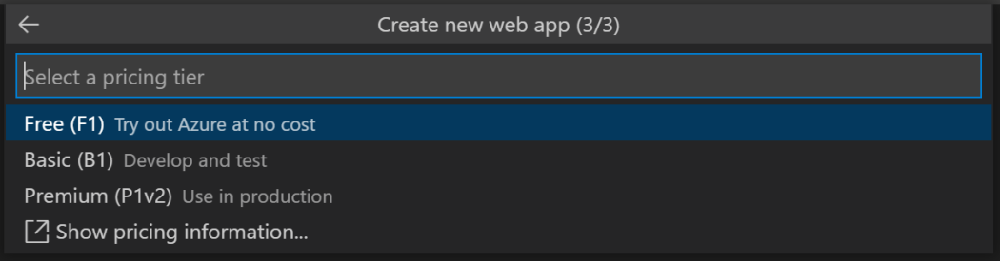

    The extension creates your web application. The process will take a few moments.

1. When the web app is created, you're asked to deploy the web app to the App Service, select **Deploy**.

    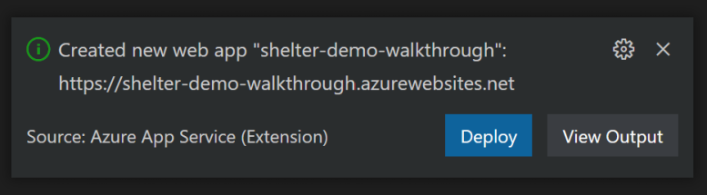

    If you miss the notice to deploy or close it, you can also deploy by finding the App Service you created, right-click it, and select **Deploy to Web App**.

Your site will now deploy!

## Create the database server

While your site is deploying, turn your attention to creating the database. You'll use PostgreSQL.

1. On the **RESOURCES** bar of the Azure extension, hover, and select the **+** (plus sign) icon to create a resource.

    

1. If prompted to choose a subscription, choose your Azure subscription.

1. Select **Create Database Server...**.

    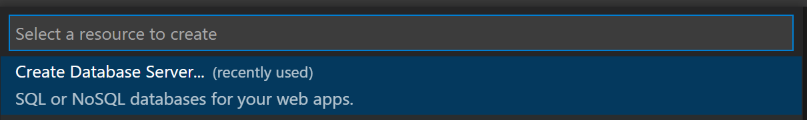


1. For the Azure Database Server, select **PostgreSQL Flexible Server**.

    

1. Enter a unique name for your database server.

    > [!IMPORTANT]
    > Make a note of the name you use for your database server.

1. Select the Postgres SKU and options.

1. For the name of the admin user, enter *shelter_admin*.

1. Enter a secure password, such as "*86i*^z5#emSk6wu3t10nC*".

    > [!IMPORTANT]
    > When you create the password, don't use a dollar sign (`$`). This symbol can cause issues for connections from Python. Make a note of the password you use.

1. Enter the password a second time to confirm it.

1. For the resource group, select **appsvc_linux_centralus**. This group was created when you deployed your web application.

    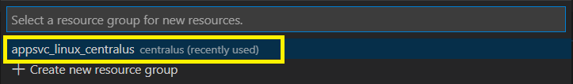

1. For the location for new resources, select **Central US**.

    

    > [!IMPORTANT]
    > When you create multiple Azure resources that will communicate with one another, always place them in the same region. This collocation ensures the best performance.

Your server will now be created! This process will take a few minutes. 

## Create a database firewall rule to allow access from dev environment

After the database is created, you need to create a firewall rule to allow your developer environment to access the database. Wait until the database exists before following the next steps to create the rule.

1. Open the Visual Studio Code command palette with **F1** or the key combination **Ctrl** + **Shift** + **P**.

1. Search for "PostgreSQL: Configure Firewall" and select it.

    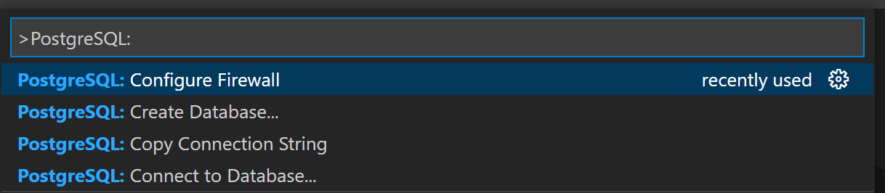

1. When prompted for the resource to apply the firewall to, select the Postgres database you created.

1. A final dialog box asks to continue and shows the IP address it will add. Select **Yes**.

It takes a few minutes to add the rule. Watch the VS Code notification window for status.

## Create a database on the database server

Now that you've configured App Service and created the server, you can create the database in the Postgres Database Server.

1. In the **RESOURCES** of the Azure Tools extension, expand the **PostgreSQL Servers (Flexible)** node and find the server you created.

1. Right-click the name of your database server and select **Create Database**.

    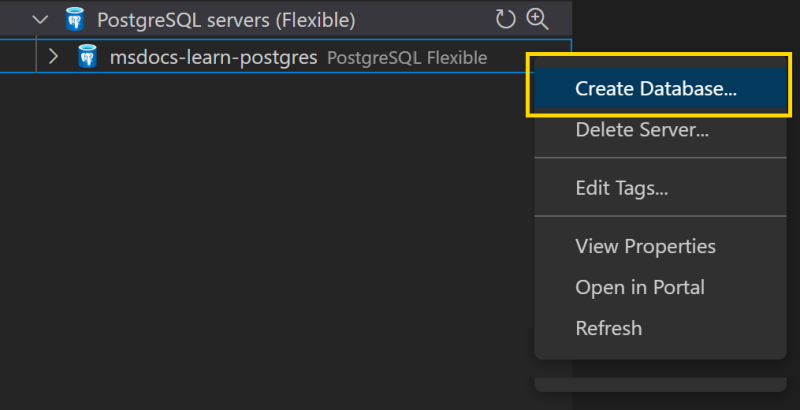

1. Enter *shelters*.

Your database will be created.

## Allow access to the database server from App Service

In this exercise, you also need the dog shelters web app hosted in Azure App Service to connect to the Azure Database for PostgreSQL Flexible Server. When an application within Azure tries to connect to your database server, the firewall verifies that Azure connections are allowed. Above you allowed connections from your local environment. Now, you must also allow connections from App Service.

1. In VS Code, in the **RESOURCES** of the Azure Tools extension, expand the **PostgreSQL Servers (Flexible)** node and find the server you created.

1. Right-click the name of your database server and select **Open in Portal**.

1. Select the **Networking** resource of the Postgres Server.

1. Select **Allow public access from any Azure service within Azure to this server** option in the portal from the Networking tab and select **Save**.

    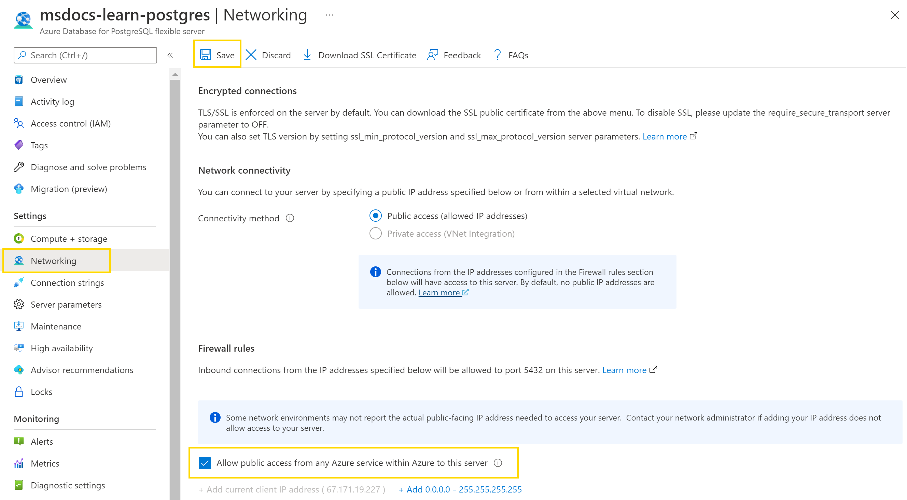


## Configure application settings for the web app

App Service uses the application settings to configure environmental variables. Settings are a convenient way to store information you shouldn't put in your code, such as database connection strings.

1. Under **App Service**, expand the sandbox subscription. Then expand your application.
1. To create the first application setting, right-click **Application Settings** and then select **Add New Setting**.

    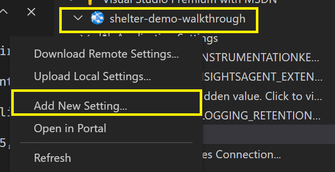

1. In the first field, enter the name *DBUSER*.
1. In the second field, enter the value *shelter_admin*.
1. Repeat the preceding steps to create the remaining settings:

    Name       | Value
    -----------|---------------------------------------
    DBHOST     | `<The server name you created previously>`
    DBPASS     | `<The password you created previously>`
    DBUSER     | `shelter_admin`
    DBNAME     | `shelters`
    SECRET_KEY | `<Generate a secure password>`

    > [!NOTE]
    > Replace the **DBHOST** and **DBPASS** values with the ones you created earlier in this exercise. For **SECRET_KEY**, create a new password.

All the necessary environmental variables are now created on your app service.

## Create the schema and superuser

The last step in the deployment is to set up the database. In local development, you run `python manage.py migrate` and `python manage.py createsuperuser` to create the database schema and superuser. On Azure, you'll do the same. 

You'll connect to the web server in Azure by using Secure Shell (SSH). You can make the connection in Visual Studio Code as shown below.

1. In the **App Service** extension, right-click your app service and then select **SSH into Web App**.

    

    An SSH connection will be made to your web server in Azure. This process might take a few minutes. A terminal pane appears in Visual Studio Code. This terminal is the SSH connection to your web server. If you have trouble connecting, see the [troubleshooting steps below](#troubleshooting-ssh).

    > [!IMPORTANT]
    > If you receive an error message stating you need to enable SSL for the database, ensure you created all environmental variables correctly.

1. Inside the SSH terminal pane, run the following commands to ensure the appropriate libraries are installed and to create the database.

    ```bash
    # Run database migrations
    python manage.py makemigrations dog_shelters
    python manage.py migrate
    ```

1. Create your superuser by running the following command.

    ```bash
    python manage.py createsuperuser
    ```

1. Provide a **name**, **email** address, and **password** for the superuser.

1. After you create your superuser, run the command `exit` to close the connection.

Your database is now configured in Azure, and you have a superuser for your site.

### Troubleshooting SSH

If you can't connect to SSH from VS Code, here are some steps you can try:

* Go to the Azure portal page for the App Service and access SSH there. In VS Code, right-click the name of the App Service and select **Open in Portal**. On the portal page for the App Service, go to the **SSH** resources in the left resource pane.

* Check that App Service hosting the web app started correctly. If there was a deployment error or coding issue, the App Service may not have started, and you can't SSH into it. On the portal page for the App Service, go to the **Diagnose and solve problems** in the left resource pane to look for issues.

* Read more about [SSH in App Service](https://docs.microsoft.com/en-us/azure/app-service/configure-linux-open-ssh-session).

## Go to your site

Now that you've deployed and configured everything, you can view your website on Azure.

In the **App Service** extension, right-click the name of your site, and then select **Browse Website**.

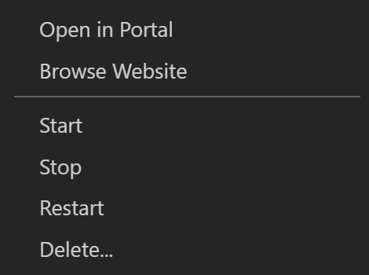

Your website now appears. The default page shows no shelters. To add shelters:

1. Go to the Django administration part of the site by adding "/admin" the website URL. 

   You'll be asked to authenticate with the superuser name and password you created above. 

1. Add a shelter and navigate back to the main page and you'll be able to register a dog for that shelter.

Here's an example screenshot of the site:

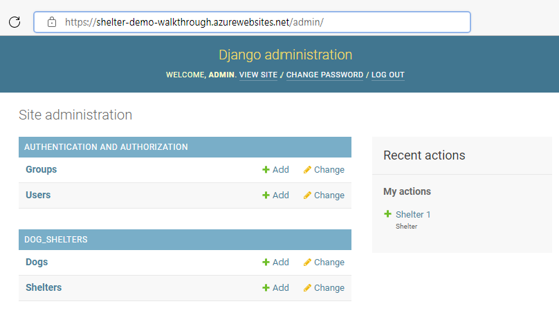

If you try to go to a location that doesn't exist on your site, you'll get a generic **Not found** error because `DEBUG` is disabled.

You've now deployed a website to Azure!
