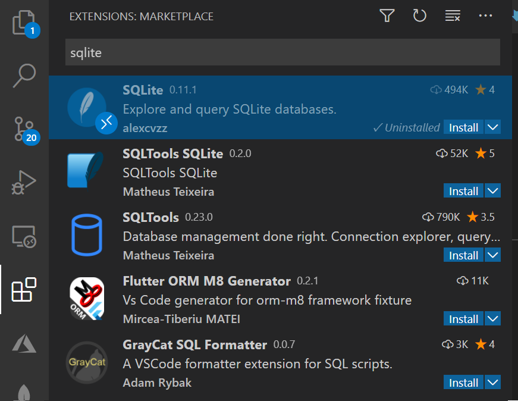
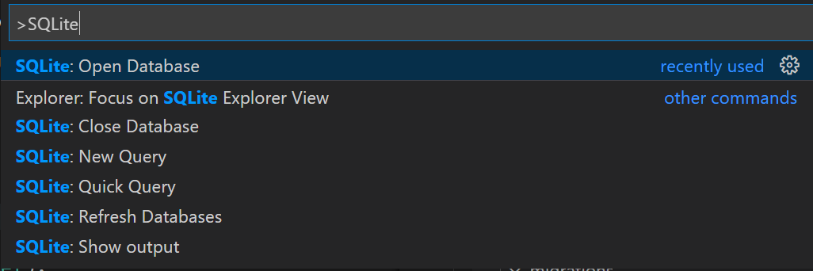

With our models created, let's create our database. We'll use the default of SQLite and the tools available through Django.

## List all migrations

Let's start by listing all migrations.

In the terminal window for Visual Studio Code, run the following command:

```bash
python manage.py showmigrations
```

You'll notice a list of migrations. You might wonder why you have migrations, even though you just started your application and haven't made any. Django includes various tables for its user management system, managing sessions, and other internal uses.

## Create migrations for `dog_shelters`

Let's tell Django that new models are added and that we want the changes to be stored as a migration.

1. Return to the terminal window in Visual Studio Code.
1. Run the following command:

    ```bash
    python manage.py makemigrations dog_shelters
    ```

After you run the command, you should see code that shows both models stored as a migration in `dog shelters`.


## Update the database

The `migrate` command will run all migrations. In the case of SQLite, the command will even create the database if it doesn't exist. Let's create our database and perform the migrations.

1. Return to the terminal window in Visual Studio Code.
1. Run the following command:

    ```bash
    python manage.py migrate
    ```

The migrations that the command runs include the one that we created and the ones that are built in to Django.

## Display the schema

Now that we completed the necessary setup for our SQLite database, let's use the [SQLite](https://marketplace.visualstudio.com/items?itemName=alexcvzz.vscode-sqlite) Visual Studio Code extension to explore the created schema.

1. Select the **Extensions** button on the workbench, and search for **SQLite**.

    

1. Select **Install** on SQLite.

    > [!NOTE] 
    > You might get an error message about being unable to access the SQLite core process. If this happens, you can [install SQLite](https://www.sqlite.org/download.html?azure-portal=true) for your operating system.

1. Open the command palette by selecting Ctrl+Shift+P on the keyboard (or Cmd+Shift+P on a Mac).
1. Type **SQLite** and select **SQLite: Open Database**.

   

1. Select **db.sqlite3**.
1. At the bottom of your workbench on the left side, select the arrow next to **SQLITE EXPLORER**.

   

1. You can now see the list of all the created tables. Expand each one to view the various columns. 

   If you explore your **shelter** and **dog** tables, you'll notice the various columns that you created. These columns include **id**, which is automatically created on each table.

## Summary

You've now managed a database by using Django, deploying any changes that you made.
