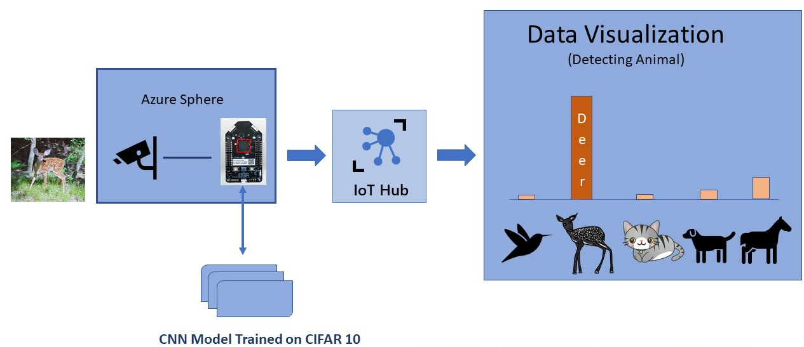

Image classification can be used in many scenarios on edge devices. For example, the ability to detect images can help in detecting the presence of people and animals in a scene. 

Azure Sphere enables you to implement a neural network model performing real-time image classification on a secured, internet-connected microcontroller-based device.

Suppose you are a park ranger responsible for a large park that is open to the public. Herds of wild deer roam freely in the park. These deer are the star attraction of the park. However, the deer are wild animals and can be unpredictable, especially at certain times of the year. Their space must be respected, and it is recommended to maintain a minimum distance of 50 meters away from the deer.

People and dogs also frequent the park and sometimes interact with the deer. As the park ranger, you are responsible for the safety of both people and animals in the park. You have noticed that recently, interactions between people and deer have increased.  To ensure everyone's safety, you want to study and analyze these interactions between people, deer, and dogs. To capture this data, you need a device in the field that can record the interactions between deer and people. The device should capture and store only pictures that include deer. The system should be capable of operating in the field safely and securely.  By capturing images with deer, you can analyze the interactions between deer, people, and dogs. You can then suggest additional safety measures or recommend alternate routes for people to walk in the park to increase safety.

By the end of this module, you will be able to implement a neural network model performing real-time image classification for detecting the presence of deer in a scene.

## Learning objectives

In this module, you will:

- Implement image classification on a microcontroller device using a pre-trained neural network model.
- Describe how the components and services of Azure Sphere work to deploy a pre-trained image classification model.

## Prerequisites

- A PC running Windows 10
- Basic knowledge of Azure Sphere
- USB cable to connect Azure Sphere to the computer
- USB-to-serial adapter
- Mini cable to connect the serial adapter to the computer
- Jumper wires to connect the serial adapter to Azure Sphere
- Basic knowledge of using Visual Studio Code
- Visual Studio Code installed on your computer
- Git installed on your computer
- Ability to use Git/GitHub
