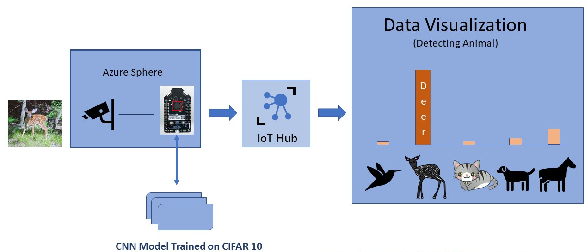

Image classification can be used in many embedded edge scenarios where a device needs to label a small image locally instead of sending the input to another computer for inference.

Azure Sphere enables you to build and run a real-time capable application (RTApp) on an MT3620 Cortex-M4F real-time core. In this module, the RTApp runs local whole-image classification against one compile-time 32x32 RGB input image by using a pretrained, prequantized neural network model. In this context, *real-time* refers to the Azure Sphere real-time capable core that runs the RTApp; the module evaluates only the compiled-in image and doesn't process streams or infer regions within an image.

Suppose you're evaluating whether a secured microcontroller can run a small image-classification workload at the embedded edge. You have a CIFAR-10 class image that has already been converted into C data for the application. You want to build the RTApp, sideload it to an Azure Sphere development kit for local testing, and view the class result from the device output.

Azure Sphere devices can be internet-connected for device management, OS updates, cloud deployments, and high-level applications. The RTApp inference path in this module is local to the device; Azure Sphere RTApps don't use the internet or Azure Sphere OS application libraries.

By the end of this module, you'll be able to implement local whole-image classification on an Azure Sphere real-time capable core by using a pretrained, prequantized CIFAR-10 model.

## Learning objectives

In this module, you will:

- Implement local image classification on a microcontroller device using a pre-trained, prequantized neural network model.
- Describe how Azure Sphere components support local deployment and execution on a real-time capable core, with setup and update services as background device-management context.

## Prerequisites

- An Azure account with an active subscription and a resource group for Azure Sphere resources.
- An Azure Sphere development kit, such as an MT3620 development kit.
- A development computer running Windows 11, Windows 10 Anniversary Update or later, Ubuntu 24.04 LTS x64, or Ubuntu 22.04 LTS x64.
- USB access from the host computer to the development kit; if you use a virtual machine, support for USB pass-through.
- Azure Sphere SDK installed for your operating system.
- On Linux, `sudo` permission. Install `net-tools` and `curl` before running the SDK installer, answer `Y` when it asks to set up the default `udev` rule and `azsphere` group, then sign out and back in (or restart) before running `az sphere` commands.
- Azure CLI 2.45.0 or later with the Azure Sphere extension installed and signed in to your Azure subscription.
- Visual Studio Code with the Azure Sphere and CMake Tools extensions installed.
- CMake and Ninja installed and available on your PATH.
- GNU Arm Embedded Toolchain installed for real-time capable applications.
- Basic knowledge of Azure Sphere, Visual Studio Code, Git, and GitHub.
