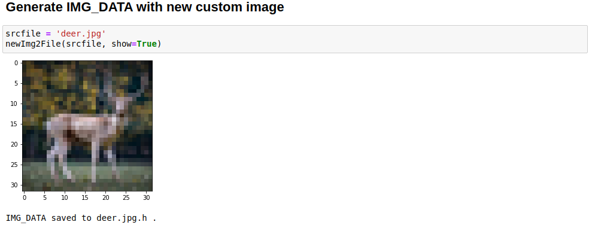
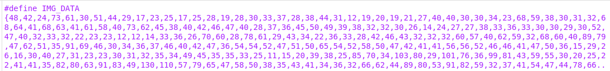
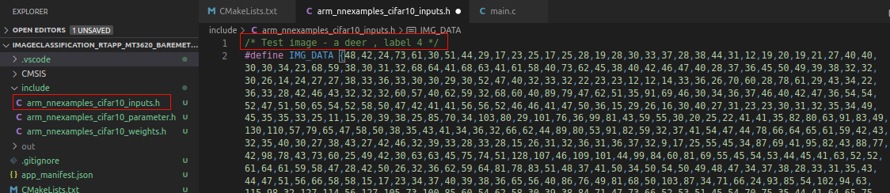

In this exercise, you'll deploy your real-time application to Azure Sphere. You'll test your input image and display the output result on the terminal emulator.

Make sure that:

- Your Azure Sphere device is connected to your computer by USB.
- Your Azure Sphere device is connected to the internet.
- You have set up your development environment.

In this module, you aren't using a camera to capture images. You'll generate your input image by converting the images to pixel values using a Python script.

## Generate your image data

In this exercise, you'll test an input image of a deer.


The pixel values of the image are converted by the Python script defined in the [scripts folder](https://github.com/MicrosoftDocs/mslearn-oxford-image-classification-azure-sphere) in the repository you cloned.



1. Open the deer.jpg.h file and copy the pixel values.

   

2. Add evaluation image data in include\arm_nnexamples_cifar10_inputs.h to test. The image data is defined in arm_nnexamples_cifar10_inputs.h.

   

3. By default, the values are added in arm_nnexamples_cifar10_inputs.h to test. You can comment and test different images.

## Deploy a real-time application

To recap label data in CIFAR10:

- airplane: 0
- automobile: 1
- bird: 2
- cat: 3
- deer: 4
- dog: 5
- frog: 6
- horse: 7
- ship: 8
- truck: 9

1. Press **F5** to debug the project. If the project hasn't previously been built, or if files have changed and a rebuild is required, Visual Studio Code will build the project before debugging starts.

2. The Azure Sphere output window should show "Deploying image..." followed by the paths to the SDK and compiler.

3. The connected terminal emulator should display the following output from the ImageClassification_RTApp_MT3620_Baremetal program. You'll see the output of the CIFAR10 model.

    ```
    start execution
    input pre-processing
    conv1 img_buffer2 -> img_buffer1
    pool1 img_buffer1 -> img_buffer2
    conv2 img_buffer2 -> img_buffer1
    pool2 img_buffer1 -> img_buffer2
    conv3 img_buffer2 -> img_buffer1
    pool3 img_buffer-> img_buffer2
    0: 0
    1: 0
    2: 0
    3: 0
    4: 127
    5: 0
    6: 0
    7: 0
    8: 0
    9: 0
    Complete.
    ``` 
   With a 32x32 pixel color image as the input, which has then been classified into one of the 10 output classes by the model.
   
   As the value is the output of the softmax layer, each number denotes the probability for one of the 10 image classes. In the following case, label 4 corresponds to the "deer" label and has the highest number. That means the model found a deer in the input image.

4. Set a breakpoint somewhere in main.c and step through the application, so that you can explore the Visual Studio Code debugging features for Azure Sphere.
