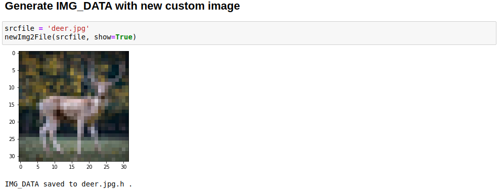
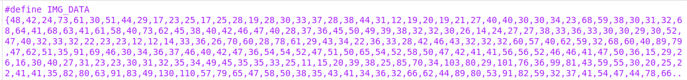
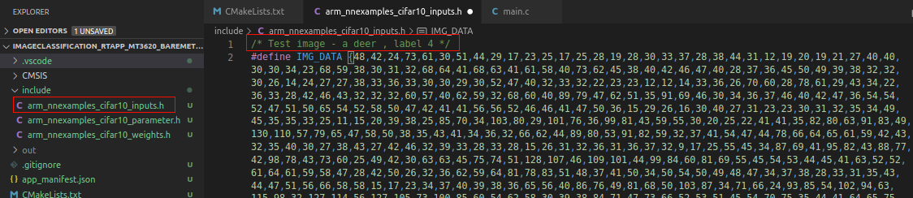

In this exercise, you'll run the RTApp locally on Azure Sphere, test one compile-time CIFAR-10 input image, and display the output in the terminal emulator.

Make sure that:

- Your Azure Sphere device is connected to your computer by USB.
- RT-core debugging is enabled for the device. If needed, run `az sphere device enable-development --enable-rt-core-debugging --catalog <CatalogName> --resource-group <ResourceGroupName>` from an elevated command prompt.
- The GNU Arm toolchain is installed and available to the Azure Sphere tools.
- The UART output hardware is configured and connected to your terminal emulator.
- You have set up your development environment. Internet access is needed only for setup, update, or dependency download commands.

The sample runs inference once at startup over the `IMG_DATA` macro compiled into `include\arm_nnexamples_cifar10_inputs.h`. To test another image, generate new `IMG_DATA` values, replace the active `IMG_DATA` macro body, rebuild the image package, sideload it again, and restart or debug the RTApp. This exercise uses the local sideload/debug workflow; cloud deployment is a separate workflow that targets an Azure Sphere catalog, product, and device group.

## Generate your image data

In this exercise, you'll test an input image of a deer. Replace the active `IMG_DATA` values with values generated from this image before you expect deer output.


`IMG_DATA` must be a flat `uint8_t` array of `32*32*3 = 3072` raw RGB values from 0 through 255. Values are interleaved in row-major HWC order: `[R,G,B, R,G,B, ...]`. Don't prequantize or prescale the values. `main.c` applies mean subtraction and Q7 normalization by using `INPUT_MEAN_SHIFT` and `INPUT_RIGHT_SHIFT` before the first convolution.

The [scripts folder](https://github.com/MicrosoftDocs/mslearn-oxford-image-classification-azure-sphere/tree/master/scripts) in the repository contains `cifar-10-IMG_DATA.ipynb`, which can resize and convert a source image into the required `IMG_DATA` layout.



1. Install the notebook dependencies in your Python environment. The repository's `scripts\requirements.txt` is a reference list that names packages such as NumPy, Keras, Matplotlib, and Pillow; it isn't formatted as a pip-installable requirements file, so don't install it with pip's `-r` option. Install compatible package versions directly, and install Jupyter too if you don't already have it.

   To run the upstream notebook unchanged, pin Pillow below version 10 because the notebook uses `Image.ANTIALIAS`, which was removed in Pillow 10. Use TensorFlow 2.15 for the notebook's Keras dependency because it includes Keras 2.15; unpinned Keras 3 requires backend configuration and removed `keras.preprocessing.image`, which the notebook uses:

   ```powershell
   python -m pip install numpy "tensorflow==2.15" matplotlib jupyter "Pillow<10"
   ```

   > [!NOTE]
   > As another safe option, update a local copy of `scripts\cifar-10-IMG_DATA.ipynb` to replace `Image.ANTIALIAS` with `Image.Resampling.LANCZOS`. After that change, install a Pillow version that supports `Image.Resampling`, such as current Pillow releases, instead of pinning `Pillow<10`.

2. Open `scripts\cifar-10-IMG_DATA.ipynb`.

3. Put the source image in the `scripts` folder, or update the notebook's `srcfile` value to point to the image. For the deer example, use `deer.jpg`.

4. Run the notebook cells, including:

   ```python
   srcfile = 'deer.jpg'
   newImg2File(srcfile, show=True)
   ```

   The notebook creates a header beside the source image, such as `scripts\deer.jpg.h`.

5. Open the generated `deer.jpg.h` file and copy only the generated `IMG_DATA` values.

   

6. In `include\arm_nnexamples_cifar10_inputs.h`, replace the active `#define IMG_DATA { ... }` macro body with the generated deer values. Leave only one active `IMG_DATA` definition.

   

## Run the RTApp locally

To recap label data in CIFAR10:

- airplane: 0
- automobile: 1
- bird: 2
- cat: 3
- deer: 4
- dog: 5
- frog: 6
- horse: 7
- ship: 8
- truck: 9

1. In Visual Studio Code, select the **Launch Azure Sphere App (RTCore)** launch configuration. This configuration is used together with the RT-core debugging capability that you enabled earlier.

2. If you want to stop inside `ExecuteModel`, set the breakpoint in `main.c` before you press **F5**. `ExecuteModel` runs once near startup, so setting this breakpoint after the app has already run might not stop there. If you miss it, stop debugging and press **F5** again, or restart the debug session, to rebuild, sideload, restart, and attach again.

3. Press **F5** to debug the project. If the project hasn't previously been built, or if files have changed and a rebuild is required, Visual Studio Code builds the project, creates an image package, sideloads it to the attached device for local testing, and starts the RTApp in debug mode.

4. The Azure Sphere output window should show "Deploying image..." followed by the paths to the SDK and compiler.

5. The connected terminal emulator should display the following output from the ImageClassification_RTApp_MT3620_Baremetal program after you've replaced `IMG_DATA` with the generated deer values. You'll see the output of the CIFAR-10 model.

    ```
    start execution
    input pre-processing
    conv1 img_buffer2 -> img_buffer1
    pool1 img_buffer1 -> img_buffer2
    conv2 img_buffer2 -> img_buffer1
    pool2 img_buffer1 -> img_buffer2
    conv3 img_buffer2 -> img_buffer1
    pool3 img_buffer-> img_buffer2
    0: 0
    1: 0
    2: 0
    3: 0
    4: 127
    5: 0
    6: 0
    7: 0
    8: 0
    9: 0
    Complete.
    ```
   The model has processed one 32x32 RGB input image and produced one score for each CIFAR-10 class.

   These numbers are Q7 quantized softmax scores, not floating-point probabilities. The class with the highest score is the selected class. In this output, label 4 has the highest score, so the selected CIFAR-10 class is "deer".

6. Set other breakpoints in `main.c` and step through the application, so that you can explore the Visual Studio Code debugging features for Azure Sphere. To classify a different image, generate new values, replace the entire active `IMG_DATA` macro body, rebuild the package, sideload it again, and restart or debug the RTApp to see new terminal output.

   > [!TIP]
   > Breakpoints near the start of an RTApp can be missed because the RTApp may begin running before OpenOCD attaches. For early-start debugging, temporarily add a delay loop such as `static volatile bool continueFromStartup = false; while (!continueFromStartup) { }` at the start of `RTCoreMain`, attach the debugger, set `continueFromStartup` to `true`, and remove the loop before release. This workaround is separate from setting `ExecuteModel` breakpoints before **F5**.
