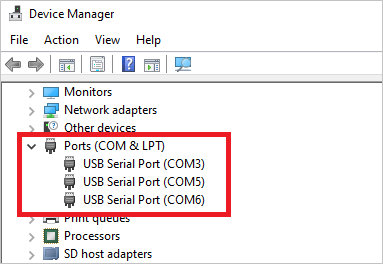

Connect your Azure Sphere dev kit to your PC through USB. When plugged in, the device exposes three COM ports. Open Device Manager on the PC and make sure that three COM ports are installed. COM ports may be different from those in the figure.



Alternatively, you can download the drivers from [Future Technology Devices International (FTDI)](https://www.ftdichip.com/Drivers/VCP.htm). Choose the driver that matches your Windows installation (32-bit or 64-bit).

## Install the Azure Sphere SDK

1. [Download the SDK](https://aka.ms/AzureSphereSDKDownload). Save the downloaded file on your PC.
2. Run the downloaded .exe to install the SDK. Agree to the license terms, and then select **Next**.
3. Select **Install** to begin installation.
4. Accept the elevation prompt if one appears.
5. When setup finishes, restart your PC if the setup application requests it.

## Sign in to Azure Sphere

1. Press the Windows key and type **Azure Sphere Developer Command Prompt**.

2. Select and start the **Azure Sphere Developer Command Prompt**.

   

3. If you've never signed in to Azure Sphere before or installed the SDK, add the -- newuser parameter to create a new tenant user. Replace \<email@address.com\> with your account and run the command.

   ```
   azsphere login --newuser <email@address.com>
   ```

   Type the following command to sign in to Azure Sphere using a Microsoft account.

   ```
   azsphere login
   ```

## Create a new tenant

> [!NOTE]
> If you have access to a single tenant or multiple tenants, you can proceed to the next step.

1. Now that you have successfully logged in, you'll create a new tenant. Type the following command. Replace \<tenant_name\> with a name that other users can recognize. You can create only one Azure Sphere tenant with each device.

   ```
   azsphere tenant create -n <tenant_name>
   ```

2. After that, you'll be prompted to sign in again for the Azure Sphere tenant credentials.

## Select the default Azure Sphere tenant

1. If you have access to a single tenant, it will be selected by default.

   If you have access to more than one tenant, run the following command to list Azure Sphere tenants.

   ```
   azsphere tenant list
   ```

2. Copy the ID from the list above and replace \<tenant_id\> with it. Run the following command to set the default tenant.

   ```
   azsphere tenant select -i <tenant_id>
   ```

## Claim your device

  > [!NOTE]
  > If you have already claimed your Azure Sphere device, you can proceed to the next step.

  > [!NOTE]
  > Claiming an Azure Sphere device is a one-time operation. You can't move the device to another Azure tenant once it has been claimed. However, you can add more users and roles to the Azure Sphere tenant, including users with admin rights.

1. Run the following command to claim the device.

   ```
   azsphere device claim
   ```

## Configure the Azure Sphere Wi-Fi network

You'll configure Azure Sphere for networking. Hence, you can receive cloud updates from the Azure Sphere Security Service and communicate with services such as Azure IoT Hub.

1. Scan for Wi-Fi access points using the following command.

   ```
   azsphere device wifi scan
   ```

2. Run the following command to add your Wi-Fi network to the device. Replace \<yourwifissid\> with the name of your network, and replace \<yourwifipassword\> with your network password.

   ```
   azsphere device wifi add -s <yourwifissid> -p <yourwifipassword>
   ```

3. Run the following command to check your Wi-Fi connection status.

   ```
   azsphere device wifi show-status
   ```

## Update the Azure Sphere OS

1. Run the following command to check the device's OS version.

   ```
   azsphere device show-os-version
   ```

2. If the device isn't up to date, run the following command to restart and trigger the update process.

   ```
   azsphere device restart
   ```

3. It will take a few minutes for the update to be applied. Then recheck the OS version.

   ```
   azsphere device show-os-version
   ```

4. Run the following command to check that the Wi-Fi network connection is active after updating the OS.

   ```
   azsphere device wifi show-status
   ```

## Delete any existing applications on Azure Sphere

1. Run the following command to delete existing applications on the device.

   ```
   azsphere device sideload delete
   ```

2. Restart Azure Sphere.

   ```
   azsphere device restart
   ```

## Enable high-level core device debugging

1. Run the following command to enable app development on the device.

   ```
   azsphere device enable-development
   ```
