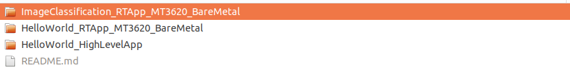
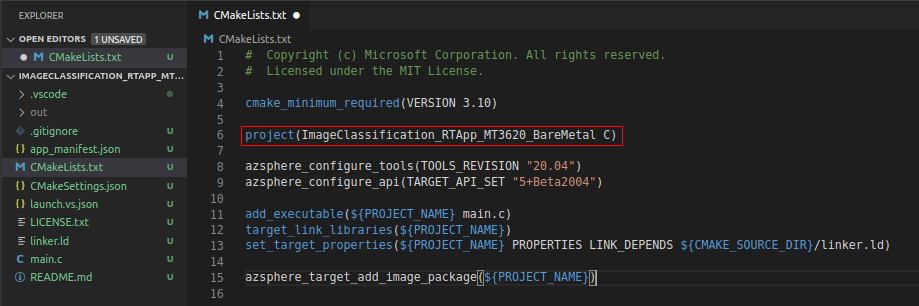

In this exercise, you'll create a real-time application to classify images on the Azure Sphere. You'll start with cloning the [HelloWorld_RTApp_MT3620_BareMetal sample](https://github.com/Azure/azure-sphere-samples/tree/master/Samples/HelloWorld/HelloWorld_RTApp_MT3620_BareMetal) and adjust the configuration to your project.

## Create a new RTApp

1. Go to the directory you want to clone the repository.

2. Clone the [Azure Sphere samples repository](https://github.com/Azure/azure-sphere-samples).

   ```
   git clone https://github.com/Azure/azure-sphere-samples.git
   ```

3. Navigate to Samples > HelloWorld folder in the repository.

4. Copy the HelloWorld_RTApp_MT3620_BareMetal folder, rename and save it for your project sample. *(Ex: ImageClassification_RTApp_MT3620_BareMetal)*

5. Start Visual Studio Code.

6. You need to install the following extensions in Visual Studio Code.

   - Azure Sphere
   - C/C++
   - CMake Tools

7. After installation, configure Visual Studio Code with the path to the Azure Sphere SDK installation directory:

   1. In the **File** menu select **Preferences > Settings > Extensions > AzureSphere**.
   2. Under **Azure Sphere: Sdk Path** enters the path to the Azure Sphere SDK installation directory. By default, this is /opt/azurespheresdk.

8. Navigate to File > Open Folder.

9. Select the project you renamed newly.

   

   > Note: If Visual Studio Code displays a dialog box indicating that no CMake kits are available, select `Do not use a kit`. You should see messages from CMake.

10. Open the CMakeList.txt in Visual Studio Code.

11. In the CMakeLists.txt file, change the project name to the name of your new folder and save the changes. 

    

12. Open the app_manifest.json file and save the changes.

    - Set `Name` to your project name,
    - Set `ApplicationType` to `"RealTimeCapable" `and save the changes.

    