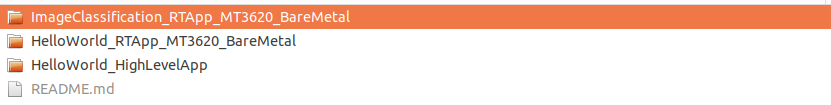
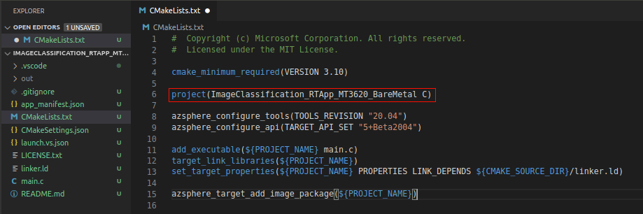
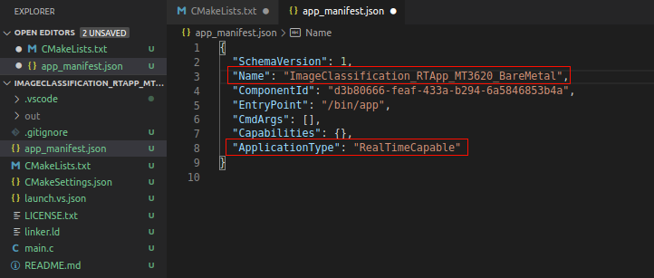

In this exercise, you'll create a real-time application to classify images on Azure Sphere. You'll start by copying the current [HelloWorld_RTApp_MT3620_BareMetal sample](https://github.com/Azure/azure-sphere-samples/tree/main/Samples/HelloWorld/HelloWorld_RTApp_MT3620_BareMetal), then update the copied project name and manifest.

## Create a new RTApp

1. Go to the directory where you want to clone the repository.

2. Clone the [Azure Sphere samples repository](https://github.com/Azure/azure-sphere-samples).

   ```
   git clone https://github.com/Azure/azure-sphere-samples.git
   ```

3. Navigate to the Samples > HelloWorld folder in the repository.

4. Copy the HelloWorld_RTApp_MT3620_BareMetal folder, rename it, and save it for your project sample. *(Ex: ImageClassification_RTApp_MT3620_BareMetal)*

5. Generate a new GUID/UUID for the copied application. For example, in PowerShell run:

   ```powershell
   [guid]::NewGuid()
   ```

   Save this value for the `ComponentId` field in the copied project's `app_manifest.json`.

6. Before opening the copied project in Visual Studio Code, verify that your RTApp tools are installed and discoverable.

   - Install the Azure Sphere SDK and Azure Sphere extension for Azure CLI. The SDK installer sets the `AzureSphereDefaultSDKDir` environment variable, which the sample's `CMakePresets.json` uses to locate the Azure Sphere RTCore CMake toolchain file.
   - Install CMake and Ninja.
   - Install the GNU Arm Embedded Toolchain for `arm-none-eabi`. Visual Studio Code usually discovers it automatically. If CMake can't find it, set both the Visual Studio Code **Azure Sphere: Arm Gnu Path** setting and the sample's `ArmGnuPath` environment variable to the GNU Arm toolchain installation root, such as `C:\Program Files (x86)\GNU Arm Embedded Toolchain\10 2020-q4-major` on Windows, not the `bin` subdirectory. The Azure Sphere RTCore CMake toolchain file appends `/bin/<compiler>` automatically, so pointing at `bin` causes a `bin/bin/...` lookup failure. Don't point either value at an Azure Sphere SDK sysroot.

7. Start Visual Studio Code.

8. You need the following extensions in Visual Studio Code.

   - Azure Sphere
   - C/C++
   - CMake Tools

9. Navigate to **File** > **Open Folder**.

10. Select the newly named project.

    

    > [!NOTE]
    > Use the CMake preset that came with the current sample. If Visual Studio Code asks for a configure preset, select `ARM-Debug`. If it asks for a CMake kit, don't manually choose a compiler kit; use the Azure Sphere preset-based configuration.

11. Open CMakeLists.txt in Visual Studio Code.

12. In the CMakeLists.txt file, change the project name to the name of your new folder and save the changes.

    

13. Open the app_manifest.json file.

    - Set `Name` to your project name.
    - Set `ComponentId` to the new GUID/UUID that you generated for this copied application.
    - Verify that `ApplicationType` is `RealTimeCapable`.
    - Preserve `EntryPoint`, `CmdArgs`, `Capabilities`, and `MallocVersion` unless your application specifically requires a change. This RTApp doesn't communicate with a high-level app, so `Capabilities` remains `{}`. If you later add inter-core communication, add `AllowedApplicationConnections` as a key **inside** `Capabilities` listing the partner high-level app's component ID, and add the symmetrical entry to that high-level app's manifest.

    Save the changes.

    

14. After changing `CMakeLists.txt`, `CMakePresets.json`, or other CMake configuration files, run **CMake: Delete Cache and Reconfigure** from the Visual Studio Code Command Palette so IntelliSense and builds use the updated configuration. If you're using the CLI instead of Visual Studio Code, delete or recreate the build directory, such as `out\ARM-Debug`, before configuring again.
