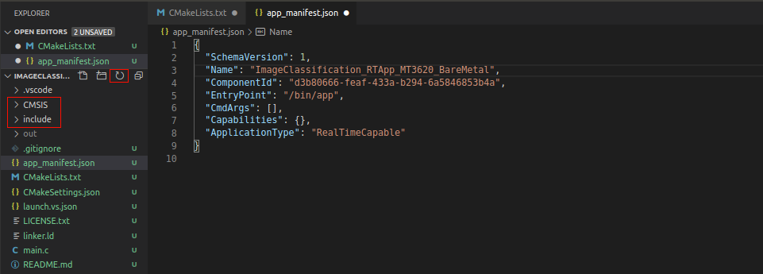
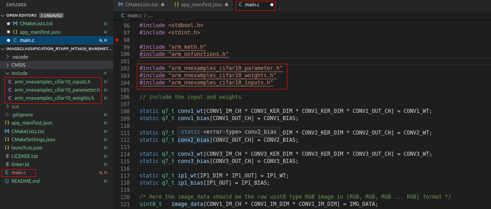
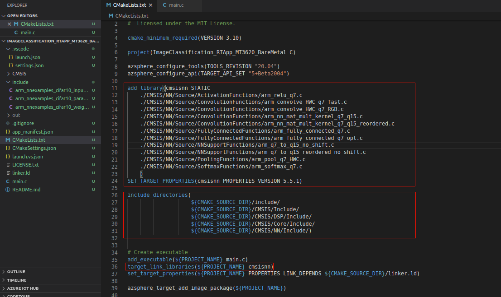

In this exercise, you'll modify and update the ImageClassification_RTApp_MT3620_BareMetal sample project that you newly renamed. Start with installing the Microsoft sample project as a baseline. You'll copy weights and parameters from the project and update your source code.

1. Go to the directory where you want to clone the repository.

2. Clone the [Microsoft sample image classification repository](https://github.com/MicrosoftDocs/mslearn-oxford-image-classification-azure-sphere).

   ```
   git clone https://github.com/MicrosoftDocs/mslearn-oxford-image-classification-azure-sphere.git
   ```

3. Navigate to the mslearn-oxford-image-classification-azure-sphere folder and open the CMSISNN-Cifar10 project sample on your computer.

4. Copy the CMSIS library folder and paste it into your ImageClassification_RTApp_MT3620_BareMetal project folder.

5. Copy the include folder and paste it into your ImageClassification_RTApp_MT3620_BareMetal project folder.

6. Copy the main.c file in the CMSISNN-cifar10 project folder and replace it with the main.c file in the ImageClassification_RTApp_MT3620_BareMetal project folder.

7. Go back to Visual Studio Code and refresh the explorer. You'll see that CMSIS and include folders are added.

   

8. Open the main.c file. You'll see the parameters, weights and input are defined in main.c. You'll add the directory path in the next step so that it will not give an error.

   

9. Open CMakeLists.txt to modify it.

   - Add required libraries.

     ```
     add_library(cmsisnn STATIC
     	./CMSIS/NN/Source/ActivationFunctions/arm_relu_q7.c
     	./CMSIS/NN/Source/ConvolutionFunctions/arm_convolve_HWC_q7_fast.c
     	./CMSIS/NN/Source/ConvolutionFunctions/arm_convolve_HWC_q7_RGB.c
     	./CMSIS/NN/Source/ConvolutionFunctions/arm_nn_mat_mult_kernel_q7_q15.c
     	./CMSIS/NN/Source/ConvolutionFunctions/arm_nn_mat_mult_kernel_q7_q15_reordered.c
     	./CMSIS/NN/Source/FullyConnectedFunctions/arm_fully_connected_q7.c
     	./CMSIS/NN/Source/FullyConnectedFunctions/arm_fully_connected_q7_opt.c
     	./CMSIS/NN/Source/NNSupportFunctions/arm_q7_to_q15_no_shift.c
     	./CMSIS/NN/Source/NNSupportFunctions/arm_q7_to_q15_reordered_no_shift.c
     	./CMSIS/NN/Source/PoolingFunctions/arm_pool_q7_HWC.c
     	./CMSIS/NN/Source/SoftmaxFunctions/arm_softmax_q7.c
     	)
     SET_TARGET_PROPERTIES(cmsisnn PROPERTIES VERSION 5.5.)
     
     #link CMSIS libraries
     target_link_libraries(${PROJECT_NAME} cmsisnn)
     ```

   - Include directories.

     ```
     include_directories(
     					${CMAKE_SOURCE_DIR}/include/ 
     					${CMAKE_SOURCE_DIR}/CMSIS/Include/ 
     					${CMAKE_SOURCE_DIR}/CMSIS/DSP/Include/
     					${CMAKE_SOURCE_DIR}/CMSIS/Core/Include/
     					${CMAKE_SOURCE_DIR}/CMSIS/NN/Include/)
     ```

10. When you update the CMake file, save your changes. Your CMakeList.txt file will look like:

    
