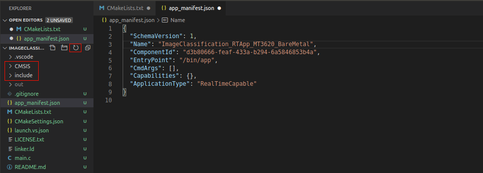
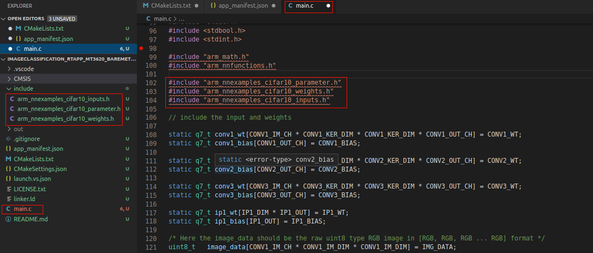
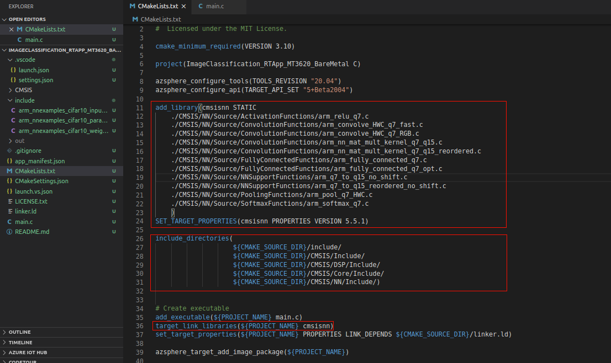

In this exercise, you'll modify and update the ImageClassification_RTApp_MT3620_BareMetal project that you created from the current HelloWorld RTApp sample. You copy the pretrained, prequantized CIFAR-10 example source, headers, and required legacy CMSIS-NN sources into your project, then update your current CMake file without replacing the sample's `CMakePresets.json` or Azure Sphere image-package step.

1. Go to the directory where you want to clone the repository.

2. Clone the [Microsoft sample image classification repository](https://github.com/MicrosoftDocs/mslearn-oxford-image-classification-azure-sphere).

   ```
   git clone https://github.com/MicrosoftDocs/mslearn-oxford-image-classification-azure-sphere.git
   ```

3. Navigate to the mslearn-oxford-image-classification-azure-sphere folder and open the CMSISNN-Cifar10 project sample on your computer.

4. Copy the `CMSISNN-Cifar10\CMSIS` folder and paste it into your ImageClassification_RTApp_MT3620_BareMetal project folder. Preserve the folder casing and nested layout. After copying, your RTApp project should contain paths such as `CMSIS\CMSIS\NN\Source`, `CMSIS\CMSIS\NN\Include`, `CMSIS\CMSIS\Core\Include`, and `CMSIS\CMSIS\DSP\Include`. This sample uses the legacy CMSIS_5 v5.5.1 Q7 NN APIs, so check CMSIS_5 references for functions such as `arm_softmax_q7` rather than only the modern standalone CMSIS-NN API reference.

5. Copy the `CMSISNN-Cifar10\include` folder and paste it into your ImageClassification_RTApp_MT3620_BareMetal project folder. This folder contains:

   - `arm_nnexamples_cifar10_weights.h`, with the quantized weights, biases, and Q7 shift constants.
   - `arm_nnexamples_cifar10_parameter.h`, with layer shape and convolution/pooling configuration constants.
   - `arm_nnexamples_cifar10_inputs.h`, with the flat 32-by-32 RGB `IMG_DATA` input and input preprocessing shift constants.

6. Copy `CMSISNN-Cifar10\main.c` into your `ImageClassification_RTApp_MT3620_BareMetal` project folder, replacing the HelloWorld `main.c`.

7. Go back to Visual Studio Code and refresh the explorer. You see that `CMSIS` and `include` folders are added.

   

8. Open the `main.c` file. You see the parameters, weights, and input headers included in `main.c`. You'll add the source and include paths in the next step so CMake can compile these files.

   

9. Open `CMakeLists.txt` to modify it. Start from the current HelloWorld RTApp CMake structure that you copied from the Azure Sphere samples. Don't copy the legacy `CMSISNN-Cifar10\CMakeLists.txt` or `CMakeSettings.json` wholesale. Keep the current `CMakePresets.json`, keep the existing linker dependency, and keep `azsphere_target_add_image_package(${PROJECT_NAME})` as the final call.

   Update the file so it follows this structure. Replace the empty `target_link_libraries(${PROJECT_NAME})` line from HelloWorld with `target_link_libraries(${PROJECT_NAME} cmsisnn)`.

   ```cmake
   cmake_minimum_required(VERSION 3.20)

   project(ImageClassification_RTApp_MT3620_BareMetal C)

   add_executable(${PROJECT_NAME} main.c)

   add_library(cmsisnn STATIC
       CMSIS/CMSIS/NN/Source/ActivationFunctions/arm_relu_q7.c
       CMSIS/CMSIS/NN/Source/ConvolutionFunctions/arm_convolve_HWC_q7_fast.c
       CMSIS/CMSIS/NN/Source/ConvolutionFunctions/arm_convolve_HWC_q7_RGB.c
       CMSIS/CMSIS/NN/Source/ConvolutionFunctions/arm_nn_mat_mult_kernel_q7_q15.c
       CMSIS/CMSIS/NN/Source/ConvolutionFunctions/arm_nn_mat_mult_kernel_q7_q15_reordered.c
       CMSIS/CMSIS/NN/Source/FullyConnectedFunctions/arm_fully_connected_q7.c
       CMSIS/CMSIS/NN/Source/FullyConnectedFunctions/arm_fully_connected_q7_opt.c
       CMSIS/CMSIS/NN/Source/NNSupportFunctions/arm_q7_to_q15_no_shift.c
       CMSIS/CMSIS/NN/Source/NNSupportFunctions/arm_q7_to_q15_reordered_no_shift.c
       CMSIS/CMSIS/NN/Source/PoolingFunctions/arm_pool_q7_HWC.c
       CMSIS/CMSIS/NN/Source/SoftmaxFunctions/arm_softmax_q7.c
   )
   set_target_properties(cmsisnn PROPERTIES VERSION 5.5.1)

   include_directories(
       ${CMAKE_SOURCE_DIR}/include
       ${CMAKE_SOURCE_DIR}/CMSIS/CMSIS/Core/Include
       ${CMAKE_SOURCE_DIR}/CMSIS/CMSIS/DSP/Include
       ${CMAKE_SOURCE_DIR}/CMSIS/CMSIS/NN/Include
   )

   target_link_libraries(${PROJECT_NAME} cmsisnn)
   set_target_properties(${PROJECT_NAME} PROPERTIES LINK_DEPENDS ${CMAKE_SOURCE_DIR}/linker.ld)

   azsphere_target_add_image_package(${PROJECT_NAME})
   ```

10. Save `CMakeLists.txt`.

11. Because you changed CMake configuration, run **CMake: Delete Cache and Reconfigure** from the Visual Studio Code Command Palette. Make sure the `ARM-Debug` configure preset is selected. If you're building from the CLI, delete or recreate the build directory, such as `out\ARM-Debug`, and then configure again with the `ARM-Debug` preset.

12. Your updated CMakeLists.txt file looks like:

    
