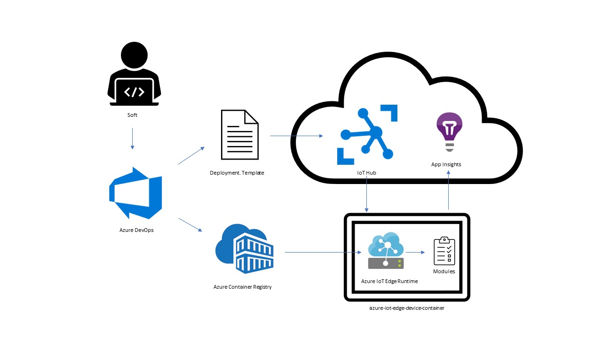

In this module, you'll implement a solution for smoke testing using a CI/CD (continuous integration and continuous delivery) strategy using Azure Pipelines and Azure Monitor Application Insights. The solution is designed to create a smoke test by incorporating code from developers and running it on virtual Azure IoT Edge devices in an automated manner.

Suppose you work as an engineer who's responsible for deploying production software to IoT Edge devices. Your job involves creating the final software code release of your product. Your IoT solution has expanded considerably. Previously, you had a small number of devices of the same type located in the same geography. Now, you're deploying to thousands of different IoT devices spread across a wider geography. Your product has also evolved. The company has expanded, and your software release now includes code from a larger number of developers. To build this release pipeline, you must integrate code from various members of the development team.

Because it's expensive to deploy to diverse physical IoT devices, your team has tasked you with creating a process for smoke testing the solution. Smoke testing checks the core functionality of a program. A successful smoke test ensures that the program is ready for further testing. By using a smoke test for IoT devices, you can create a baseline for the core functionality. If the smoke test for the solution on IoT devices fails, your team can concentrate on fixing the identified issues. This avoids expensive rework with more sophisticated tests, optimizing the time for your developer and the test teams.

You need to create a smoke test as a subset of your main functionality. The test should be self-scoring and automated. It should be capable of running on virtual IoT devices so that your team can save costs by avoiding the use of physical IoT devices. Also, the test should incorporate the principles of CI/CD for IoT Edge devices. Hence, you want to automate the entire process end to end. Your smoke-testing strategy should incorporate code from developers and run it on virtual IoT Edge devices in an automated manner.

By the end of this module, you'll be able to create a smoke test for virtual IoT Edge devices using Azure DevOps, Azure Pipelines, and Application Insights.

## Learning objectives

In this module, you will:

- Create a pipeline that deploys a smoke test using virtual IoT Edge devices
- Monitor the performance of the solution using a CI/CD strategy

## Prerequisites

- Basic knowledge of Azure DevOps
- Basic knowledge of CI/CD
- Basic knowledge of IoT Edge
- An active Azure subscription
- A GitHub account
