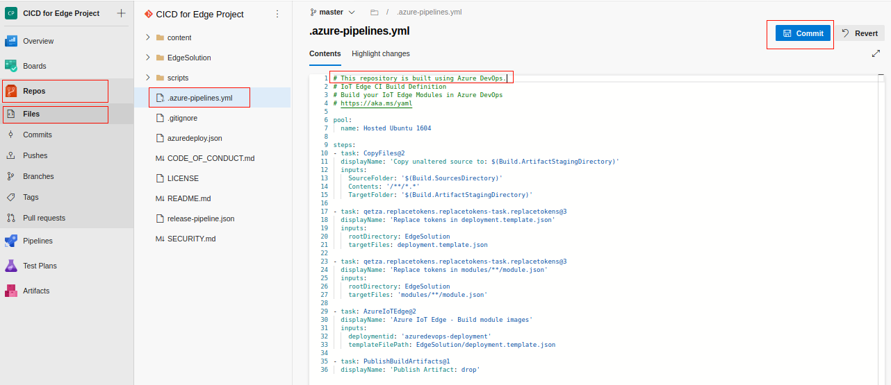
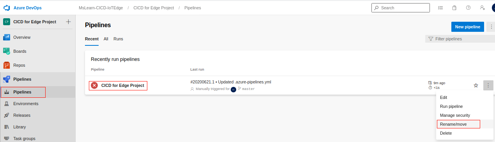
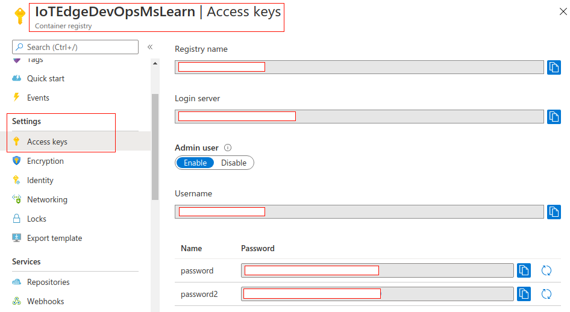
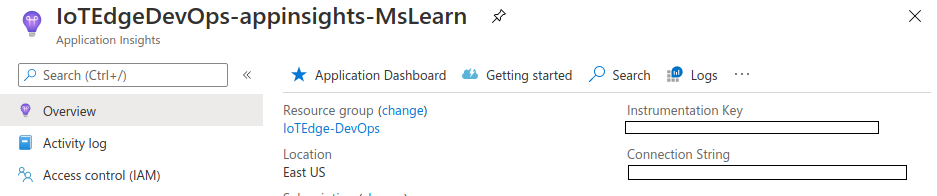
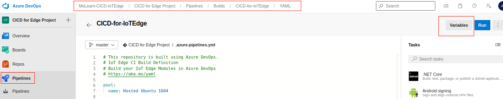

## Create Azure resources

Azure DevOps Projects creates a CI/CD pipeline in Azure DevOps. First, you'll need to create cloud services that will be used for the module.

1. Sign in to the [Microsoft Azure portal](https://portal.azure.com/).

1. Select the following **Deploy to Azure** button. The **Custom deployment** panel appears.

   [](https://portal.azure.com/#create/Microsoft.Template/uri/https%3A%2F%2Fraw.githubusercontent.com%2FMicrosoftDocs%2Fmslearn-oxford-implement-cicd-iot-edge%2Fmaster%2Fazuredeploy.json)

1. On the **Basics** tab, fill in the following values for each setting.

    | Setting | Value |
    | --- | --- |
    | **Deployment scope** |
    | Subscription | Select your subscription |
    | Resource group | Select a name from the dropdown, or select the **Create New** link, and in the **Name** text box, enter a name. |
    | **Parameters** |
    | Region | Select the same region as your resource group |
    | Resource Name Suffix | Enter a globally unique value |

1. Select **Review + create**, and then select **Create** to deploy your resources to Azure.

   > [!NOTE]
   > If you encounter any issues in the deployment, we advise deleting the created resource group (if any), and retrying with a new value for the **Resource Name Suffix** parameter.

1. After deployment successfully completes, select **Go to resource group** to review your resources.

## Create an Azure DevOps project

1. If you don't have an Azure DevOps organization, you should follow the steps to create one for free.

   1. Open [Azure Pipelines](https://azure.microsoft.com/services/devops/pipelines) and choose **Start free**.
   1. Sign in/up with Microsoft.
   1. Give a name to your organization, and create it.

1. From the **Azure DevOps** page, on the upper right corner, select **New project**. The **Create new project** pane appears.

1. In the **Project name** text box, enter a project name.

1. In the **Description** text box, enter descriptive text about your new project.

1. Under **Visibility**, select either private or public.

1. Select **Create**. The project's welcome page appears.

1. In the left menu pane, select **Repos**, and in the **Import a repository** box, select **Import**. The **Import a Git repository** pane appears.

1. In the **Clone URL** field, enter this URL, and select **Import**.

    ```
    https://github.com/MicrosoftDocs/mslearn-oxford-implement-cicd-iot-edge.git
    ```

## Create a CI pipeline

This repository contains an Azure DevOps build definition, which is preconfigured to build the included EdgeSolution in [azure-pipelines.yml](https://github.com/MicrosoftDocs/mslearn-oxford-implement-cicd-iot-edge/blob/master/.azure-pipelines.yml). This build definition relies on an external plugin called [Replace Tokens](https://marketplace.visualstudio.com/items?itemName=qetza.replacetokens).

1. Begin by installing the **Replace Tokens** task from the Visual Studio Marketplace by visiting [this link](https://marketplace.visualstudio.com/) and selecting **Get it free**. Then, select **Install** to install the token into the organization that contains your newly created Azure DevOps project.

1. After this task is successfully installed, return to the Azure DevOps project, and select **Repos** > **Files**. Select the edit icon to edit the `.azure-pipelines.yml` file.

1. Add the following comment to the top of the file, as shown below.

   ```
   # This repository is built using Azure DevOps.
   ```

   

1. Select **Commit** to commit your change. The **Commit** pane appears. Select **Commit**.

1. Return to the **Files** panel.

1. In the upper right corner, select **Set up build**, and then select **Run**. You should see that a build has kicked off upon editing the build definition.

1. In the left menu pane, select **Pipelines**. You will see the build will fail. This is to be expected, as Azure DevOps will create the build definition with a name that contains spaces, which cause a conflict in the "Azure IoT Edge - Build module images" task.

1. To fix this, select **Pipelines**. The **Pipelines** panel appears.

1. From the *Recently run pipelines*, at the far right, select the vertical ellipsis for your pipeline, and select **Rename/move**. The **Rename/move pipeline** dialog appears. In the **Name** text box, and rename the newly created build definition so that it does not contain spaces. Select **Save**.

   

### Create build definition variables

1. Now you need to add build variables in order to run the build successfully. You'll need to obtain:

   - Azure Container Registry host name as `acr.host`
   - Azure Container Registry username as `acr.user`
   - Azure Container Registry password as `acr.password`

1. Go to the Azure portal, and navigate to the resource group you created for this module.

1. Select the **Container Registry** resource.

1. From the left menu pane, under **Settings**, select **Access keys**.

1. Copy the **registry name**, **Login server**, **Username**, and **password**.

   

1. Obtain the Application Insights instrumentation key, which will be represented by `appinsights.instrumentationkey`. Go to the Azure portal, and navigate to the resource group you created for this module.

1. In the left menu pane, select **Overview**. Under the **Resources** tab, select the **Application Insights** resource.

1. In the **Essentials** section, copy the **Instrumentation Key**.

   

1. Go back to Azure DevOps project, and navigate to **Pipelines**.

1. In the pipeline you ran earlier, select the far left vertical ellipsis, and then select **Edit**.

1. In the upper left, select **Variables**. The **New variable** pane appears.

    

1. Add four variables with names and values by slecting **OK** after each entry. When all four variables have been entered, select **Save**, and then select **Run**. The **Run pipeline** pane appears. Select **Run**.

1. Review the status of the pipeline by going back to **Pipelines**. The build should finish successfully as follows.

    

### Apply a branch policy

1. With a successful build definition in place, we can now enforce continuous integration by applying a branch policy to the master branch. In the left menu pane, select **Repos**, and again, in the left menu pane, select **Branches**. Select the vertical ellipsis at the far end of the row for the master branch, and from the dropdown, select **Branch policies**.

1. In the middle of the **master** panel, select **Build Validation**, and then select the **+** icon (Add new build policy), and select the newly created build pipeline. Keep everything with their default values, and then select **Save**.

   

   While this policy is enabled, all commits to feature branches will kick off an execution of the newly created build pipeline. It must succeed in order for a pull request of those changes to be made to the master branch.
