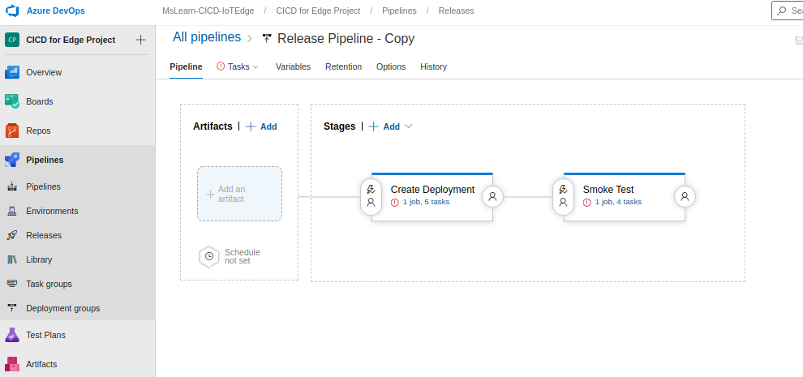
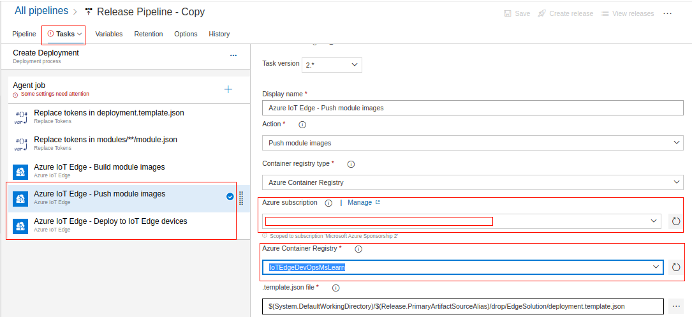
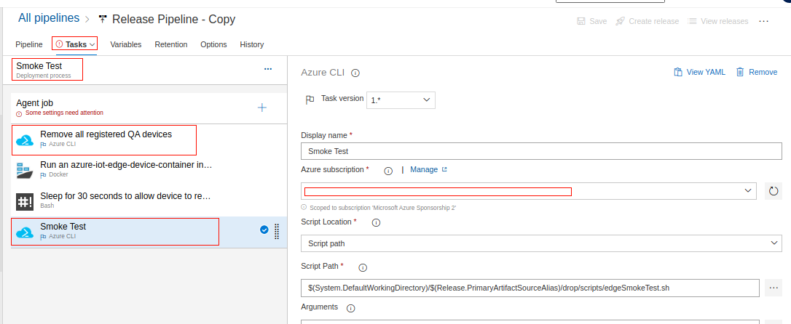
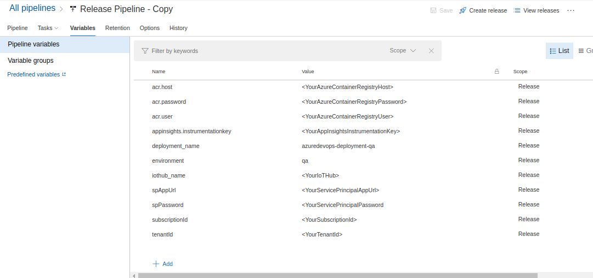
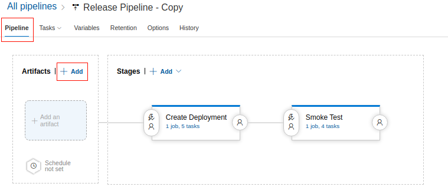
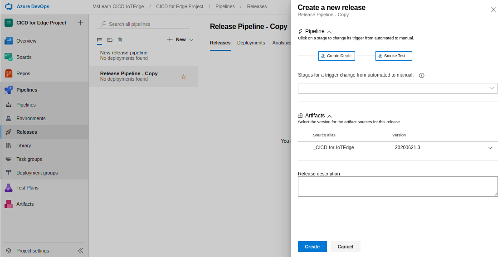

## Create a new release pipeline

Deployments to devices need to be done under tight control in production environments. To achieve this, you'll create a release pipeline that deploys to QA devices and smoke tests the edge runtime in a containerized device. This is accomplished by running an instance of [azure-iot-edge-device-container](https://github.com/toolboc/azure-iot-edge-device-container), which is configured as a QA device. Then, you'll probe the IoT hub to ensure that the QA device receives the desired deployment configuration, and is able to successfully run all configured modules. This test is contained in [edgeSmokeTest.sh](https://github.com/MicrosoftDocs/mslearn-oxford-implement-cicd-iot-edge/blob/master/scripts/edgeSmokeTest.sh).

1. To begin creating a release pipeline, in the left menu pane, select **Pipelines**, and then select **Releases**. Select **New pipeline**. The **Select a template** pane appears. To create a new pipeline with an empty job, select **Empty job**, and then select ***Save**. In the **Save** dialog, select a **Folder** from the dropdown, and enter any **Comment**. Select **OK**.

1. From the left menu pane, select **Releases**. In the middle menu pane, select the **New** dropdown, and then select **Import release pipeline**. Download the [release-pipeline.json](https://github.com/MicrosoftDocs/mslearn-oxford-implement-cicd-iot-edge/blob/master/release-pipeline.json) file located in the root of this repository and import it. The import should finish successfully as follows.

   

    You'll need to fix a few things before you can successfully run the release pipeline, specifically Azure subscription endpoints, agent pools, variable settings, and artifact source.

1. From the **Tasks** dropdown, select **Create Deployment**. Provide the appropriate Azure subscription and Azure Container Registry name for the **Azure IoT Edge - Push module images** task.

   

1. Provide the appropriate Azure subscription and Azure Container Registry name for the **Azure IoT Edge - Deploy to IoT Edge devices** task.

1. From the **Tasks** dropdown, select **Smoke Test**. Provide the appropriate Azure subscription and Azure Container Registry name for the **Remove all registered QA devices** and **Smoke Test** tasks.

   

1. To fix the agent pools, from the **Tasks** dropdown, select **Create Deployment**, and then select **Agent Job** to change the agent pool.

1. Repeat the same step. From the **Tasks** dropdown, select **Smoke Test**, and then select **Agent Job** to change the agent pool to **Hosted Ubuntu 1604**.

1. Now, you should be able to save the release pipeline. We highly recommended saving it at this point if Azure DevOps allows.

1. On the **Variables** tab, you'll need to modify all variables in brackets (<>).

   

1. Use the same values for `acr.host`, `acr.user`, `acr.password`, and `appinsights.instrumentationkey` that you previously used in the CI build definition.

1. `iothub_name` is the name of the IoT hub you created. Navigate to the Azure portal home page, go to the resource group you created, and make a copy of the IoT hub name.

1. For the additional variables, you need to create a service principal by performing the following steps:

    1. Go to the Azure portal.

    2. Open Azure Cloud Shell.

    3. Run `az account list` to see available subscriptions, and set the appropriate subscription.

       ```
       az account set --subscription <subscriptionid>
       ```

    4. Create a service principal for your subscription with the Azure CLI.

       ```
       az ad sp create-for-rbac --name <name>
       ```

    5. You should see output similar to the following.

       ```
       {
       "appId": "12345678-1234-1234-1234-1234567890ab",
       "displayName": "azure-iot-edge-device-container-sp",
       "name": "http://azure-iot-edge-device-container-sp",
       "password": "MyPassword",
       "tenant": "abcdefgh-abcd-abcd-abcd-abcdefghijkl"
       }
       ```

    6. Make note of the `name`, `password`, and `tenant` values, as these values will be used for `spAppURl`, `spPassword`, and `tenant` respectively.

    7. Provide all parameters as required in **Variables**.

1. Now, go back to **Pipeline**, and add an artifact.

    

1. Select your CI build pipeline as the source type, and configure it to obtain the latest version.

1. After you have configured everything appropriately, select **Save**.

1. In the left menu pane, select **Pipelines**, and then select **Releases**.

1. Select the newly created release pipeline, and select **Create a release**.

    

    The new release pipeline should begin running.
