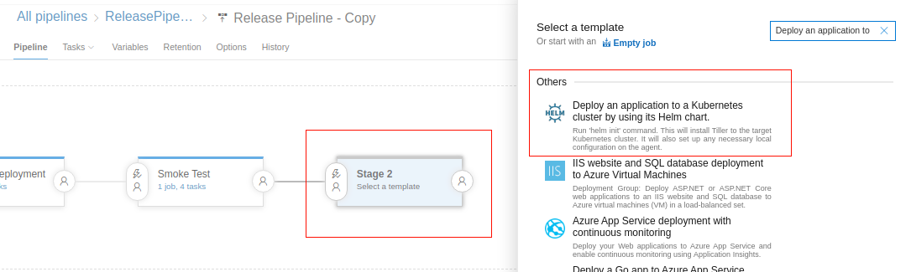
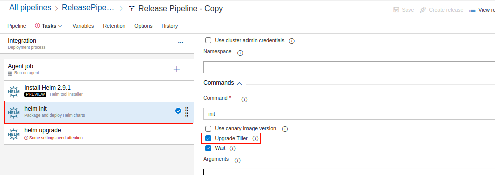

Integration testing is important for Azure IoT Edge solutions that rely on services to accomplish desired functionality. You'll set up a scalable deployment of QA devices using an Azure Kubernetes cluster. This allows for an ability to deploy a theoretically limitless number of devices into an isolated environment for testing. In addition, you'll be able to monitor these devices using the dockerappinsights module, which is configured in [deployment.template.json](https://github.com/MicrosoftDocs/mslearn-oxford-implement-cicd-iot-edge/blob/master/EdgeSolution/deployment.template.json). Completion of this exercise will require configuration of Azure Kubernetes Service (AKS).

## Create an AKS cluster

To create an AKS cluster, complete the following steps:

1. On the Azure portal menu or from the **Home** page, select **Create a resource**.
2. Select **Containers** > **Kubernetes Service**.
3. On the **Basics** page, configure the following options:
   - Select an Azure **Subscription**.
   - Select or create an Azure **Resource group**.
   - Enter a **Kubernetes cluster name**.
   - Select a **Region**, **Kubernetes version**, and **DNS name prefix** for the AKS cluster.
   - Select a VM **Node size** for the AKS nodes.
   - Select **Next: Scale** when you finish.
4. Click **Next**.
5. On the **Authentication** page, configure the following options:
   - Create a new service principal by leaving the **Service Principal** field with **(new) default service principal**. Or you can choose **Configure service principal** to use an existing one. If you use an existing one, you'll need to provide the SPN client ID and secret.
   - Enable the option for Kubernetes role-based access control (RBAC). This will provide more fine-grained control over access to the Kubernetes resources deployed in your AKS cluster.

6. Click **Review + create** and then **Create** when validation finishes. It takes a few minutes to create the AKS cluster. When your deployment is complete, click **Go to resource**.

7. Open Azure Cloud Shell.

8. Run the following command to download credentials and configure the Kubernetes CLI to use them.

   ```
   az aks get-credentials --resource-group <your-resource-group> --name <your-cluster-name>
   ```

9. Verify the connection to your cluster. Run the following command to return a list of the cluster nodes.

   ```
   kubectl get nodes
   ```

## Add a scalable integration test to a release pipeline

1. Go back to the Azure DevOps web portal and navigate to **Release pipeline**.

2. Add a new stage after **Smoke Test**.

3. Select the **Deploy an application to a Kubernetes cluster by using its Helm chart** template and apply it.

   

4. Rename this stage to **Integration**.

5. Navigate to **Tasks** > **Integration**.

6. Open the **Install Helm** task and specify the Helm version as 2.9.1 instead of the latest.

7. You'll notice that the **Helm init** and **Helm upgrade** tasks require some additional configuration.

8. Provide the Azure subscription, resource group, and Kubernetes cluster that you created in the previous step for **Helm init** and **Helm upgrade**.

9. Configure the agent job to run on the **Hosted Ubuntu 1604** agent pool.

10. Configure the **Helm init** task to upgrade/install Tiller.

    

11. Configure the **Helm upgrade** task to deploy the Helm chart for  **azure-iot-edge-device-container**. Begin by adding a new **Bash** task right before the **Helm upgrade** task. Configure the type to **inline** and add the following:

    ```
    helm repo add azure-iot-edge-device-container https://toolboc.github.io/azure-iot-edge-device-container
    helm repo list
    helm repo update
    ```

12. Configure the Helm upgrade task:

    - Set the **Namespace** value to **iot-edge-qa**.

    - Set **Command** to **upgrade**.

    - Set **Chart Type** to **Name**.

    - Set **Chart Name** to **azure-iot-edge-device-container/azure-iot-edge-device-container**.

    - Set **Release Name** to **iot-edge-qa**.

    - Set **Values** to:

      ```
      spAppUrl=$(spAppUrl),spPassword=$(spPassword),tenantId=$(tenantId),subscriptionId=$(subscriptionId),iothub_name=$(iothub_name),environment=$(environment),replicaCount=2 
      ```
    - Ensure that the **Install if release not present**, **Recreate Pods**, **Force**, and **Wait** checkboxes are checked.
    
13. Start a new release and when it's complete, view your AKS cluster dashboard.

14. Go to the Azure portal and open Azure Cloud Shell.

15. Run the following command.

    ```
    az aks browse --resource-group <kube-cluster-resource-group> --name <kube-cluster-name>
    ```

16. You'll notice that QA devices have been deployed to the cluster.

### Monitoring devices with Application Insights

Monitoring allows us to perform long-running tests against edge modules and provide real-time alerts using Application Insights. Our EdgeSolution includes a dockerappinsights module, which is configured in [deployment.template.json](https://github.com/toolboc/IoTEdge-DevOps/blob/master/EdgeSolution/deployment.template.json). This module monitors the Docker host of each containerized IoT Edge device.

Make sure that the device has been deployed and is running. You can monitor the device by viewing the Application Insights resource deployed.

1. Go to the resource group you created in the beginning of the module.
2. Open the Application Insights resource.
3. Navigate to **Metrics Explorer** under **Investigate**.
4. To configure a chart, select **Add Chart** > **Edit Chart** and add the following to monitor block I/O for all edge modules.

   
   
5. Add the following to monitor the network traffic for all Edge modules.

   
