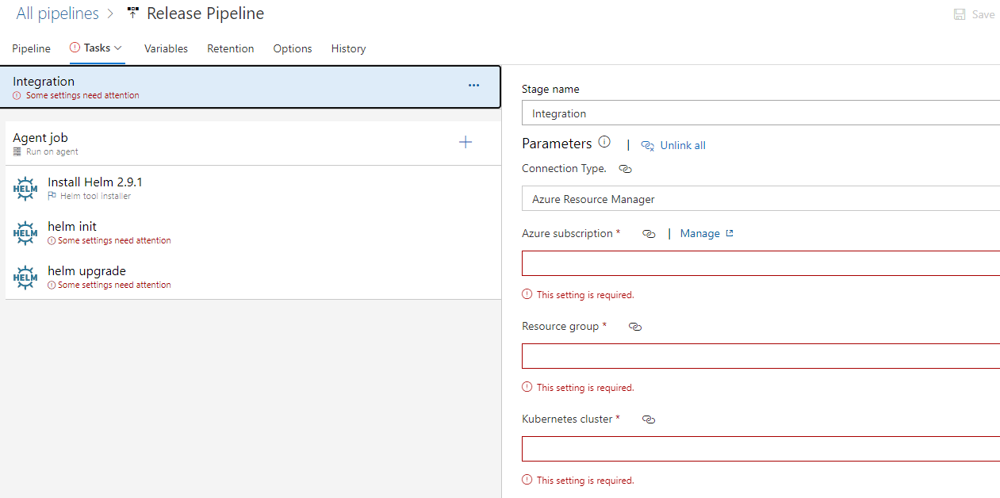
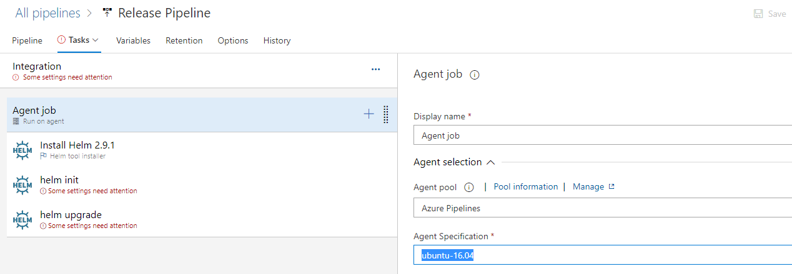
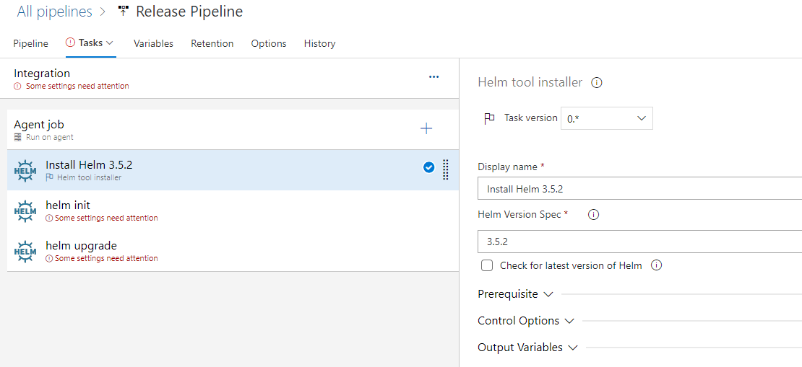
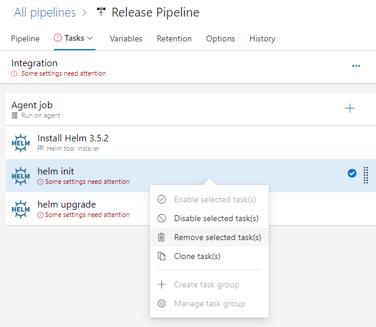
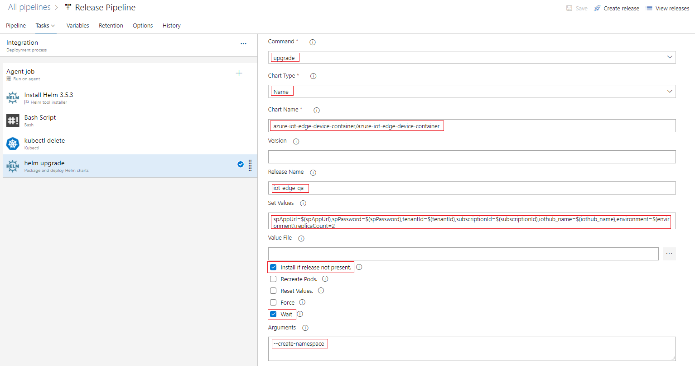
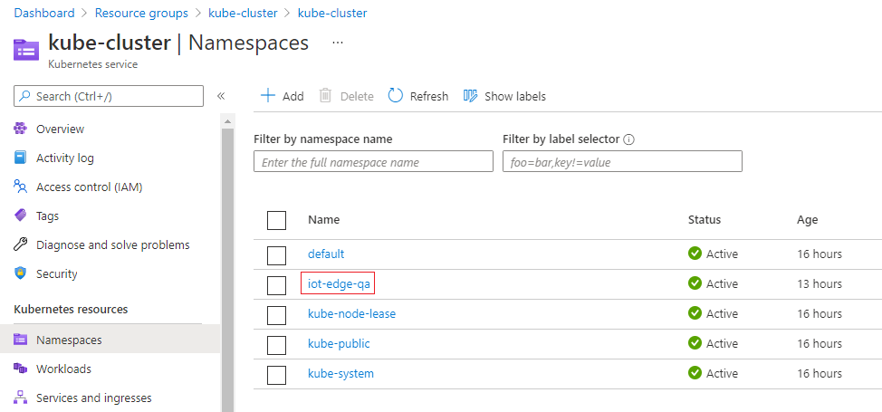
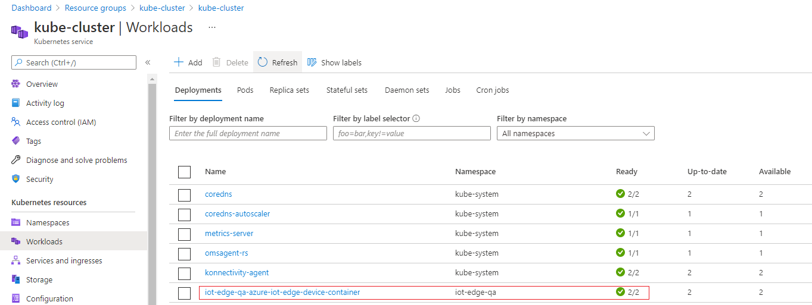

Integration testing is important for Azure IoT Edge solutions that rely on services to accomplish desired functionality. You'll set up a scalable deployment of QA devices using an Azure Kubernetes cluster. This allows for an ability to deploy a theoretically limitless number of devices into an isolated environment for testing. In addition, you'll be able to monitor these devices using the dockerappinsights module, which is configured in [deployment.template.json](https://github.com/MicrosoftDocs/mslearn-oxford-implement-cicd-iot-edge/blob/master/EdgeSolution/deployment.template.json). Completion of this exercise will require configuration of Azure Kubernetes Service (AKS).

## Create an AKS cluster

To create an AKS cluster, complete the following steps:

1. On the Azure portal menu or from the **Home** page, select **Create a resource**.

1. In the left menu pane, select **Containers**, and then select **Kubernetes Service**. The **Create Kubernetes cluster** panel appears.

1. On the **Basics** tab, enter the following values for each setting.

    | Setting | Value |
    | --- | --- |
    | **Project details** |
    | Subscription | Select your Azure subscription |
    | Resource group | Select a name from the dropdown, or select the **Create New** link, and in the **Name** text box, enter a name. |
    | **Cluster details** |
    | Kubernetes cluster name | Enter a name. |
    | Region | Select the same region as your resource group. |
    | Availability zones | *default* |
    | Kubernetes version |  *default* |
    | **Primary node pool** |
    | Node size | *default* for the AKS nodes. |
    | Node count | *default* |

1. Select the **Authentication** tab. Enter the following values for each setting.

    | Setting | Value |
    | --- | --- |
    | **Cluster infrastructure** |
    | Authentication method | Select **Service principal**. |
    | Service principal | *default* **(new) default service principal**. Or, you can select the **Configure service principal** link to use an existing one. If you use an existing one, you'll need to provide the SPN client ID and secret. |
    | **Kubernetes authentication and authorization** |
    | Role-based access control (RBAC) | **Enabled**. This will provide more fine-grained control over access to the Kubernetes resources deployed in your AKS cluster. |
    | AKS-managed Azure Active Directory | **Disabled** |
    | **Node pool OS disk encryption** |
    | Encryption type | *default* |

1. Select **Review + create**, and then select **Create** when validation successfully completes. It takes a few minutes to create the AKS cluster. When your deployment is complete, select **Go to resource**.

1. Open Azure Cloud Shell.

1. Run the following command to download credentials and configure the Kubernetes CLI to use them.

   ```
   az aks get-credentials --resource-group <your-resource-group> --name <your-cluster-name>
   ```

1. Verify the connection to your cluster. Run the following command to return a list of the cluster nodes.

   ```
   kubectl get nodes
   ```

## Add a scalable integration test to a release pipeline

1. Go back to the Azure DevOps web portal, and navigate to **Release pipeline**.

1. Add a new stage after **Smoke Test**.

1. Select the **Deploy an application to a Kubernetes cluster by using its Helm chart** template, and select **Apply**.

   

1. Rename this stage to **Integration**.

1. From the top menu bar, select **Tasks**, and then select **Integration**.  Modify the top-level parameters for this stage by supplying the appropriate values for the **Azure Subscription**, **Resource group**, and **Kubernetes cluster**. These should be the values that were used when deploying your Kubernetes cluster.



1. Configure the agent job to run on the **Hosted Ubuntu 1604** agent pool.



1. Open the **Install Helm** task, and specify the Helm version as 3.5.2 instead of the latest. 



1. You will notice that the **Helm init** task requires some additional configuration.  Helm version 3 and above no longer requires "Helm init", so we will remove this task.  To do this, right-click the task item and choose **Remove selected task(s)**.



1. Next, we'll create a new task to add the Helm chart for the **azure-iot-edge-device-container**. Begin by adding a new **Bash** task right before the **Helm upgrade** task. Configure the type to **inline** and add the following code.

    ```
    helm repo add azure-iot-edge-device-container https://toolboc.github.io/azure-iot-edge-device-container
    helm repo list
    helm repo update
    ```


1. Next, we want to ensure that our Helm deployment does not recycle existing pods on consecutive runs, and instead deploys brand new instances of the "azure-iot-edge-device-container" for testing. Add a new **kubectl** task after the **Bash** task, then modify the **Service Connection Type** to **Azure Resource Manager**, select the Azure subscription that contains your Kubernetes Cluster, then choose the resource group and name of your cluster as done previously.  


1. In this same section, scroll down and modify the **Namespace** to "iot-edge-qa", set the **Command** to "delete , and set **Arguments** field to "pods --all".


1. Finally, configure the Helm upgrade task:

    - Set the **Namespace** value to **iot-edge-qa**.

    - Set **Command** to **upgrade**.

    - Set **Chart Type** to **Name**.

    - Set **Chart Name** to **azure-iot-edge-device-container/azure-iot-edge-device-container**.

    - Set **Release Name** to **iot-edge-qa**.

    - Set **Values** to:

      ```
      spAppUrl=$(spAppUrl),spPassword=$(spPassword),tenantId=$(tenantId),subscriptionId=$(subscriptionId),iothub_name=$(iothub_name),environment=$(environment),replicaCount=2 
      ```

    - Ensure that the **Install if release not present** and **Wait** checkboxes are checked.



1. Start a new release and when complete, navigate your AKS service within the Azure Portal, then select **Namespaces**.  You will notice that the iot-edge-qa deployment has been deployed to the cluster.



1.  To view the individual pods, you can select "Workloads" where you should see that two instances have been deployed.



### Monitor devices with Application Insights

Monitoring enables us to perform long-running tests against edge modules, and provide real-time alerts using Application Insights. Our EdgeSolution includes a dockerappinsights module, which is configured in [deployment.template.json](https://github.com/toolboc/IoTEdge-DevOps/blob/master/EdgeSolution/deployment.template.json). This module monitors the Docker host of each containerized IoT Edge device.

Make sure that the device has been deployed and is running. You can monitor the device by viewing the Application Insights resource deployed.

1. Go to the resource group you created in the beginning of the module.

1. Open the Application Insights resource.

1. Under **Investigate**, select **Metrics Explorer**.

1. To configure a chart, select **Add Chart**, and then select **Edit Chart**.

1. Add the following values to monitor block I/O for all edge modules.

   

1. Add the following values to monitor the network traffic for all Edge modules.

   
