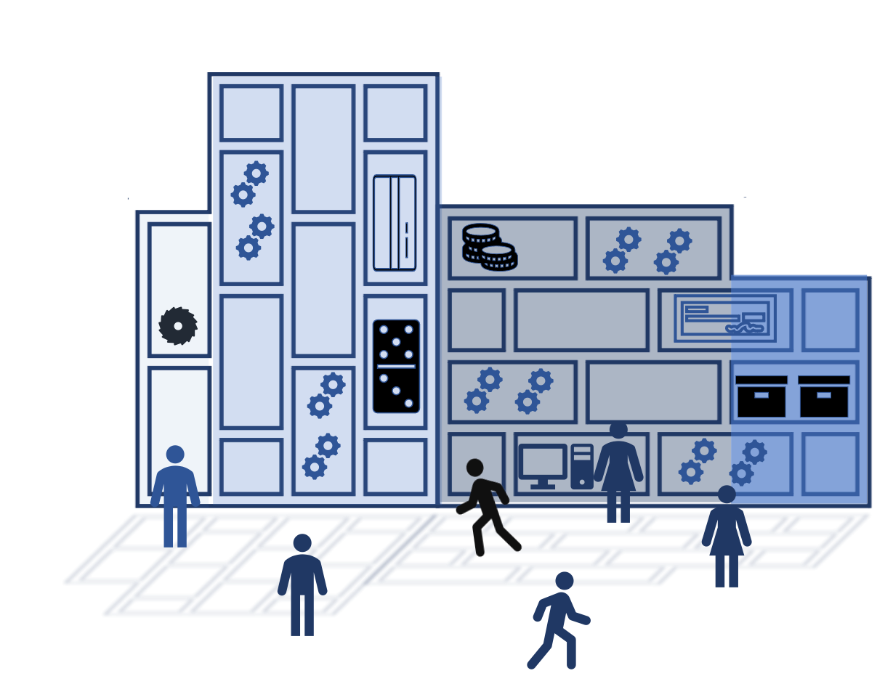

Through the deployment of 5G technologies, the capabilities of mobile networks and the Internet are converging. Azure developers can now create innovative applications by leveraging the new capabilities of 5G networks. 5G networks represent a fundamental change in architecture. They empower Enterprise Azure developers to create low latency, high-bandwidth applications. 

How can Azure developers create network-aware applications that provide more than simple connectivity? How can they simplify their application development process by using low-code tools? How can they use a single dashboard view for on-premises and cloud-based deployments?

In this module, we will understand the capabilities of 5G technologies within the context of Azure private MEC.

Suppose you're the lead technical architect of a firm creating a 3D warehousing application based on robotics technologies. You manage a fleet of autonomous robots. Each robot has a sensor, a communications chip that communicates with the Radio Access Networks set up in the factory. Unlike traditional warehouses, which are geographically spread out, 3D warehouses are organized vertically. The autonomous robots manage the vertical space within a warehouse. Robots carry bins and can accurately and rapidly deliver inventory to a set of workstations where the orders are managed by staff. 

The reliability of this complex and delicate operation is based on resilient wireless connectivity and low latency. Sometimes, connectivity is lost when robots move near each other. Connectivity and latency are also impacted depending on the density of the robots in the narrow vertical space. Hence you need a superior, resilient networking technology that can provide ultra-low latency. Further, you need to combine the sensors and the network with AI and Cloud infrastructure to create a complete end-to-end service.

If your enterprise can achieve this goal, you can reduce costs, strengthen the supply chain, reduce lead times for order fulfillment, increase employee efficiency and improve safety. To achieve these goals, you need to deploy low latency networking technology, integrate it with familiar Azure tools, and provide a standard dashboard for management. 

