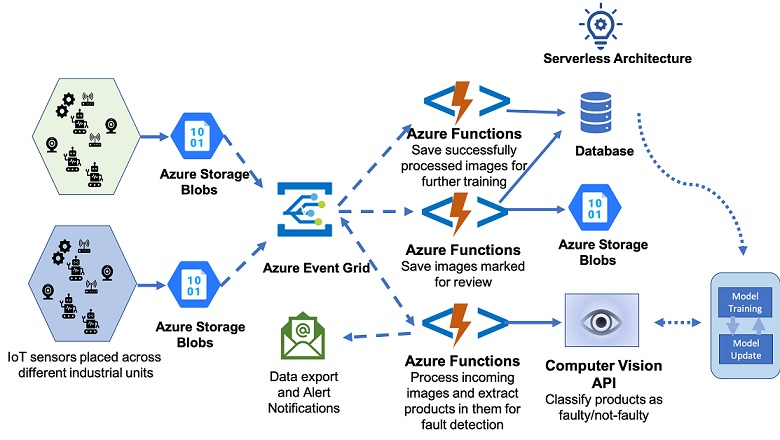

Azure Functions for IoT enables developers to create scalable IoT applications that can be rapidly deployed without provisioning a fixed infrastructure capacity in advance. Demand for IoT solutions can spike up or down rapidly. Hence, IoT solutions especially benefit from the ability to scale infrastructure using Azure Functions. Azure Functions is a part of the Azure serverless solution. Azure Serverless solution is comprised of three elements: Serverless Kubernetes, Serverless functions and Serverless application environments. In this module, we focus on serverless functions for IoT applications. Here you can connect IoT devices and use Azure Functions to execute code that implements your business logic.

## Scenario

Suppose you work in a factory producing electrical appliances as a supervisor on the assembly line. Your role is to ensure that the appliances are produced with no defects. You've been told that production is going to be ramped up significantly. Currently, defects are detected by visual inspection. Due to the increased production schedule, it's no longer possible to visually inspect each item. The production is expected to increase in a short time frame. So, it's necessary to deploy an AI/IoT solution that uses cameras to detect objects and immediately notify a supervisor of defects using an email notification.

The increase in production has some additional considerations. You need to rapidly deploy the solution and you also need to ensure that the solution is scalable as needed. Your team is well versed in development but not in operations including managing and provisioning infrastructure. Hence, you want to avoid scoping the architecture in advance.

In this module, you'll learn how Azure Functions work to manage scenarios like these. You'll understand how you can use Azure Functions to implement business logic with IoT devices. After completing this module, you'll be able to evaluate the role of Azure Functions for IoT solutions.
