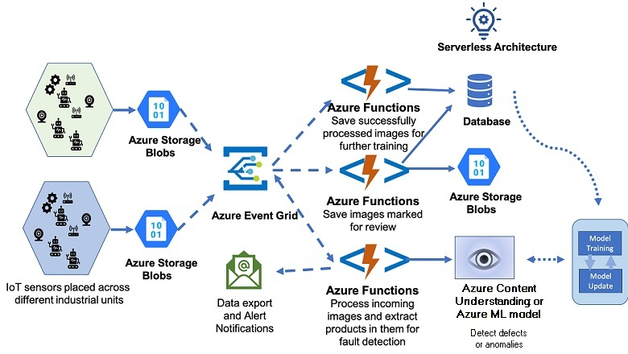

Azure Functions enables developers to create scalable, event-driven IoT applications that can be rapidly deployed. Demand for IoT solutions can spike up or down rapidly. Azure serverless offerings reduce infrastructure management; key offerings include Azure Functions for event-driven code and Azure Logic Apps for workflow orchestration. In this module, we focus on using Azure Functions in IoT applications. IoT devices or cameras send data to an ingestion service, such as IoT Hub or Azure Blob Storage, and Azure Functions runs business logic in Azure when a trigger receives the event.

## Scenario

Suppose you work in a factory producing electrical appliances as a supervisor on the assembly line. Your role is to ensure that the appliances are produced with no defects. You've been told that production is going to be ramped up significantly. Currently, defects are detected by visual inspection. Due to the increased production schedule, it's no longer possible to visually inspect each item. The production is expected to increase in a short time frame. So, it's necessary to deploy an AI/IoT solution that uses cameras to detect objects and immediately notify a supervisor of defects using an email notification.

The increase in production has some additional considerations. You need to rapidly deploy the solution and you also need to ensure that the solution is scalable as needed. Your team is well versed in development but not in operations including managing and provisioning infrastructure. Hence, you want to avoid scoping the architecture in advance.

In this module, you learn how Azure Functions work to manage scenarios like these. You understand how you can use Azure Functions to implement business logic that processes IoT events in Azure. After completing this module, you'll be able to evaluate the role of Azure Functions in IoT solutions.
