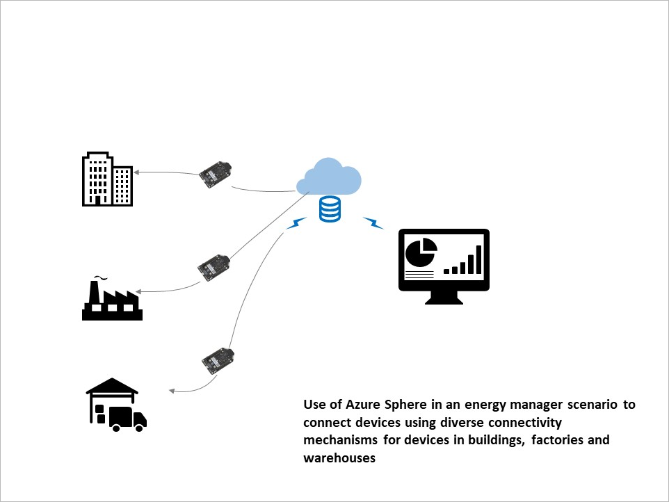

Managing a variety of sensors in an Industrial IoT scenario can be challenging. The sensors could be deployed over a range of environments within the enterprise (for example: in buildings, warehouses, or the factory floor). To capture the maximum data from these sensors, you need to cater to various connectivity mechanisms. Azure Sphere offers a variety of connectivity options. By understanding these options, you can choose the optimal mechanism to connect sensors and capture data.

Suppose you are an energy manager monitoring an Industrial IoT solution. You are tasked with protecting your company's operations from the power fluctuations arising from the energy suppliers. The role of the energy manager is critical in large enterprises because energy fluctuations affect business operations. The energy Manager runs energy planning and scheduling systems to help you optimize energy use. These systems help the enterprise monitor energy consumption, reduce costs, get the best price from the suppliers, protect equipment from energy surges and improve sustainability. The energy management system relies on a variety of sensors deployed in production units to capture data in real-time from the production systems in the field. Sensors that capture usage data from the machines in the field have to capture data over a range of connectivity mechanisms in a secure manner. In addition, the energy manager needs to capture data from sensors in buildings and warehouses.

Previously, you were dependent on limited and sporadic connectivity - especially in remote areas. Many of the devices are old or not internet-connected. You now want to deploy solutions that offer security but also multiple forms of connectivity. Hence, you are exploring azure sphere connectivity options over a variety of connectivity mechanisms. If you can expand the range of devices connected to the energy management system, you can capture more information near real-time. This could reduce the energy consumption of your company to as much as 4 percent. You could also improve sustainability and reliability.

](../media/sphere-diagram.png#lightbox)

## Learning objectives

In this module, you will:

- List the available connectivity options for Azure Sphere
- Determine the pros and cons of each connectivity method
- Provide a framework for the selection of the correct connectivity methods for Enterprise and Industrial IoT scenarios

## Prerequisites

- Basic knowledge of IoT
- Basic knowledge of Azure Sphere