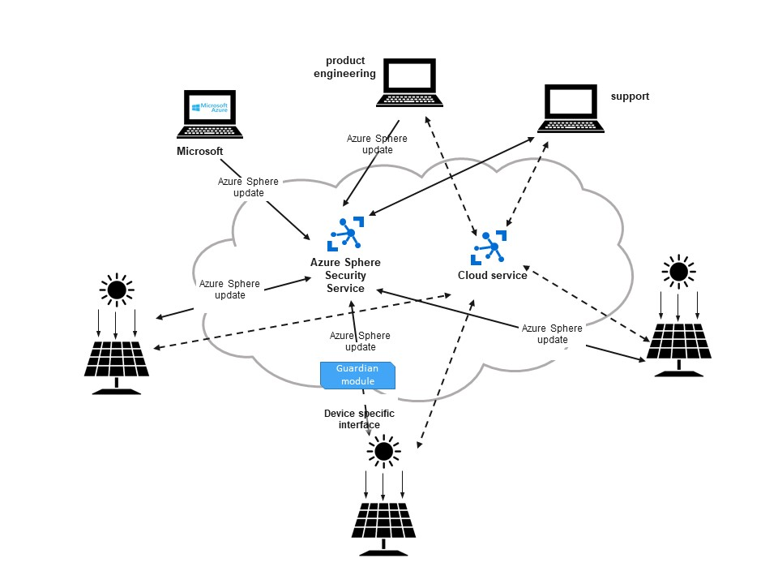

Azure Sphere is a platform for securing IoT devices end-to-end.   Azure Sphere is targeted to microcontrollers. A microcontroller is a single-chip computer that has processor, storage, memory, and IoT capabilities.  

Traditionally, we haven't approached IoT Security from a holistic perspective. We've tried to secure specific components ex the hardware, software so on. This is especially true of smaller / restricted devices like microcontrollers. Many of these devices are ‘legacy’ that is, have been deployed for many years. The aim of Azure Sphere is to create an end-to-end trusted environment for deploying and using IoT devices (both new and legacy). It's estimated that there are currently 9 billion MCU-based IoT devices shipped each year. These devices are rapidly becoming connected and are a key part of our social and commercial life. Securing these devices is the major challenge. Once secured, the data captured from IoT devices provides opportunities to create and deploy new services.  

Suppose you're a part of the Engineering team responsible for management of a group of solar panels.  You're responsible for managing the daily operations of the solar panels.  Many of these panels are older and they're all in remote locations. As a part of a Green initiative, your company is now looking to expand the number of solar panels. Your goal is to remotely monitor the health of the solar panels (both new and legacy) and update the applications deployed on these panels. This task must be done remotely and securely. Also, you want to solve business problems from the data acquired from the solar panels.  You're thus looking to implement a solution that can securely manage a range of IoT devices (Solar panels). You can then use the data from these secure devices to build solutions for your own business problems.

##### 

In this module, you'll learn how to use Azure sphere to address scenarios such as the above. By the end of this module, you'll be able to understand the capabilities of Azure sphere. You'll be able to evaluate Azure Sphere as a platform for creating secure IoT applications.